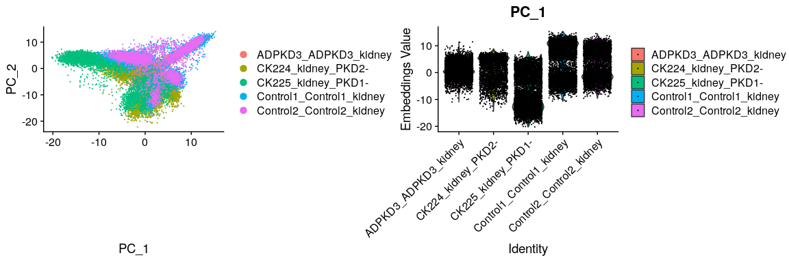
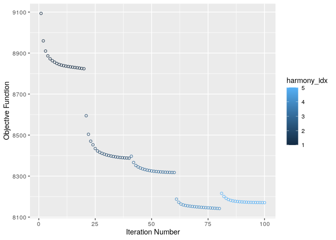
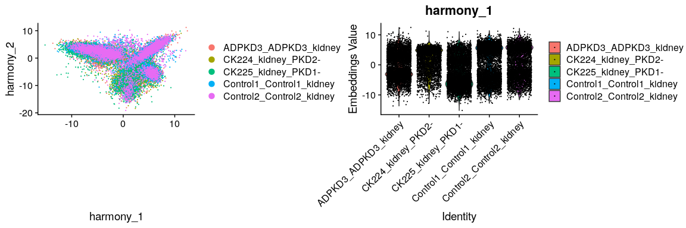
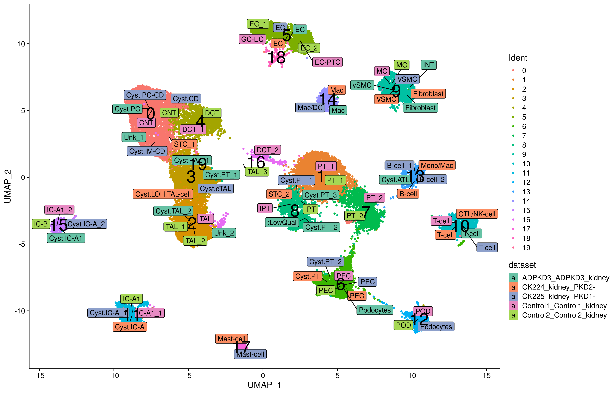
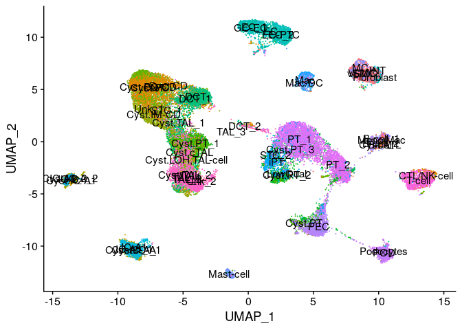

Harmony integration of adult kidney tissue from ADPKD and control
samples-
================
Javier Perales-Paton - <javier.perales@bioquant.uni-heidelberg.de>

## Load libraries and auxiliar functions

``` r
set.seed(1234)
suppressPackageStartupMessages(require(Seurat))
suppressPackageStartupMessages(require(harmony))
suppressPackageStartupMessages(require(cowplot))
suppressPackageStartupMessages(require(ggplot2))
suppressPackageStartupMessages(require(genesorteR))
suppressPackageStartupMessages(require(openxlsx))
source("../src/seurat_fx.R")
```

## Load SeuratObject with initial clustering outcome

``` r
CK224 <- readRDS(paste0("../Individual_analysis_CK224_PT25_PKD2-/",
            "output/2_cell_assignment/data/SeuratObject.rds"))
CK224$final_Ident <- Idents(CK224)
CK224_umap <- DimPlot(CK224, reduction="umap", label=TRUE) + NoLegend() + ggtitle(Project(CK224))
```

    ## Warning: Using `as.character()` on a quosure is deprecated as of rlang 0.3.0.
    ## Please use `as_label()` or `as_name()` instead.
    ## This warning is displayed once per session.

``` r
CK225 <- readRDS(paste0("../Individual_analysis_CK225_PT8_PKD1-/",
            "output/2_cell_assignment/data/SeuratObject.rds"))
CK225$final_Ident <- Idents(CK225)
CK225_umap <- DimPlot(CK225, reduction="umap", label=TRUE) + NoLegend() + ggtitle(Project(CK225))

Control1 <- readRDS(paste0("../Individual_analysis_Control1/",
            "output/2_cell_assignment/data/SeuratObject.rds"))
Control1$final_Ident <- Idents(Control1)
Control1$orig.ident <- factor(paste0("Control1_", as.character(Control1$orig.ident)))
Control1_umap <- DimPlot(Control1, reduction="umap", label=TRUE) + NoLegend() + ggtitle(Project(Control1))

Control2 <- readRDS(paste0("../Individual_analysis_Control2/",
            "output/2_cell_assignment/data/SeuratObject.rds"))
Control2$final_Ident <- Idents(Control2)
Control2$orig.ident <- factor(paste0("Control2_", as.character(Control2$orig.ident)))
Control2_umap <- DimPlot(Control2, reduction="umap", label=TRUE) + NoLegend() + ggtitle(Project(Control2))

ADPKD3 <- readRDS(paste0("../Individual_analysis_ADPKD3/",
            "output/2_cell_assignment/data/SeuratObject.rds"))
ADPKD3$final_Ident <- Idents(ADPKD3)
ADPKD3$orig.ident <- factor(paste0("ADPKD3_", as.character(ADPKD3$orig.ident)))
ADPKD3_umap <- DimPlot(ADPKD3, reduction="umap", label=TRUE) + NoLegend() + ggtitle(Project(ADPKD3))


umap_split <- CombinePlots(list(CK224_umap, CK225_umap, ADPKD3_umap, Control1_umap, Control2_umap), ncol=3)
```

## Merging

``` r
S <- merge(ADPKD3, list(CK224, CK225, Control1, Control2))
```

    ## Warning in CheckDuplicateCellNames(object.list = objects): Some cell names
    ## are duplicated across objects provided. Renaming to enforce unique cell
    ## names.

``` r
rm(CK224, CK225, Control1, Control2, ADPKD3)
```

## PCA

``` r
S <- NormalizeData(S)
S <- FindVariableFeatures(S, selection.method="vst", nfeatures=2000)
S <- ScaleData(S, verbose=FALSE)
S <- RunPCA(S, pc.genes=S@var.genes, npcs=50, verbose= FALSE)
```

## Batch

``` r
p1 <- DimPlot(object = S, reduction = "pca", pt.size = .1, group.by = "orig.ident", do.return = TRUE)
```

    ## The following functions and any applicable methods accept the dots: CombinePlots

``` r
p2 <- VlnPlot(object = S, features = "PC_1", group.by = "orig.ident", do.return = TRUE, pt.size = .1)
CombinePlots(list(p1,p2))
```

<!-- -->

## Run Harmony

``` r
S$lab <- ifelse(grepl("(CK[0-9]+|Control|ADPKD)", S$orig.ident), "Kramann", "Other")
S <- RunHarmony(S, c("lab","orig.ident"), plot_convergence=TRUE)
```

    ## Harmony 1/10

    ## Harmony 2/10

    ## Harmony 3/10

    ## Harmony 4/10

    ## Harmony 5/10

    ## Harmony converged after 5 iterations

<!-- -->

``` r
S$orig.ident2 <- sapply(S$orig.ident, function(z) {
            if(grepl("^(CK224|CK225|CK73|CK77|ADPKD)", z)) {
                z
            } else if(grepl("Control", z)) {
                z
            } else {
                stop("ERROR: unexpected sample")
            }
})

S$final_Ident2 <- paste0(gsub("_.*$","",S$orig.ident2), "|", S$final_Ident)
```

``` r
p3 <- DimPlot(object = S, reduction = "harmony", pt.size = .1, group.by = "orig.ident", do.return = TRUE)
```

    ## The following functions and any applicable methods accept the dots: CombinePlots

``` r
p4 <- VlnPlot(object = S, features = "harmony_1", group.by = "orig.ident", do.return = TRUE, pt.size = .1)
CombinePlots(list(p3,p4))
```

<!-- -->

## UMAP

``` r
S <- RunUMAP(S, reduction="harmony", dims=1:20)
```

    ## Warning: The default method for RunUMAP has changed from calling Python UMAP via reticulate to the R-native UWOT using the cosine metric
    ## To use Python UMAP via reticulate, set umap.method to 'umap-learn' and metric to 'correlation'
    ## This message will be shown once per session

    ## 15:23:17 UMAP embedding parameters a = 0.9922 b = 1.112

    ## 15:23:17 Read 26509 rows and found 20 numeric columns

    ## 15:23:17 Using Annoy for neighbor search, n_neighbors = 30

    ## 15:23:17 Building Annoy index with metric = cosine, n_trees = 50

    ## 0%   10   20   30   40   50   60   70   80   90   100%

    ## [----|----|----|----|----|----|----|----|----|----|

    ## **************************************************|
    ## 15:23:21 Writing NN index file to temp file /tmp/RtmpnWCkUl/file3afb5fcb9b4
    ## 15:23:21 Searching Annoy index using 1 thread, search_k = 3000
    ## 15:23:31 Annoy recall = 100%
    ## 15:23:32 Commencing smooth kNN distance calibration using 1 thread
    ## 15:23:33 Initializing from normalized Laplacian + noise
    ## 15:23:36 Commencing optimization for 200 epochs, with 1194052 positive edges
    ## 15:24:01 Optimization finished

``` r
umap_split2 <- DimPlot(S, reduction="umap", group.by="final_Ident", label=TRUE, split.by="orig.ident2") + NoLegend()
```

## Find clusters again

``` r
S$final_Ident2 <- paste0(gsub("_.*", "|",S$orig.ident), S$final_Ident)
S <- FindNeighbors(S, reduction = "harmony", dims = 1:20)
```

    ## Computing nearest neighbor graph

    ## Computing SNN

``` r
S <- FindClusters(S, resolution = 0.5)
```

    ## Modularity Optimizer version 1.3.0 by Ludo Waltman and Nees Jan van Eck
    ## 
    ## Number of nodes: 26509
    ## Number of edges: 1039070
    ## 
    ## Running Louvain algorithm...
    ## Maximum modularity in 10 random starts: 0.9428
    ## Number of communities: 20
    ## Elapsed time: 5 seconds

``` r
umap_reId <- DimPlot(S, reduction="umap", group.by="ident", label=TRUE, split.by="orig.ident2") + NoLegend()
```

``` r
library(ggrepel)
library(dplyr)
```

    ## 
    ## Attaching package: 'dplyr'

    ## The following objects are masked from 'package:stats':
    ## 
    ##     filter, lag

    ## The following objects are masked from 'package:base':
    ## 
    ##     intersect, setdiff, setequal, union

``` r
dat <- data.frame(UMAP_1=S@reductions$umap@cell.embeddings[,1],
          UMAP_2=S@reductions$umap@cell.embeddings[,2],
          final_Ident=S$final_Ident,
          Ident=Idents(S),
          dataset=S$orig.ident2
          )

labs <- dat %>% group_by(final_Ident, dataset) %>%
    summarize(coord1=median(UMAP_1),
          coord2=median(UMAP_2))
labs$Ident <- factor(rep(NA, nrow(labs)),
                 levels=levels(dat$Ident))

labs2 <- dat %>% group_by(Ident) %>%
    summarize(coord1=median(UMAP_1),
          coord2=median(UMAP_2))
labs2$dataset <- factor(rep(NA, nrow(labs2)),
            levels=levels(dat$dataset))

ggplot(dat, aes(x=UMAP_1, y=UMAP_2, colour=Ident)) + 
    geom_point() + 
# stat_summary(fun.y = mean, geom = "point", colour = "darkred", size = 5) +
    geom_label_repel(data=labs, 
              aes(coord1, coord2, 
                  fill=dataset, label=final_Ident), 
              colour="black", size=4) +
    geom_text(data=labs2, 
              aes(coord1, coord2, 
                  fill=dataset, label=Ident), 
              colour="black", size=10) +
     scale_fill_brewer(type = "div", palette = "Set2") +
    theme_cowplot()
```

    ## Warning: Ignoring unknown aesthetics: fill

<!-- -->

``` r
DimPlot(S, group.by="final_Ident", label=TRUE)
```

<!-- -->

## Save

``` r
saveRDS(S, file=paste0(DATADIR,"/S.rds"))
```

## Rsession

``` r
sessionInfo()
```

    ## R version 3.6.1 (2019-07-05)
    ## Platform: x86_64-pc-linux-gnu (64-bit)
    ## Running under: Ubuntu 18.04.3 LTS
    ## 
    ## Matrix products: default
    ## BLAS:   /usr/lib/x86_64-linux-gnu/blas/libblas.so.3.7.1
    ## LAPACK: /usr/lib/x86_64-linux-gnu/lapack/liblapack.so.3.7.1
    ## 
    ## locale:
    ##  [1] LC_CTYPE=en_US.UTF-8       LC_NUMERIC=C              
    ##  [3] LC_TIME=en_GB.UTF-8        LC_COLLATE=en_US.UTF-8    
    ##  [5] LC_MONETARY=en_GB.UTF-8    LC_MESSAGES=en_US.UTF-8   
    ##  [7] LC_PAPER=en_GB.UTF-8       LC_NAME=C                 
    ##  [9] LC_ADDRESS=C               LC_TELEPHONE=C            
    ## [11] LC_MEASUREMENT=en_GB.UTF-8 LC_IDENTIFICATION=C       
    ## 
    ## attached base packages:
    ## [1] stats     graphics  grDevices utils     datasets  methods   base     
    ## 
    ## other attached packages:
    ##  [1] dplyr_0.8.3      ggrepel_0.8.1    openxlsx_4.2.3   genesorteR_0.3.1
    ##  [5] Matrix_1.2-17    ggplot2_3.3.3    cowplot_1.0.0    harmony_1.0     
    ##  [9] Rcpp_1.0.2       Seurat_3.1.0     rmarkdown_1.15   nvimcom_0.9-82  
    ## 
    ## loaded via a namespace (and not attached):
    ##  [1] tsne_0.1-3          nlme_3.1-141        bitops_1.0-6       
    ##  [4] RcppAnnoy_0.0.13    RColorBrewer_1.1-2  httr_1.4.1         
    ##  [7] sctransform_0.2.0   tools_3.6.1         backports_1.1.4    
    ## [10] R6_2.4.0            irlba_2.3.3         KernSmooth_2.23-16 
    ## [13] uwot_0.1.4          lazyeval_0.2.2      colorspace_1.4-1   
    ## [16] withr_2.1.2         npsurv_0.4-0        gridExtra_2.3      
    ## [19] tidyselect_0.2.5    compiler_3.6.1      plotly_4.9.0       
    ## [22] labeling_0.3        caTools_1.17.1.2    scales_1.0.0       
    ## [25] lmtest_0.9-37       ggridges_0.5.1      pbapply_1.4-2      
    ## [28] stringr_1.4.0       digest_0.6.21       R.utils_2.9.0      
    ## [31] pkgconfig_2.0.3     htmltools_0.3.6     bibtex_0.4.2       
    ## [34] htmlwidgets_1.3     rlang_0.4.0         zoo_1.8-6          
    ## [37] jsonlite_1.6        mclust_5.4.5        ica_1.0-2          
    ## [40] gtools_3.8.1        zip_2.1.1           R.oo_1.22.0        
    ## [43] magrittr_1.5        munsell_0.5.0       ape_5.3            
    ## [46] reticulate_1.13     lifecycle_0.1.0     R.methodsS3_1.7.1  
    ## [49] stringi_1.4.3       yaml_2.2.0          gbRd_0.4-11        
    ## [52] MASS_7.3-51.4       gplots_3.0.1.1      Rtsne_0.15         
    ## [55] plyr_1.8.4          grid_3.6.1          parallel_3.6.1     
    ## [58] gdata_2.18.0        listenv_0.7.0       crayon_1.3.4       
    ## [61] lattice_0.20-38     splines_3.6.1       SDMTools_1.1-221.1 
    ## [64] zeallot_0.1.0       knitr_1.24          pillar_1.4.2       
    ## [67] igraph_1.2.4.1      future.apply_1.3.0  reshape2_1.4.3     
    ## [70] codetools_0.2-16    leiden_0.3.1        glue_1.3.1         
    ## [73] evaluate_0.14       lsei_1.2-0          metap_1.1          
    ## [76] RcppParallel_4.4.3  data.table_1.12.8   vctrs_0.2.0        
    ## [79] png_0.1-7           Rdpack_0.11-0       gtable_0.3.0       
    ## [82] RANN_2.6.1          purrr_0.3.2         tidyr_1.0.0        
    ## [85] future_1.14.0       assertthat_0.2.1    xfun_0.9           
    ## [88] rsvd_1.0.2          RSpectra_0.15-0     survival_2.44-1.1  
    ## [91] viridisLite_0.3.0   pheatmap_1.0.12     tibble_2.1.3       
    ## [94] cluster_2.1.0       globals_0.12.4      fitdistrplus_1.0-14
    ## [97] ROCR_1.0-7
