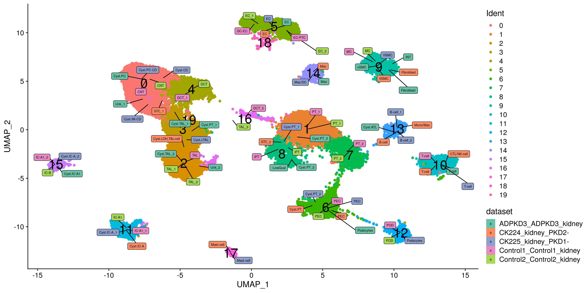
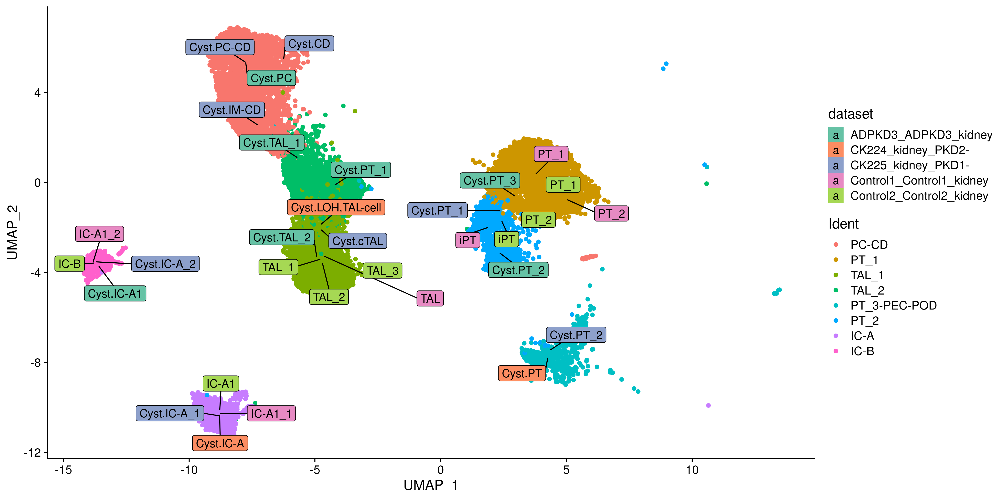
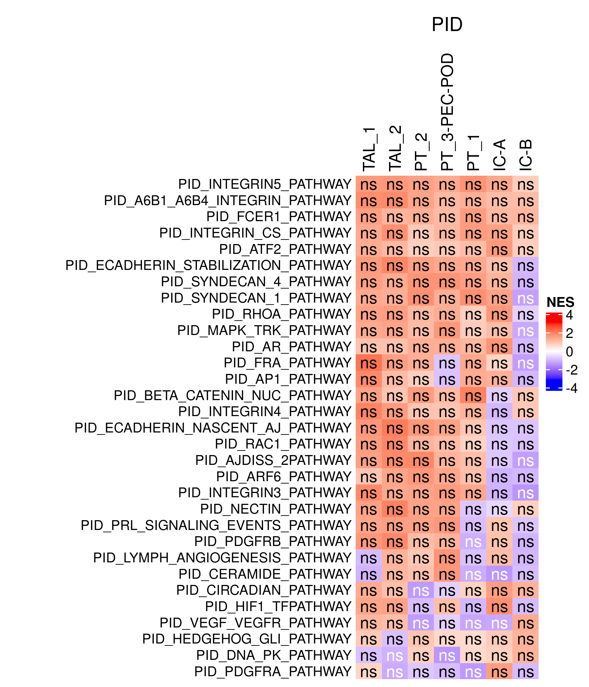
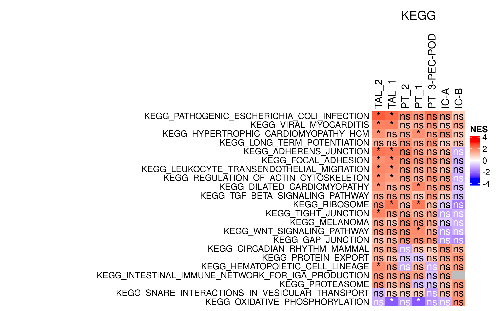
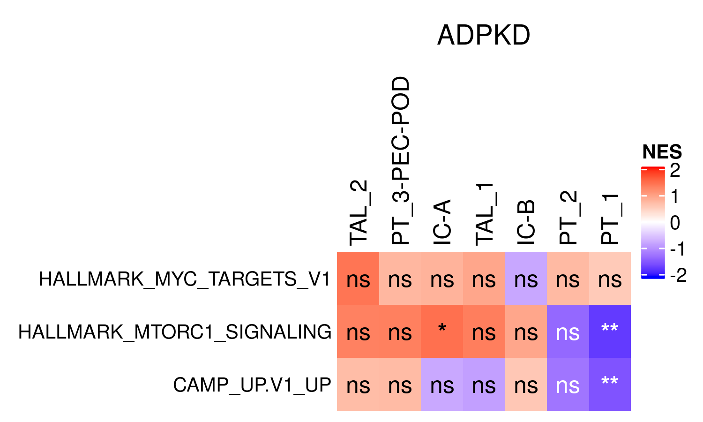

Differential expression and functional genomics analysis of ADPKD vs
Control via pseudobulking
================
Javier Perales-Paton - <javier.perales@bioquant.uni-heidelberg.de>

## Load libraries and auxiliar functions

``` r
set.seed(1234)
suppressPackageStartupMessages(require(Seurat))
suppressPackageStartupMessages(require(cowplot))
suppressPackageStartupMessages(require(ggplot2))
suppressPackageStartupMessages(require(genesorteR))
suppressPackageStartupMessages(require(openxlsx))
suppressPackageStartupMessages(require(dplyr))
suppressPackageStartupMessages(require(ggrepel))
suppressPackageStartupMessages(require(scater))
suppressPackageStartupMessages(require(edgeR))
suppressPackageStartupMessages(require(fgsea))
suppressPackageStartupMessages(require(GSEABase))
suppressPackageStartupMessages(require(clusterProfiler))
suppressPackageStartupMessages(require(tibble))
suppressPackageStartupMessages(require(ComplexHeatmap))
suppressPackageStartupMessages(require(openxlsx))
suppressPackageStartupMessages(require(viper))
suppressPackageStartupMessages(require(purrr))
source("../src/seurat_fx.R")
```

## Integrated

``` r
S <- readRDS("./01_harmony_integration/data/S.rds")
```

``` r
g1 <- DimPlot(S, group.by="orig.ident2") + NoLegend() + ggtitle("By dataset") +
    scale_colour_brewer(type = "div", palette = "Set2")
g2 <- DimPlot(S, group.by="ident") + NoLegend() + ggtitle("By cluster")
plot_grid(g1, g2, ncol=1)
```

<!-- -->

``` r
dat <- data.frame(UMAP_1=S@reductions$umap@cell.embeddings[,1],
          UMAP_2=S@reductions$umap@cell.embeddings[,2],
          final_Ident=S$final_Ident,
          Ident=Idents(S),
          dataset=S$orig.ident2
          )

labs <- dat %>% group_by(final_Ident, dataset) %>%
    summarize(coord1=median(UMAP_1),
          coord2=median(UMAP_2))
labs$Ident <- factor(rep(NA, nrow(labs)),
                 levels=levels(dat$Ident))

labs2 <- dat %>% group_by(Ident) %>% summarize(coord1=median(UMAP_1),
                           coord2=median(UMAP_2))

ggplot(dat, aes(x=UMAP_1, y=UMAP_2, colour=Ident)) + 
    geom_point() + 
    geom_text(data=labs2, aes(coord1, coord2, label=Ident), size=8, colour="black") +
    geom_label_repel(data=labs, 
              aes(coord1, coord2, 
                  fill=dataset, label=final_Ident), 
              box.padding=0.5,
              size=2,
              colour="black") +
     scale_fill_brewer(type = "div", palette = "Set2") +
    theme_cowplot()
```

<!-- -->

## Subset clusters

``` r
# Selection of cyst
cyst_sel <- grep("Cyst\\.", S$final_Ident, value=TRUE)
cyst_cells <- sapply(unique(cyst_sel), function(cl) names(cyst_sel)[cyst_sel==cl])

# Selection of idents from integrated space
idents_sel <- lapply(cyst_cells, function(cells) sort(table(Idents(S[, cells])),decreasing=TRUE))
print(idents_sel)
```

    ## $Cyst.PT_1
    ## 
    ##    3    8    1    7    6    2    9   16    4    0    5   10   12   17 
    ## 1208  174   38   27   16    6    4    4    2    1    1    1    1    1 
    ## 
    ## $Cyst.TAL_2
    ## 
    ##   2   3   7   4   5   8   9  10  16  17 
    ## 568  38  24   4   1   1   1   1   1   1 
    ## 
    ## $Cyst.PC
    ## 
    ##   0   4   2   6  10  11  14 
    ## 265  44   2   1   1   1   1 
    ## 
    ## $Cyst.ATL
    ## 
    ## 13  5  8 10 
    ## 40  1  1  1 
    ## 
    ## $Cyst.TAL_1
    ## 
    ##   3   4   0   2   7   6  11   5   9  17 
    ## 331 199 116  50   8   4   2   1   1   1 
    ## 
    ## $Cyst.PT_3
    ## 
    ##   1   8   7   3   6  16  18 
    ## 381 177  56   4   3   2   1 
    ## 
    ## $Cyst.PT_2
    ## 
    ##   8   7   6   3   2   1  12   0   4   9  13  14 
    ## 406 269 128 102  10   8   4   1   1   1   1   1 
    ## 
    ## $`Cyst.IC-A1`
    ## 
    ## 15 11 
    ## 37 19 
    ## 
    ## $`Cyst.LOH,TAL-cell`
    ## 
    ##   2   3   8  19   4   6  13   5  14  16  18 
    ## 289 158  12  12   5   3   3   1   1   1   1 
    ## 
    ## $`Cyst.IC-A`
    ## 
    ## 11 15 14 
    ## 27  2  1 
    ## 
    ## $Cyst.PT
    ## 
    ##   6   8   9  13 
    ## 367   3   1   1 
    ## 
    ## $`Cyst.PC-CD`
    ## 
    ##    0    4    3    7   12   14    9   10   15   17   18   19 
    ## 1477   89   27    9    2    2    1    1    1    1    1    1 
    ## 
    ## $`Cyst.IM-CD`
    ## 
    ##   0   3   4   6  12  14  15 
    ## 809 107  11   4   1   1   1 
    ## 
    ## $Cyst.CD
    ## 
    ##   0   4   3  19 
    ## 124  17   1   1 
    ## 
    ## $Cyst.cTAL
    ## 
    ##   2   4   3   0  11  12   8  16  18  19 
    ## 189 124  44  18   2   2   1   1   1   1 
    ## 
    ## $`Cyst.IC-A_1`
    ## 
    ##  11   4  15 
    ## 421   3   1 
    ## 
    ## $`Cyst.IC-A_2`
    ## 
    ##  15  11   0   4  17 
    ## 352   4   2   1   1

So basically,

``` r
ren <- c("0"="PC-CD",
     "1" = "PT_1",
     "2" = "TAL_1",
    "3" = "TAL_2",
    "6" = "PT_3-PEC-POD", 
    "6" = ":Odd",
    "8" = "PT_2",
    "11" ="IC-A",
#   "13" = "ATL", # NOTE: clustering together with B-cell
    "15" = "IC-B")

filterin <- c(grep("PT", S$final_Ident, value=TRUE),
          grep("CD", S$final_Ident, value=TRUE),
          grep("PC", S$final_Ident, value=TRUE),
          grep("IC-", S$final_Ident, value=TRUE),
          grep("TAL", S$final_Ident, value=TRUE))
filterin <- unique(filterin)
```

``` r
S1 <- S[, Idents(S) %in% names(ren) & S$final_Ident %in% filterin]
S1 <- RenameIdents(S1, ren)
```

``` r
dat <- data.frame(UMAP_1=S1@reductions$umap@cell.embeddings[,1],
          UMAP_2=S1@reductions$umap@cell.embeddings[,2],
          final_Ident=S1$final_Ident,
          Ident=Idents(S1),
          dataset=S1$orig.ident2
          )

labs <- dat %>% group_by(final_Ident, dataset) %>%
    summarize(coord1=median(UMAP_1),
          coord2=median(UMAP_2))
labs$Ident <- factor(rep(NA, nrow(labs)),
                 levels=levels(dat$Ident))

ggplot(dat, aes(x=UMAP_1, y=UMAP_2, colour=Ident)) + 
    geom_point() + 
    geom_label_repel(data=labs, 
              aes(coord1, coord2, 
                  fill=dataset, label=final_Ident), 
              box.padding=0.5,
              colour="black", size=4) +
     scale_fill_brewer(type = "div", palette = "Set2") +
    theme_cowplot()
```

<!-- -->

## Pseudo-bulk

``` r
nCells <- sapply(levels(Idents(S1)), function(CL) {
             Sx <- S1[, Idents(S1)==CL]
             table(Sx$orig.ident)
              })
mats <- sapply(levels(Idents(S1)), function(CL) {
               Sx <- S1[, Idents(S1)==CL]
        mat <- scater::sumCountsAcrossCells(as.matrix(Sx@assays$RNA@counts),
                         ids = Sx$orig.ident
                         )
        return(mat)

    })
lapply(mats, colnames)
```

    ## $`PC-CD`
    ## [1] "ADPKD3_ADPKD3_kidney"     "CK225_kidney_PKD1-"      
    ## [3] "Control2_Control2_kidney"
    ## 
    ## $PT_1
    ## [1] "ADPKD3_ADPKD3_kidney"     "CK225_kidney_PKD1-"      
    ## [3] "Control1_Control1_kidney" "Control2_Control2_kidney"
    ## 
    ## $TAL_1
    ## [1] "ADPKD3_ADPKD3_kidney"     "CK224_kidney_PKD2-"      
    ## [3] "CK225_kidney_PKD1-"       "Control1_Control1_kidney"
    ## [5] "Control2_Control2_kidney"
    ## 
    ## $TAL_2
    ## [1] "ADPKD3_ADPKD3_kidney"     "CK224_kidney_PKD2-"      
    ## [3] "CK225_kidney_PKD1-"       "Control1_Control1_kidney"
    ## [5] "Control2_Control2_kidney"
    ## 
    ## $`PT_3-PEC-POD`
    ## [1] "ADPKD3_ADPKD3_kidney"     "CK224_kidney_PKD2-"      
    ## [3] "CK225_kidney_PKD1-"       "Control1_Control1_kidney"
    ## [5] "Control2_Control2_kidney"
    ## 
    ## $PT_2
    ## [1] "ADPKD3_ADPKD3_kidney"     "CK224_kidney_PKD2-"      
    ## [3] "CK225_kidney_PKD1-"       "Control1_Control1_kidney"
    ## [5] "Control2_Control2_kidney"
    ## 
    ## $`IC-A`
    ## [1] "ADPKD3_ADPKD3_kidney"     "CK224_kidney_PKD2-"      
    ## [3] "CK225_kidney_PKD1-"       "Control1_Control1_kidney"
    ## [5] "Control2_Control2_kidney"
    ## 
    ## $`IC-B`
    ## [1] "ADPKD3_ADPKD3_kidney"     "CK224_kidney_PKD2-"      
    ## [3] "CK225_kidney_PKD1-"       "Control1_Control1_kidney"
    ## [5] "Control2_Control2_kidney"

Let’s merge all cell types by patients and show clustering:

  - Is there any clustering pattern by patient, lab, or cell type?

<!-- end list -->

``` r
mats2 <- sapply(names(mats), function(CL) {
    tmp <- mats[[CL]]
    colnames(tmp) <- paste0(CL,".",colnames(tmp))
    return(tmp)
    })
cls <- sapply(names(mats2), function(CL) rep(CL, ncol(mats2[[CL]])))
src <- unlist(lapply(mats, colnames))
gr <- factor(ifelse(grepl("(CK22[45]|ADPKD)", src), "ADPKD", "healthy"),
         levels=c("healthy", "ADPKD"))
mats2 <- do.call("cbind", mats2)

samplesDF <- data.frame(src=src, 
            cell=unlist(cls), 
          nCells=unlist(nCells))
rownames(samplesDF) <- colnames(mats2)

# Quick start with edgeR to get plotMDS
y <- DGEList(mats2, samples=samplesDF, group = gr 
         )

# Pre-processing
z <- y[, y$samples$nCells > 10]
keep <- filterByExpr(z)
summary(keep)
```

    ##    Mode   FALSE    TRUE 
    ## logical   16105    8399

``` r
z <- z[keep, ]
z <- calcNormFactors(z)


plot1 <- plotMDS(cpm(z, log=TRUE), plot=FALSE)
plot1$samples <- z$samples

plot23 <- lapply(split(colnames(z),z$samples$group), function(idx) {
           plotX <- plotMDS(cpm(z[, idx], log=TRUE), plot=FALSE)
           plotX$samples <- z$samples[idx,]
           return(plotX)
    })

plot123 <- list(plot1, plot23[[1]], plot23[[2]])
names(plot123) <- c("merged",paste0(names(plot23), " subset"))
dat <- data.frame(x=unlist(lapply(plot123, function(z) z$x)),
          y=unlist(lapply(plot123, function(z) z$y)),
          cell=unlist(lapply(plot123, function(z) z$samples$cell)),
         group=unlist(lapply(plot123, function(z) z$samples$group)),
         label=unlist(sapply(names(plot123), function(z) rep(z, nrow(plot123[[z]]$samples))))
          )
ggplot(dat, aes(x, y, colour=cell, shape=group)) + 
    geom_point(size=3) + 
    # 2nd batch
    geom_text(data=dat[grep("ADPKD|Control", rownames(dat)), ], 
          mapping=aes(x,y), label="_", colour="blue", fontface="bold", size=4) + 
    # 1st batch
    geom_text(data=dat[grep("CK22[45]", rownames(dat)), ], 
          mapping=aes(x,y), label="_", colour="red", fontface="bold", size=4) + 
    xlab(paste0(plot1$axislabel," 1")) +
    xlab(paste0(plot1$axislabel," 1")) +
    ylab(paste0(plot1$axislabel," 2")) + 
    theme_light() + 
    theme(axis.line = element_line(colour="black"),
          strip.text.x=element_text(colour="black", size=18, face="bold")) + 
    facet_wrap(.~ label, scales="free_y") #+ theme(legend.position="bottom")
```

<!-- -->

## Comparison between conditions

For every cell population

``` r
# Quick start with edgeR
z <- DGEList(mats2, samples=samplesDF, group = gr)


# For every cell type, perform a test for differential gene expression
# We create a list to store final results
DGELRT_list <- setNames(vector("list", length=length(levels(z$samples$cell))),
            levels(z$samples$cell))

# Loop over it
for(cellIdx in levels(z$samples$cell)) {
    cat(paste0("[INFO] Working on ", cellIdx, "\n"), file=stdout())
    y <- z[, z$samples$cell==cellIdx]   
    # Pre-processing
    y <- y[, y$samples$nCells > 10]
    if(length(levels(y$samples$group))!=2) {
        cat(paste0("[INFO] \t Skipping ",cellIdx," due to no 2-group observations\n"), file=stdout())
        next;
    }

    keep <- filterByExpr(y)
    cat(paste0("[INFO] \t Filtering lowly expr genes:", cellIdx, "\n"), file=stdout())
    summary(keep)

    y <- y[keep, ]

    y <- calcNormFactors(y)
    # Contrast design
    design <- model.matrix(~ y$samples$group)
    rownames(design) <- colnames(y)
    print(design)

    y <- estimateDisp(y, design)
    summary(y$trended.dispersion)

    # GLM
    fit <- glmQLFit(y, design, robust=TRUE)
    cat(paste0("[INFO] \t priors:", cellIdx, "\n"), file=stdout())
    summary(fit$var.prior)
    summary(fit$df.prior)

    # GLF test
    res <- glmQLFTest(fit, coef=ncol(design))
    summary(decideTests(res))
     
    degs <- decideTests(res)
    cat(paste0("[INFO] \t Diff.expr. genes:", cellIdx, "\n"), file=stdout())
    table(degs)

    DGELRT_list[[cellIdx]] <- res 
}
```

    ## [INFO] Working on IC-A
    ## [INFO]    Filtering lowly expr genes:IC-A
    ##                               (Intercept) y$samples$groupADPKD
    ## IC-A.ADPKD3_ADPKD3_kidney               1                    1
    ## IC-A.CK224_kidney_PKD2-                 1                    1
    ## IC-A.CK225_kidney_PKD1-                 1                    1
    ## IC-A.Control1_Control1_kidney           1                    0
    ## IC-A.Control2_Control2_kidney           1                    0
    ## attr(,"assign")
    ## [1] 0 1
    ## attr(,"contrasts")
    ## attr(,"contrasts")$`y$samples$group`
    ## [1] "contr.treatment"
    ## 
    ## [INFO]    priors:IC-A
    ## [INFO]    Diff.expr. genes:IC-A
    ## [INFO] Working on IC-B
    ## [INFO]    Filtering lowly expr genes:IC-B
    ##                               (Intercept) y$samples$groupADPKD
    ## IC-B.ADPKD3_ADPKD3_kidney               1                    1
    ## IC-B.CK225_kidney_PKD1-                 1                    1
    ## IC-B.Control1_Control1_kidney           1                    0
    ## IC-B.Control2_Control2_kidney           1                    0
    ## attr(,"assign")
    ## [1] 0 1
    ## attr(,"contrasts")
    ## attr(,"contrasts")$`y$samples$group`
    ## [1] "contr.treatment"
    ## 
    ## [INFO]    priors:IC-B
    ## [INFO]    Diff.expr. genes:IC-B
    ## [INFO] Working on PC-CD
    ## [INFO]    Skipping PC-CD due to no 2-group observations
    ## [INFO] Working on PT_1
    ## [INFO]    Filtering lowly expr genes:PT_1
    ##                               (Intercept) y$samples$groupADPKD
    ## PT_1.ADPKD3_ADPKD3_kidney               1                    1
    ## PT_1.CK225_kidney_PKD1-                 1                    1
    ## PT_1.Control1_Control1_kidney           1                    0
    ## PT_1.Control2_Control2_kidney           1                    0
    ## attr(,"assign")
    ## [1] 0 1
    ## attr(,"contrasts")
    ## attr(,"contrasts")$`y$samples$group`
    ## [1] "contr.treatment"
    ## 
    ## [INFO]    priors:PT_1
    ## [INFO]    Diff.expr. genes:PT_1
    ## [INFO] Working on PT_2
    ## [INFO]    Filtering lowly expr genes:PT_2
    ##                               (Intercept) y$samples$groupADPKD
    ## PT_2.ADPKD3_ADPKD3_kidney               1                    1
    ## PT_2.CK224_kidney_PKD2-                 1                    1
    ## PT_2.CK225_kidney_PKD1-                 1                    1
    ## PT_2.Control1_Control1_kidney           1                    0
    ## PT_2.Control2_Control2_kidney           1                    0
    ## attr(,"assign")
    ## [1] 0 1
    ## attr(,"contrasts")
    ## attr(,"contrasts")$`y$samples$group`
    ## [1] "contr.treatment"
    ## 
    ## [INFO]    priors:PT_2
    ## [INFO]    Diff.expr. genes:PT_2
    ## [INFO] Working on PT_3-PEC-POD
    ## [INFO]    Filtering lowly expr genes:PT_3-PEC-POD
    ##                                       (Intercept) y$samples$groupADPKD
    ## PT_3-PEC-POD.ADPKD3_ADPKD3_kidney               1                    1
    ## PT_3-PEC-POD.CK224_kidney_PKD2-                 1                    1
    ## PT_3-PEC-POD.CK225_kidney_PKD1-                 1                    1
    ## PT_3-PEC-POD.Control1_Control1_kidney           1                    0
    ## PT_3-PEC-POD.Control2_Control2_kidney           1                    0
    ## attr(,"assign")
    ## [1] 0 1
    ## attr(,"contrasts")
    ## attr(,"contrasts")$`y$samples$group`
    ## [1] "contr.treatment"
    ## 
    ## [INFO]    priors:PT_3-PEC-POD
    ## [INFO]    Diff.expr. genes:PT_3-PEC-POD
    ## [INFO] Working on TAL_1
    ## [INFO]    Filtering lowly expr genes:TAL_1
    ##                                (Intercept) y$samples$groupADPKD
    ## TAL_1.ADPKD3_ADPKD3_kidney               1                    1
    ## TAL_1.CK224_kidney_PKD2-                 1                    1
    ## TAL_1.CK225_kidney_PKD1-                 1                    1
    ## TAL_1.Control1_Control1_kidney           1                    0
    ## TAL_1.Control2_Control2_kidney           1                    0
    ## attr(,"assign")
    ## [1] 0 1
    ## attr(,"contrasts")
    ## attr(,"contrasts")$`y$samples$group`
    ## [1] "contr.treatment"
    ## 
    ## [INFO]    priors:TAL_1
    ## [INFO]    Diff.expr. genes:TAL_1
    ## [INFO] Working on TAL_2
    ## [INFO]    Filtering lowly expr genes:TAL_2
    ##                                (Intercept) y$samples$groupADPKD
    ## TAL_2.ADPKD3_ADPKD3_kidney               1                    1
    ## TAL_2.CK224_kidney_PKD2-                 1                    1
    ## TAL_2.CK225_kidney_PKD1-                 1                    1
    ## TAL_2.Control1_Control1_kidney           1                    0
    ## TAL_2.Control2_Control2_kidney           1                    0
    ## attr(,"assign")
    ## [1] 0 1
    ## attr(,"contrasts")
    ## attr(,"contrasts")$`y$samples$group`
    ## [1] "contr.treatment"
    ## 
    ## [INFO]    priors:TAL_2
    ## [INFO]    Diff.expr. genes:TAL_2

``` r
DGELRT_list <- DGELRT_list[!unlist(lapply(DGELRT_list, function(z) is.null(z)))]
```

``` r
ttags <- lapply(DGELRT_list, function(k) topTags(k, n = Inf))
signatures <- lapply(ttags, function(k)  {
                rnk <- -log10(k$table$PValue) * sign(k$table$logFC)
                names(rnk) <- rownames(k$table)
                return(rnk)
            })
```

``` r
dat <- lapply(ttags, function(k) { 
          k$table$gene <- rownames(k)
          return(k$table)
})
dat <- do.call("rbind", dat)
dat$cell <- unlist(sapply(names(ttags), function(k) rep(k, nrow(ttags[[k]]))))
rownames(dat) <- NULL
dat$signif <- dat$FDR < 0.05

# Highlight ADPKD markers
dat$show <- FALSE
markers <- read.table("../data/Prior/ADPKD_Jack.tsv", sep="\t", header=TRUE,
              stringsAsFactors=FALSE)
genesIN <- intersect(dat$gene, markers$Gene)
genesIN.idx <- which(dat$gene %in% genesIN)
dat$show[genesIN.idx] <- ifelse(dat$signif[genesIN.idx], TRUE, FALSE)
dat$show[genesIN.idx] <- TRUE

ggplot(dat, aes(x=logFC, y=-log10(PValue), colour=signif), alpha=0.3) + 
    geom_point() + 
    geom_label_repel(data=dat[dat$show, ], 
             aes(x=logFC, y=-log10(PValue), label=gene),
             segment.colour="black",
             size=3,
             box.padding=0.3) +
    scale_colour_manual(values=c("grey60","orange3")) +
    facet_wrap(. ~ cell, scales = "free", ncol = 4) + theme_light()
```

<!-- -->

``` r
ggplot(dat, aes(x=PValue)) + 
    geom_histogram() + 
    facet_wrap(. ~ cell, scales = "free", ncol = 4) + theme_light()
```

    ## `stat_bin()` using `bins = 30`. Pick better value with `binwidth`.

<!-- -->

``` r
write.csv(do.call("rbind",lapply(DGELRT_list, function(k) table(decideTests(k)))),
      file=paste0(DATADIR,"/degs.csv"))
```

``` r
pseudobulk_stats <- z$samples %>% dplyr::select(group, cell, nCells) %>% 
    dplyr::group_by(cell, group) %>% 
    dplyr::summarise(nCells=sum(nCells), nReplicates=length(group))

write.table(as.data.frame(pseudobulk_stats),
        file=paste0(DATADIR,"/pseudobulks.csv"), sep=",",
        row.names=FALSE, col.names=TRUE, quote=FALSE)
```

## Enrichment analysis

``` r
GO <- getGmt("../data/Prior/c5.all.v7.0.symbols.gmt")
GO <- geneIds(GO)
GO.res <- lapply(signatures, function(rnk) {
  res <- fgsea(pathways = GO, stats = rnk, nperm=1000)
  res <- res[order(-res$pval, abs(res$NES), decreasing = TRUE),]
  return(res)
})
```

    ## Warning in fgsea(pathways = GO, stats = rnk, nperm = 1000): There are ties in the preranked stats (0.1% of the list).
    ## The order of those tied genes will be arbitrary, which may produce unexpected results.
    
    ## Warning in fgsea(pathways = GO, stats = rnk, nperm = 1000): There are ties in the preranked stats (0.1% of the list).
    ## The order of those tied genes will be arbitrary, which may produce unexpected results.

    ## Warning in fgsea(pathways = GO, stats = rnk, nperm = 1000): There are ties in the preranked stats (0.43% of the list).
    ## The order of those tied genes will be arbitrary, which may produce unexpected results.

    ## Warning in fgsea(pathways = GO, stats = rnk, nperm = 1000): There are ties in the preranked stats (0.01% of the list).
    ## The order of those tied genes will be arbitrary, which may produce unexpected results.

    ## Warning in fgsea(pathways = GO, stats = rnk, nperm = 1000): There are ties in the preranked stats (0.02% of the list).
    ## The order of those tied genes will be arbitrary, which may produce unexpected results.

``` r
top5NES <- unique(unlist(lapply(GO.res, function(tab) tab$pathway[order(tab$NES, decreasing=TRUE)[1:5]])))

NESres <- lapply(GO.res, function(tab) {
             paths <- intersect(tab$pathway, top5NES)
             nes <- setNames(tab$NES, tab$pathway)
             res <- nes[top5NES]
             names(res) <- top5NES
             return(res)
})
NESmat <- do.call("cbind", NESres)
rownames(NESmat)<- gsub("GO_", "", rownames(NESmat))

xx <- floor(max(abs(as.numeric(NESmat)), na.rm=TRUE))
col_fun <- circlize::colorRamp2(c(-1*xx,0,xx), c("blue", "white", "red"))
draw(Heatmap(NESmat, col=col_fun, 
         column_title = "GO terms",
         show_row_dend = FALSE, show_column_dend = FALSE,
         row_names_side = "left", column_names_side="top", 
         row_names_gp = gpar(fontsize = 10),
         name="NES"),
     padding = unit(c(2,130,2,2), "mm"))
```

<!-- -->

``` r
set.seed(1234)
PID <- getGmt("../data/Prior/c2.cp.pid.v7.0.symbols.gmt")
PID <- geneIds(PID)
PID.res <- lapply(signatures, function(rnk) {
  res <- fgsea(pathways = PID, stats = rnk, nperm=1000)
  res <- res[order(-res$pval, abs(res$NES), decreasing = TRUE),]
  return(res)
})
```

    ## Warning in fgsea(pathways = PID, stats = rnk, nperm = 1000): There are ties in the preranked stats (0.1% of the list).
    ## The order of those tied genes will be arbitrary, which may produce unexpected results.
    
    ## Warning in fgsea(pathways = PID, stats = rnk, nperm = 1000): There are ties in the preranked stats (0.1% of the list).
    ## The order of those tied genes will be arbitrary, which may produce unexpected results.

    ## Warning in fgsea(pathways = PID, stats = rnk, nperm = 1000): There are ties in the preranked stats (0.43% of the list).
    ## The order of those tied genes will be arbitrary, which may produce unexpected results.

    ## Warning in fgsea(pathways = PID, stats = rnk, nperm = 1000): There are ties in the preranked stats (0.01% of the list).
    ## The order of those tied genes will be arbitrary, which may produce unexpected results.

    ## Warning in fgsea(pathways = PID, stats = rnk, nperm = 1000): There are ties in the preranked stats (0.02% of the list).
    ## The order of those tied genes will be arbitrary, which may produce unexpected results.

``` r
top5NES <- unique(unlist(lapply(PID.res, function(tab) tab$pathway[order(tab$NES, decreasing=TRUE)[1:5]])))

NESres <- lapply(PID.res, function(tab) {
             paths <- intersect(tab$pathway, top5NES)
             nes <- setNames(tab$NES, tab$pathway)
             res <- nes[top5NES]
             names(res) <- top5NES
             return(res)
})
NESmat <- do.call("cbind", NESres)
rownames(NESmat) <- gsub("PID_","", gsub("_?PATHWAY","", rownames(NESmat)))

xx <- floor(max(abs(as.numeric(NESmat)), na.rm=TRUE))
col_fun <- circlize::colorRamp2(c(-1*xx,0,xx), c("blue", "white", "red"))
draw(Heatmap(NESmat, col=col_fun, column_title = "PID", 
         show_row_dend = FALSE, show_column_dend = FALSE,
         row_names_side = "left", column_names_side="top", 
         row_names_gp = gpar(fontsize = 10),
         name="NES"),
     padding=unit(c(2,30,2,2),"mm"))
```

<!-- -->

``` r
set.seed(1234)
KEGG <- getGmt("../data/Prior/c2.cp.kegg.v7.2.symbols.gmt")
KEGG <- geneIds(KEGG)
KEGG.res <- lapply(signatures, function(rnk) {
  res <- fgsea(pathways = KEGG, stats = rnk, nperm=1000)
  res <- res[order(-res$pval, abs(res$NES), decreasing = TRUE),]
  return(res)
})
```

    ## Warning in fgsea(pathways = KEGG, stats = rnk, nperm = 1000): There are ties in the preranked stats (0.1% of the list).
    ## The order of those tied genes will be arbitrary, which may produce unexpected results.
    
    ## Warning in fgsea(pathways = KEGG, stats = rnk, nperm = 1000): There are ties in the preranked stats (0.1% of the list).
    ## The order of those tied genes will be arbitrary, which may produce unexpected results.

    ## Warning in fgsea(pathways = KEGG, stats = rnk, nperm = 1000): There are ties in the preranked stats (0.43% of the list).
    ## The order of those tied genes will be arbitrary, which may produce unexpected results.

    ## Warning in fgsea(pathways = KEGG, stats = rnk, nperm = 1000): There are ties in the preranked stats (0.01% of the list).
    ## The order of those tied genes will be arbitrary, which may produce unexpected results.

    ## Warning in fgsea(pathways = KEGG, stats = rnk, nperm = 1000): There are ties in the preranked stats (0.02% of the list).
    ## The order of those tied genes will be arbitrary, which may produce unexpected results.

``` r
top5NES <- unique(unlist(lapply(KEGG.res, function(tab) tab$pathway[order(tab$NES, decreasing=TRUE)[1:5]])))

NESres <- lapply(KEGG.res, function(tab) {
             paths <- intersect(tab$pathway, top5NES)
             nes <- setNames(tab$NES, tab$pathway)
             res <- nes[top5NES]
             names(res) <- top5NES
             return(res)
})
NESmat <- do.call("cbind", NESres)
rownames(NESmat) <- gsub("KEGG_","", rownames(NESmat))

xx <- floor(max(abs(as.numeric(NESmat)), na.rm=TRUE))
col_fun <- circlize::colorRamp2(c(-1*xx,0,xx), c("blue", "white", "red"))
draw(Heatmap(NESmat, col=col_fun, 
         column_title = "KEGG",
         show_row_dend = FALSE, show_column_dend = FALSE,
         row_names_side = "left", column_names_side="top", 
         row_names_gp = gpar(fontsize = 10),
         name="NES"),
     padding=unit(c(2,90,2,2),"mm"))
```

<!-- -->

``` r
source("../src/runProgenyFast.R") # Ack. to A. Dugourd (c under GPL license)
progeny.mat <- read.table("../data/Prior/progeny_matrix_human_v1.csv", sep=",",header=TRUE)

pres <- lapply(signatures, function(k) {
    df <- data.frame(ID=names(k),
             cont=k)
    set.seed(1234)
    progeny.res <- runProgenyFast(df, progeny.mat)
    colnames(progeny.res) <- colnames(df)[-1]

    pvals <- apply(progeny.res, 2, function(z) pnorm(z))
    pvals <- apply(pvals, c(1,2), function(pval) ifelse(pval > 0.5, (1-pval)*2, pval*2))
    colnames(pvals) <- colnames(progeny.res)
    res <- cbind(Score=progeny.res[,1], Pvalue=pvals[,1])
})

pmat <- do.call("cbind",lapply(pres, function(k) k[,"Score"]))

xx <- floor(max(abs(as.numeric(pmat)), na.rm=TRUE))
col_fun <- circlize::colorRamp2(c(-1*xx,0,xx), c("blue", "white", "red"))
Heatmap(pmat, col=col_fun, row_names_side = "left", column_names_side = "top", 
    column_title = "PROGENy",
    show_row_dend=FALSE, show_column_dend=FALSE, name="Activity")
```

<!-- -->

``` r
# Function to transform a data.frame to viper's regulon 
# format using purrr. Ack. to CH. Holland.
df2regulon <- function(df, regulator_name="tf") {
  regulon = df %>% split(.[regulator_name]) %>% map(function(dat) {
    targets = setNames(dat$mor, dat$target)
    likelihood = dat$likelihood
    list(tfmode = targets, likelihood = likelihood)
  })
  return(regulon)
}

# Read dorothea mouse TF regulons
regulon.df <- read.table("../data/Prior/dorothea_regulon_human_v1.txt", 
             sep=",", header=TRUE, stringsAsFactors = FALSE)
# We shrink the analysis to those TF regulons with high-to-intermediate confidence
regulon.df <- subset(regulon.df, confidence %in% c("A","B","C")) # E are discarded
# Transform data.frame to viper regulon format
regul <- df2regulon(df=regulon.df)

viper_res <- lapply(signatures, function(z) {
            viper(eset = as.matrix(z),
                  regulon = regul,
                  nes = TRUE, minsize=5,
                  eset.filter = FALSE, cores=1, verbose=FALSE)
         })

viper_res <- lapply(viper_res, function(z) z[order(abs(z), decreasing = TRUE),, drop=FALSE])
viper_res <- lapply(viper_res, function(mat) {
                colnames(mat)[1] <- "NES"
                return(mat)
         })
```

``` r
# set.seed(1234)
# GO_t2g <- data.frame(term=unlist(sapply(names(GO), function(k) rep(k, length(GO[[k]])))),
#            gene = unlist(GO))
# ng <- lapply(ttags, function(k)  {
#            rownames(subset(k$table, FDR<0.05))
#           })
# 
# ng <- ng[unlist(lapply(ng, length)) > 10]
# en = lapply(ng, function(x) enricher(x, TERM2GENE=GO_t2g, minGSSize = 10, maxGSSize = 200, pvalueCutoff = 0.05))
# 
# # Pvalues are ranked already
# top5GS <- unique(unlist(lapply(en, function(z) z@result$ID[1:5])))
# print(top5GS)
# 
# en_mat <- do.call("cbind",lapply(en, function(z) -log10(z@result[top5GS, "p.adjust"])))
# rownames(en_mat) <- gsub("GO_","", top5GS)
# 
# draw(Heatmap(en_mat, col=c("white", "green4"), 
#        column_title = "GO terms",
#        cluster_rows = FALSE, cluster_columns = FALSE,
#        show_row_dend = FALSE, show_column_dend = FALSE,
#        row_names_side = "left", column_names_side="top", 
#        name="-log10(Adj.P.Val)"),
#      padding = unit(c(2,130,2,2), "mm"))
# 
```

## Load markers of ADPKD

``` r
markers <- read.table("../data/Prior/ADPKD_Jack.tsv", sep="\t", header=TRUE,
              stringsAsFactors=FALSE)
genes <- markers$Gene
```

``` r
set.seed(1234)
ADPKD <- getGmt("../data/Prior/ADPKD_sets.gmt")
ADPKD <- ADPKD[!grepl("MYC_TARGETS_V2", names(ADPKD))]
ADPKD <- geneIds(ADPKD)
ADPKD.res <- lapply(signatures, function(rnk) {
  res <- fgsea(pathways = ADPKD, stats = rnk, nperm=1000)
  res <- res[order(-res$pval, abs(res$NES), decreasing = TRUE),]
  return(res)
})
```

    ## Warning in fgsea(pathways = ADPKD, stats = rnk, nperm = 1000): There are ties in the preranked stats (0.1% of the list).
    ## The order of those tied genes will be arbitrary, which may produce unexpected results.
    
    ## Warning in fgsea(pathways = ADPKD, stats = rnk, nperm = 1000): There are ties in the preranked stats (0.1% of the list).
    ## The order of those tied genes will be arbitrary, which may produce unexpected results.

    ## Warning in fgsea(pathways = ADPKD, stats = rnk, nperm = 1000): There are ties in the preranked stats (0.43% of the list).
    ## The order of those tied genes will be arbitrary, which may produce unexpected results.

    ## Warning in fgsea(pathways = ADPKD, stats = rnk, nperm = 1000): There are ties in the preranked stats (0.01% of the list).
    ## The order of those tied genes will be arbitrary, which may produce unexpected results.

    ## Warning in fgsea(pathways = ADPKD, stats = rnk, nperm = 1000): There are ties in the preranked stats (0.02% of the list).
    ## The order of those tied genes will be arbitrary, which may produce unexpected results.

``` r
top5NES <- names(ADPKD)

NESres <- lapply(ADPKD.res, function(tab) {
             paths <- intersect(tab$pathway, top5NES)
             nes <- setNames(tab$NES, tab$pathway)
             res <- nes[top5NES]
             names(res) <- top5NES
             return(res)
})
NESmat <- do.call("cbind", NESres)

xx <- floor(max(abs(as.numeric(NESmat)), na.rm=TRUE))
col_fun <- circlize::colorRamp2(c(-1*xx,0,xx), c("blue", "white", "red"))
draw(Heatmap(NESmat, col=col_fun, 
         column_title = "ADPKD pathways",
         show_row_dend = FALSE, show_column_dend = FALSE,
         row_names_side = "left", column_names_side="top", 
         name="NES"),
     padding=unit(c(2,20,2,2),"mm"))
```

<!-- -->

## Save it

``` r
xdiffExpr <- c("* DiffExpr / ADPKD_markers",
            "logFC: log2-fold-change expression ADPKD vs. Control. Positive and negative values for up- and down-regulation, respectively.",
            "logCPM: average expression",
            "F: F-statistic",
            "PValue: P-value",
            "FDR: FDR-adjusted P-value",
            "")
xdorothea <- c("* dorothea",
               "NES: Normalized Enrichment score. Positive and negative values for up- and down-regulation, respectively.",
               "")
xprogeny <- c("* progeny",
              "score: Activity pathway score. Positive and negative values for up- and down-regulation, respectively.",
              "pvalue: gene-permutation p-value",
              "")
xfgsea <- c("* ADPKD_paths/ KEGG/ PID/ GOterms : pre-ranked GSEA",
            "pathway: name of pathway",
            "pval: enrichment p-value",
            "padj: BH-adjusted p-value",
            "ES: Enrichment score. Positive and negative values for up- and down-regulation, respectively.",
            "NES: normalized enrichment score. Positive and negative values for up- and down-regulation, respectively.",
            "nMoreExtreme : number of times a randome gene set had a more extreme ES",
            "size: size of pathway",
            "leadingEdge: enriched genes driving the enrichment",
            "")

cover <- data.frame(X=c(xdiffExpr, xdorothea, xprogeny, xfgsea))

# Save Excel
for(cell in names(DGELRT_list)) {
    fl <- paste0(DATADIR,"/",cell,"_DiffExpr.xlsx")
    wb <- createWorkbook()

    # Cover 
    addWorksheet(wb, sheetName = "Legend")
    writeData(wb, sheet ="Legend", x=cover, rowNames=FALSE, colNames=FALSE)
    # TopTags
    addWorksheet(wb, sheetName = "DiffExpr")
    writeData(wb, sheet ="DiffExpr", x=as.data.frame(ttags[[cell]]), rowNames=TRUE)
    # ADPKD markers
    addWorksheet(wb, sheetName = "ADPKD_markers")
    writeData(wb, sheet ="ADPKD_markers", 
          x=as.data.frame(ttags[[cell]])[intersect(rownames(ttags[[cell]]),genes), ], 
          rowNames=TRUE)
    # ADPKD pathways
    tmp <- ADPKD.res[[cell]]
    addWorksheet(wb, sheetName = "ADPKD_paths")
    writeData(wb, sheet ="ADPKD_paths", x=tmp, rowNames=FALSE)
    # Dorothea
    addWorksheet(wb, sheetName = "dorothea")
    writeData(wb, sheet ="dorothea", x=as.data.frame(viper_res[[cell]]), rowNames=TRUE)
    # PROGENy
    addWorksheet(wb, sheetName = "PROGENy")
    writeData(wb, sheet ="PROGENy", x=as.data.frame(pres[[cell]]), rowNames=TRUE)
    # KEGG
    tmp <- KEGG.res[[cell]]
    tmp$leadingEdge <- lapply(tmp$leadingEdge, function(z) paste(z, collapse=","))
    addWorksheet(wb, sheetName = "KEGG")
    writeData(wb, sheet ="KEGG", x=tmp, rowNames=FALSE)
    # PID
    tmp <- PID.res[[cell]]
    tmp$leadingEdge <- lapply(tmp$leadingEdge, function(z) paste(z, collapse=","))
    addWorksheet(wb, sheetName = "PID")
    writeData(wb, sheet ="PID", x=tmp, rowNames=FALSE)
    # GO terms
    addWorksheet(wb, sheetName = "GOterms")
#   writeData(wb, sheet ="GOterms", x=en[[cell]]@result, rowNames=FALSE)
    writeData(wb, sheet ="GOterms", x=GO.res[[cell]], rowNames=FALSE)

    saveWorkbook(wb, file =  fl, overwrite = TRUE)
}
```

``` r
# Save DiffExpr as TSV
for(cell in names(DGELRT_list)) {
    fl <- paste0(DATADIR,"/",cell,"_diffExpr.tsv")
    # TopTags
    write.table(as.data.frame(ttags[[cell]]),file=fl,sep="\t",
            row.names=TRUE, col.names=TRUE, quote=FALSE)
    }
```
