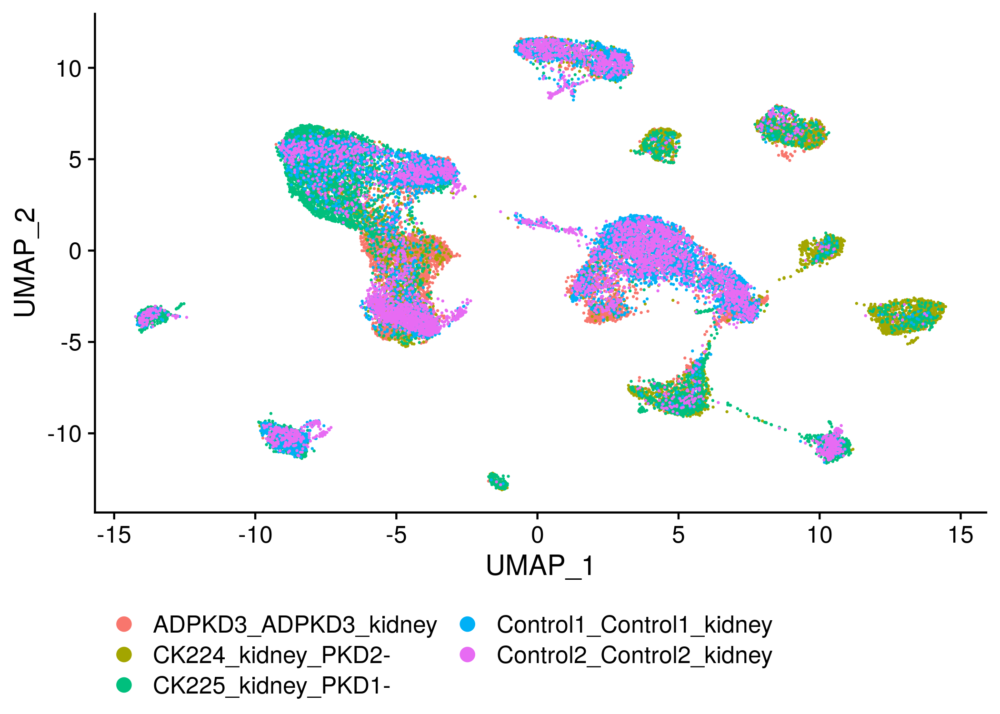
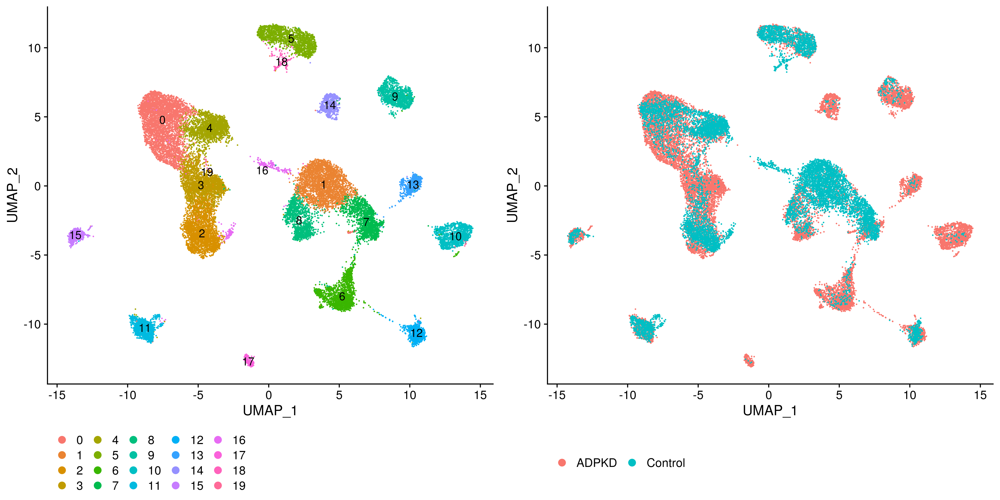
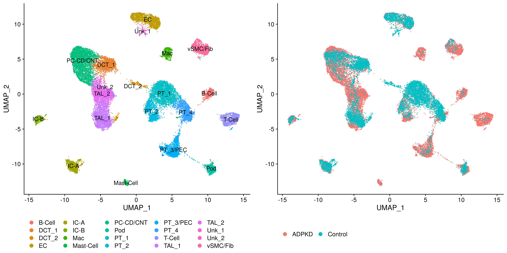
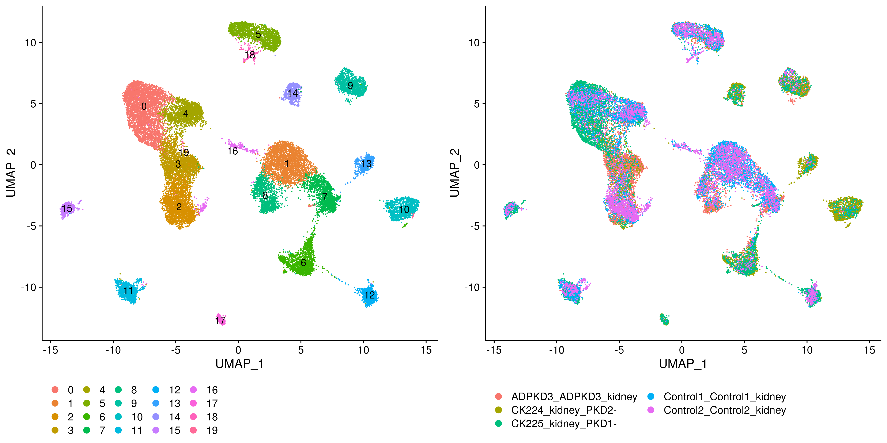
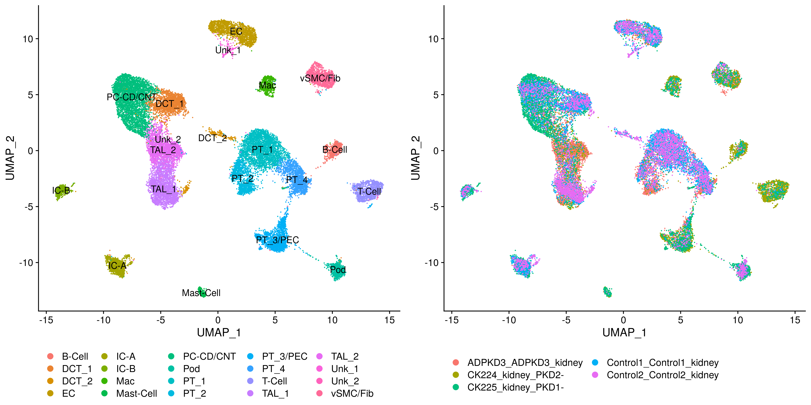

Cluster annotation in integrated Harmony space
================
Javier Perales-Paton - <javier.perales@bioquant.uni-heidelberg.de>

## Load libraries and auxiliar functions

``` r
set.seed(1234)
suppressPackageStartupMessages(require(Seurat))
suppressPackageStartupMessages(require(harmony))
suppressPackageStartupMessages(require(cowplot))
suppressPackageStartupMessages(require(ggplot2))
suppressPackageStartupMessages(require(genesorteR))
suppressPackageStartupMessages(require(openxlsx))
library(cowplot)
source("../src/seurat_fx.R")
```

## Load data

``` r
S <- readRDS(file=paste0("./01_harmony_integration/data","/S.rds"))
Project(S) <- "Integrated_tissue"
```

### 1 wilcox test

``` r
up <- setNames(vector("list",length=length(levels(S))), 
                levels(S))
for(idx in names(up)) {
   up.idx <- FindMarkers(S,ident.1 = idx, 
                         ident.2 = setdiff(levels(S), idx), 
            grouping.var = "orig.ident",
            only.pos=T)
   cols_names <- colnames(up.idx)
   
   # Add two extra cols
   up.idx$cluster <- idx
   up.idx$gene <- rownames(up.idx)
   
   up[[idx]] <- up.idx
}
```

### 2 Gene sorter

``` r
sg <- sortGenes(S@assays$RNA@data, Idents(S))
```

    ## Warning in sortGenes(S@assays$RNA@data, Idents(S)): A Friendly Warning:
    ## Some genes were removed because they were zeros in all cells after
    ## binarization. You probably don't need to do anything but you might want to
    ## look into this. Maybe you forgot to pre-filter the genes? You can also use
    ## a different binarization method. Excluded genes are available in the output
    ## under '$removed'.

## Annotation

``` r
ren_id <- c("0"="PC-CD/CNT",
        "1"="PT_1",
        "2"="TAL_1",
        "3"="TAL_2",
        "4"="DCT_1",
        "5"="EC",
        "6"="PT_3/PEC",
        "7"="PT_4",
        "8"="PT_2",
        "9"="vSMC/Fib",
        "10"="T-Cell",
        "11"="IC-A",
        "12"="Pod", # Podocytes
        "13"="B-Cell",
        "14"="Mac",
        "15"="IC-B",
        "16"="DCT_2",
        "17"="Mast-Cell",
        "18"="Unk_1",
        "19"="Unk_2")
# ren_id <- factor(ren_id, levels=ren_id)
S$idx <- Idents(S)
S$ann <- ren_id[Idents(S)]
```

``` r
stopifnot(all(names(ren_id) %in% levels(S)))
stopifnot(length(ren_id) == length(levels(S)))

S <- RenameIdents(S, ren_id)
S$init_assign <- factor(as.character(Idents(S)))

colnames(sg$condGeneProb) <- ren_id[colnames(sg$condGeneProb)]
colnames(sg$specScore) <- ren_id[colnames(sg$specScore)]
```

Finally we save the markers for manual exploration:

``` r
saveMarkers.Excel(up, sg, S, OUTDIR)
# saveMarkers.CSV(sg, OUTDIR)
```

## Visualization

``` r
S$cond <- ifelse(grepl("Control", S$orig.ident), "Control", "ADPKD")
p1 <- DimPlot(S, group.by="cond") + theme(legend.position="bottom")
```

``` r
p4 <- DimPlot(S, group.by="orig.ident") + 
    guides(fill=guide_legend(nrow=3,byrow=TRUE, size=3),
           colour=guide_legend(nrow=3, override.aes = list(size=3))) + 
           theme(legend.position="bottom")
print(p4)
```

<!-- -->

``` r
p2 <- DimPlot(S, group.by="idx", label=TRUE) + theme(legend.position="bottom")
```

    ## Warning: Using `as.character()` on a quosure is deprecated as of rlang 0.3.0.
    ## Please use `as_label()` or `as_name()` instead.
    ## This warning is displayed once per session.

``` r
p3 <- DimPlot(S, group.by="ann", label=TRUE) + theme(legend.position="bottom")
```

``` r
plot_grid(p2,p1, align="h")
```

<!-- -->

``` r
plot_grid(p3,p1, align="h")
```

<!-- -->

``` r
plot_grid(p2,p4, align="h")
```

<!-- -->

``` r
plot_grid(p3,p4, align="h")
```

<!-- -->
