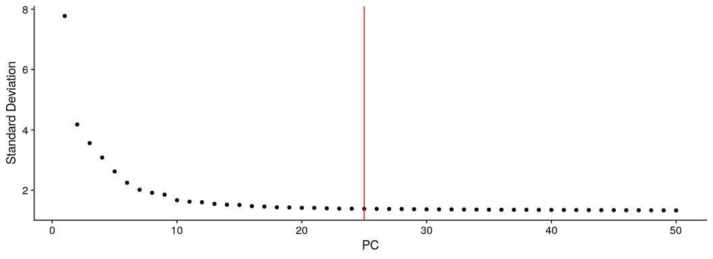
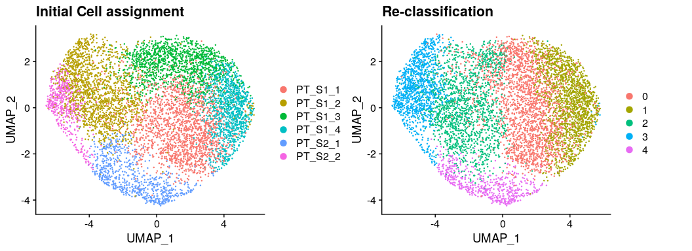
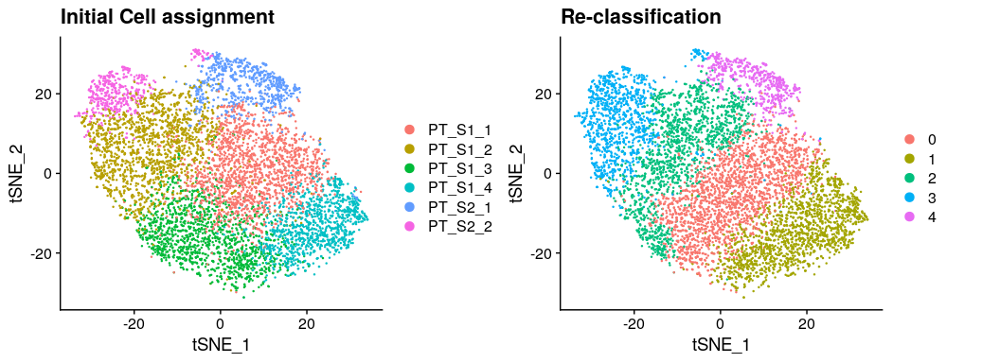

CK120 sorted CD13+ cells : Refine cell clustering
================
Javier Perales-Paton - <javier.perales@bioquant.uni-heidelberg.de>

## Load libraries and auxiliar functions

``` r
set.seed(1234)
suppressPackageStartupMessages(require(Seurat))
suppressPackageStartupMessages(require(ggplot2))
suppressPackageStartupMessages(require(GSEABase))
suppressPackageStartupMessages(require(dplyr))
suppressPackageStartupMessages(require(genesorteR))
suppressPackageStartupMessages(require(ComplexHeatmap))
suppressPackageStartupMessages(require(clustree))
suppressPackageStartupMessages(require(cowplot))
source("../src/seurat_fx.R")
```

## Load SeuratObject with initial clustering outcome

``` r
SeuratObject <- readRDS("./output/2_cell_assignment/data/SeuratObject.rds")
```

## Define output directory

``` r
# Define output directory
OUTDIR <- paste0("./output/3_refine_clustering/")
if(! dir.exists(OUTDIR)) dir.create(OUTDIR, recursive = TRUE)
```

## Re-clustering and high dim. reduction after filtering contaminant populations

To trace back previous cell boundaries, we store the outcome

``` r
if(!"init_seurat_clusters" %in% colnames(SeuratObject@meta.data))
  SeuratObject$init_seurat_clusters <- SeuratObject$seurat_clusters

if(!"init_assign" %in% colnames(SeuratObject@meta.data))
  SeuratObject$init_assign <- Idents(SeuratObject)
```

We remove one cell populations: endothelial cells. This is a contaminant
population since this sample is sorted CD13+, a well-known marker of PT
cells. This cluster is already labelled as “Exclude”, that we use to
remove it here:

``` r
# Remove original reference to clustering
SeuratObject <- SeuratObject[, !grepl("^(Exclude)", 
                                      Idents(SeuratObject))]
```

We proceed with the standard pipeline for cell clustering, over-written
previous outcome

``` r
## Feature selection
SeuratObject <- FindVariableFeatures(SeuratObject, selection.method = "vst", nfeatures = 2000)

## PCA 
SeuratObject <- RunPCA(SeuratObject, features = VariableFeatures(SeuratObject), npcs = 50)
```

    ## PC_ 1 
    ## Positive:  MT-ND2, MT-ND4L, GPX3, MTRNR2L8, GSTA2, UGT2B7, GSTA1, SLC22A8, APOM, PLG 
    ##     FABP1, PRAP1, SLC22A6, AOC1, CTSB, HPD, CUBN, MIOX, FAM151A, SLC13A3 
    ##     LGMN, NAT8, SLC7A8, AZGP1, SLC27A2, SLC5A12, SLC4A4, ALB, PCK1, SLC3A2 
    ## Negative:  EEF1A1, TMSB10, S100A11, IL32, RPL13, RPL10, RPL3, KRT18, VIM, RPL12 
    ##     RPS12, PTMA, RPLP1, MYL6, RPS27A, RPS23, RPS8, RPL8, RPS18, RPL15 
    ##     RPS6, RPL7A, S100A10, RPS2, RPL34, RPL32, RPL18A, GSTP1, RPS3A, RPS24 
    ## PC_ 2 
    ## Positive:  IGFBP7, GSTP1, NUPR1, THY1, TUBA1A, S100A6, TMSB4X, TMSB10, SPARC, PRAP1 
    ##     ANK2, ADGRG1, S100A10, TAGLN2, SPON2, RP11-149I23.3, TNFRSF12A, TMEM54, SLC7A8, GNG11 
    ##     LGMN, PFKP, HSPB8, TPM4, APBB1IP, TXNIP, CLDN4, RARRES2, PAH, PLS3 
    ## Negative:  PCK1, MIOX, DCXR, RBP4, GLYATL1, BHMT, HAO2, GPT, FMO5, BBOX1 
    ##     SLC6A18, ALDH6A1, AGXT, MT1G, CYP17A1, PTER, RP11-536I6.2, SLC7A13, UPP2, MYH8 
    ##     AOX1, MT1H, MSRB1, AKR7A3, MPC1, ACY3, SLC5A10, SLC22A7, ABHD14A, GAPDH 
    ## PC_ 3 
    ## Positive:  RBP4, VIM, TMSB4X, S100A6, AKAP12, SLC6A18, CRYAB, S100A11, MYH8, CRNDE 
    ##     SLC7A13, RP5-1021I20.2, ANXA2, NEU4, TPM1, IL32, LYG1, RP11-536I6.2, MARCKSL1, AGXT 
    ##     PPP1R1A, MARCKS, DEFB1, BPI, ANXA3, ATF3, TNFRSF12A, CYP17A1, RP11-149I23.3, YWHAH 
    ## Negative:  GPX3, PAH, SLC7A8, SLC22A8, FABP1, UGT2B7, GATM, GSTA1, SLC16A9, MAF 
    ##     SLC4A4, FAM151A, GSTA2, CTSB, ANK2, HPD, SLC13A3, PRAP1, CA12, LGMN 
    ##     ALB, THY1, SLC22A6, CUBN, AQP1, CTXN3, SLC3A2, IGFBP7, G0S2, GPAT3 
    ## PC_ 4 
    ## Positive:  SPP1, PIGR, SLC3A1, HSP90B1, RBP4, MT-ND4L, MT-ND2, TNFSF10, CD74, AQP1 
    ##     HSPA5, SLC7A13, ITGB8, NAT8, SLC6A18, TSPAN1, FAM134B, ITGAV, HLA-DRB1, HLA-B 
    ##     AZGP1, CYP4A11, ADGRG1, CTSB, GDF15, CYR61, CLU, INSR, PLG, SOX4 
    ## Negative:  EEF1A1, RPLP1, RPS3A, RPL3, RPS23, RPL7A, RPL13, RPL26, RPL32, RPS27A 
    ##     RPL8, RPS18, FABP1, RPL11, RPL10, RPS12, RPS16, RPL14, RPL15, RPL37 
    ##     RPL5, RPL29, RPS6, RPS24, RPS4X, RPL34, RPL13A, RPS13, RPS2, RPS3 
    ## PC_ 5 
    ## Positive:  GSTA2, GSTA1, EGR1, GATM, ATF3, IER2, FOS, MYH8, PPDPF, MGLL 
    ##     ARG2, NEBL, MRLN, CTXN3, MIDN, MAF, NEU4, JUNB, CALML3, VAV3 
    ##     JUN, PLCH2, DCXR, KRT19, NUPR1, GCAT, BTG2, TBC1D4, KLF6, ZFP36L1 
    ## Negative:  SLC3A1, SPP1, NAT8, PIGR, MT1H, TNFSF10, TSPAN1, HSP90B1, SLC34A1, MT1G 
    ##     CD74, HSPA5, MT2A, HLA-DRB1, AZGP1, SLC5A10, CUBN, MT1E, CDH6, VCAM1 
    ##     MT1F, ABCB1, SLC27A2, FAM134B, HLA-B, AQP1, RPLP1, ITGAV, COL4A2, SLC17A3

``` r
print(ElbowPlot(SeuratObject,ndims = 50) + geom_vline(xintercept = 25, col="red"))
```

<!-- -->

``` r
## Cell clustering
SeuratObject <- FindNeighbors(SeuratObject, dims = 1:25)
```

    ## Computing nearest neighbor graph

    ## Computing SNN

``` r
SeuratObject <- FindClusters(SeuratObject, resolution = 0.5)
```

    ## Modularity Optimizer version 1.3.0 by Ludo Waltman and Nees Jan van Eck
    ## 
    ## Number of nodes: 7121
    ## Number of edges: 277590
    ## 
    ## Running Louvain algorithm...
    ## Maximum modularity in 10 random starts: 0.7706
    ## Number of communities: 5
    ## Elapsed time: 1 seconds

``` r
## Agreement with previous clustering
table("initial"=SeuratObject$init_seurat_clusters,
      "final"=SeuratObject$seurat_clusters)
```

    ##        final
    ## initial    0    1    2    3    4
    ##       0 1326  164  250    1   21
    ##       1   51   10  908  672    2
    ##       2  711  420  254    0    0
    ##       3   29 1104    0    1    0
    ##       4    4    8  163    3  542
    ##       5    0    0    2  470    5
    ##       6    0    0    0    0    0

``` r
table("Assigned"=SeuratObject$init_assign,
      "final"=SeuratObject$seurat_clusters)
```

    ##                      final
    ## Assigned                 0    1    2    3    4
    ##   PT_S1_1             1326  164  250    1   21
    ##   PT_S1_2               51   10  908  672    2
    ##   PT_S1_3              711  420  254    0    0
    ##   PT_S1_4               29 1104    0    1    0
    ##   PT_S2_1                4    8  163    3  542
    ##   PT_S2_2                0    0    2  470    5
    ##   Exclude_endothelial    0    0    0    0    0

``` r
## UMAP
SeuratObject <- RunUMAP(SeuratObject, dims = 1:25)
```

    ## Warning: The default method for RunUMAP has changed from calling Python UMAP via reticulate to the R-native UWOT using the cosine metric
    ## To use Python UMAP via reticulate, set umap.method to 'umap-learn' and metric to 'correlation'
    ## This message will be shown once per session

    ## 15:12:53 UMAP embedding parameters a = 0.9922 b = 1.112

    ## 15:12:53 Read 7121 rows and found 25 numeric columns

    ## 15:12:53 Using Annoy for neighbor search, n_neighbors = 30

    ## 15:12:53 Building Annoy index with metric = cosine, n_trees = 50

    ## 0%   10   20   30   40   50   60   70   80   90   100%

    ## [----|----|----|----|----|----|----|----|----|----|

    ## **************************************************|
    ## 15:12:54 Writing NN index file to temp file /tmp/RtmpNbTjNc/file77b250859324
    ## 15:12:54 Searching Annoy index using 1 thread, search_k = 3000
    ## 15:12:57 Annoy recall = 100%
    ## 15:12:57 Commencing smooth kNN distance calibration using 1 thread
    ## 15:12:58 Initializing from normalized Laplacian + noise
    ## 15:12:58 Commencing optimization for 500 epochs, with 327742 positive edges
    ## 15:13:15 Optimization finished

``` r
d1 <- DimPlot(SeuratObject, group.by = "init_assign") + ggtitle("Initial Cell assignment")
d2 <- DimPlot(SeuratObject) + ggtitle("Re-classification")

print(CombinePlots(list(d1,d2)))
```

<!-- -->

``` r
## tSNE
SeuratObject <- RunTSNE(SeuratObject, dims = 1:25)
d1 <- DimPlot(SeuratObject, group.by = "init_assign", reduction="tsne") + ggtitle("Initial Cell assignment")
d2 <- DimPlot(SeuratObject, reduction="tsne") + ggtitle("Re-classification")

print(CombinePlots(list(d1,d2)))
```

<!-- -->

## Archive processed data for downstream analysis

``` r
# 1 Clustering outcome
write.table(SeuratObject@meta.data[,c(grep("^RNA_snn_res",
                                           colnames(SeuratObject@meta.data),
                                           value=TRUE),
                                      "seurat_clusters"),],
            file=paste0(OUTDIR,"/init_clustering.csv"),
            sep=",", col.names = NA, row.names=TRUE, quote=TRUE)

# 2 2nd round idents (same as seurat_clusters)
write.table(data.frame("Ident"=SeuratObject@active.ident),
            file=paste0(OUTDIR,"/active_idents.csv"),
            sep=",", col.names = NA, row.names = TRUE, quote=TRUE)
```

``` r
DATA_DIR <- paste0(OUTDIR,"/data")
if(!dir.exists(DATA_DIR)) dir.create(DATA_DIR)
```

``` r
saveRDS(SeuratObject, paste0(DATA_DIR,"/SeuratObject.rds"))
```

## Session info

``` r
sessionInfo()
```

    ## R version 3.6.1 (2019-07-05)
    ## Platform: x86_64-pc-linux-gnu (64-bit)
    ## Running under: Ubuntu 18.04.3 LTS
    ## 
    ## Matrix products: default
    ## BLAS:   /usr/lib/x86_64-linux-gnu/blas/libblas.so.3.7.1
    ## LAPACK: /usr/lib/x86_64-linux-gnu/lapack/liblapack.so.3.7.1
    ## 
    ## locale:
    ##  [1] LC_CTYPE=en_US.UTF-8       LC_NUMERIC=C              
    ##  [3] LC_TIME=en_GB.UTF-8        LC_COLLATE=en_US.UTF-8    
    ##  [5] LC_MONETARY=en_GB.UTF-8    LC_MESSAGES=en_US.UTF-8   
    ##  [7] LC_PAPER=en_GB.UTF-8       LC_NAME=C                 
    ##  [9] LC_ADDRESS=C               LC_TELEPHONE=C            
    ## [11] LC_MEASUREMENT=en_GB.UTF-8 LC_IDENTIFICATION=C       
    ## 
    ## attached base packages:
    ##  [1] grid      stats4    parallel  stats     graphics  grDevices utils    
    ##  [8] datasets  methods   base     
    ## 
    ## other attached packages:
    ##  [1] cowplot_1.0.0        clustree_0.4.1       ggraph_2.0.0.9000   
    ##  [4] ComplexHeatmap_2.0.0 genesorteR_0.3.1     Matrix_1.2-17       
    ##  [7] dplyr_0.8.3          GSEABase_1.46.0      graph_1.62.0        
    ## [10] annotate_1.62.0      XML_3.98-1.20        AnnotationDbi_1.46.1
    ## [13] IRanges_2.18.2       S4Vectors_0.22.1     Biobase_2.44.0      
    ## [16] BiocGenerics_0.30.0  ggplot2_3.2.1        Seurat_3.1.0        
    ## 
    ## loaded via a namespace (and not attached):
    ##   [1] Rtsne_0.15          colorspace_1.4-1    rjson_0.2.20       
    ##   [4] ggridges_0.5.1      mclust_5.4.5        circlize_0.4.7     
    ##   [7] GlobalOptions_0.1.0 clue_0.3-57         farver_1.1.0       
    ##  [10] leiden_0.3.1        listenv_0.7.0       npsurv_0.4-0       
    ##  [13] graphlayouts_0.5.0  ggrepel_0.8.1       bit64_0.9-7        
    ##  [16] RSpectra_0.15-0     codetools_0.2-16    splines_3.6.1      
    ##  [19] R.methodsS3_1.7.1   lsei_1.2-0          knitr_1.24         
    ##  [22] polyclip_1.10-0     zeallot_0.1.0       jsonlite_1.6       
    ##  [25] ica_1.0-2           cluster_2.1.0       png_0.1-7          
    ##  [28] R.oo_1.22.0         pheatmap_1.0.12     uwot_0.1.4         
    ##  [31] ggforce_0.3.1       sctransform_0.2.0   compiler_3.6.1     
    ##  [34] httr_1.4.1          backports_1.1.4     assertthat_0.2.1   
    ##  [37] lazyeval_0.2.2      tweenr_1.0.1        htmltools_0.3.6    
    ##  [40] tools_3.6.1         rsvd_1.0.2          igraph_1.2.4.1     
    ##  [43] gtable_0.3.0        glue_1.3.1          RANN_2.6.1         
    ##  [46] reshape2_1.4.3      Rcpp_1.0.2          vctrs_0.2.0        
    ##  [49] gdata_2.18.0        ape_5.3             nlme_3.1-141       
    ##  [52] gbRd_0.4-11         lmtest_0.9-37       xfun_0.9           
    ##  [55] stringr_1.4.0       globals_0.12.4      lifecycle_0.1.0    
    ##  [58] irlba_2.3.3         gtools_3.8.1        future_1.14.0      
    ##  [61] MASS_7.3-51.4       zoo_1.8-6           scales_1.0.0       
    ##  [64] tidygraph_1.1.2     RColorBrewer_1.1-2  yaml_2.2.0         
    ##  [67] memoise_1.1.0       reticulate_1.13     pbapply_1.4-2      
    ##  [70] gridExtra_2.3       stringi_1.4.3       RSQLite_2.1.2      
    ##  [73] caTools_1.17.1.2    bibtex_0.4.2        shape_1.4.4        
    ##  [76] Rdpack_0.11-0       SDMTools_1.1-221.1  rlang_0.4.0        
    ##  [79] pkgconfig_2.0.3     bitops_1.0-6        evaluate_0.14      
    ##  [82] lattice_0.20-38     ROCR_1.0-7          purrr_0.3.2        
    ##  [85] labeling_0.3        htmlwidgets_1.3     bit_1.1-14         
    ##  [88] tidyselect_0.2.5    RcppAnnoy_0.0.13    plyr_1.8.4         
    ##  [91] magrittr_1.5        R6_2.4.0            gplots_3.0.1.1     
    ##  [94] DBI_1.0.0           pillar_1.4.2        withr_2.1.2        
    ##  [97] fitdistrplus_1.0-14 survival_2.44-1.1   RCurl_1.95-4.12    
    ## [100] tibble_2.1.3        future.apply_1.3.0  tsne_0.1-3         
    ## [103] crayon_1.3.4        KernSmooth_2.23-16  plotly_4.9.0       
    ## [106] rmarkdown_1.15      viridis_0.5.1       GetoptLong_0.1.7   
    ## [109] data.table_1.12.8   blob_1.2.0          metap_1.1          
    ## [112] digest_0.6.21       xtable_1.8-4        tidyr_1.0.0        
    ## [115] R.utils_2.9.0       RcppParallel_4.4.3  munsell_0.5.0      
    ## [118] viridisLite_0.3.0

``` r
{                                                                                                                                                                                                           
sink(file=paste0(OUTDIR,"/sessionInfo.txt"))
print(sessionInfo())
sink()
}
```
