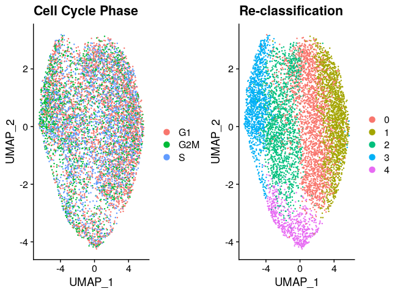
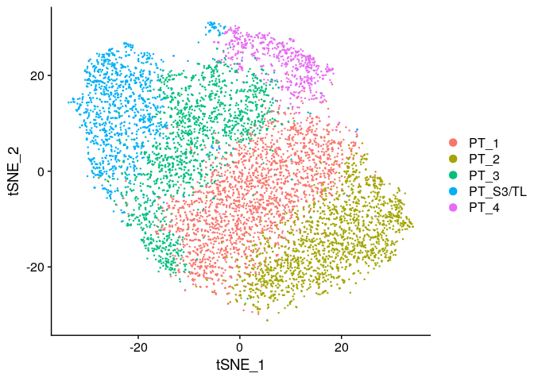
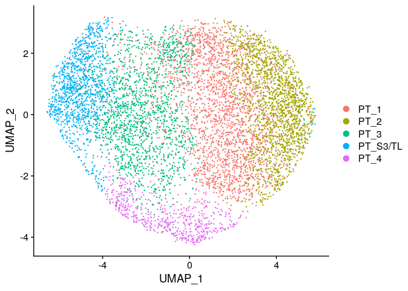

CK120 sorted CD13+ cells : Final cell assignment
================
Javier Perales-Paton - <javier.perales@bioquant.uni-heidelberg.de>

## Load libraries and auxiliar functions

``` r
set.seed(1234)
suppressPackageStartupMessages(require(Seurat))
suppressPackageStartupMessages(require(ggplot2))
suppressPackageStartupMessages(require(GSEABase))
suppressPackageStartupMessages(require(dplyr))
suppressPackageStartupMessages(require(genesorteR))
suppressPackageStartupMessages(require(ComplexHeatmap))
suppressPackageStartupMessages(require(clustree))
suppressPackageStartupMessages(require(cowplot))
suppressPackageStartupMessages(require(openxlsx))
source("../src/seurat_fx.R")
```

## Load SeuratObject with initial clustering outcome

``` r
SeuratObject <- readRDS("./output/3_refine_clustering//data/SeuratObject.rds")
```

## Define output directory

``` r
# Define output directory
OUTDIR <- paste0("./output/4_final_assignment/")
if(! dir.exists(OUTDIR)) dir.create(OUTDIR, recursive = TRUE)
```

## Identify the proliferating PT-like cell population

``` r
s.genes <- cc.genes$s.genes
g2m.genes <- cc.genes$g2m.genes

SeuratObject <- CellCycleScoring(SeuratObject, s.features = s.genes, g2m.features = g2m.genes, set.ident = FALSE)
d3 <- DimPlot(SeuratObject, group.by = "Phase") + ggtitle("Cell Cycle Phase")
d4 <- DimPlot(SeuratObject) + ggtitle("Re-classification")

print(CombinePlots(list(d3,d4)))
```

<!-- -->

## Cell marker extraction

We are going to use two methods for the extraction of cell markers.  
1\. Differential gene expression using wilcox test from Seurat. Only
positive and consistent markers will be tested (with default
parameters).  
2\. GenesorteR to get posterior probabilities for each gene of observing
a certain cell population.

### 1 wilcox test

``` r
up <- setNames(vector("list",length=length(levels(SeuratObject))), 
               levels(SeuratObject))
for(idx in names(up)) {
  up.idx <- FindMarkers(SeuratObject,ident.1 = idx, 
                        ident.2 = setdiff(levels(SeuratObject), idx), only.pos=T)
  cols_names <- colnames(up.idx)
  
  # Add two extra cols
  up.idx$cluster <- idx
  up.idx$gene <- rownames(up.idx)
  
  up[[idx]] <- up.idx
}
```

### 2 Gene sorter

``` r
sg <- sortGenes(SeuratObject@assays$RNA@data, Idents(SeuratObject))
```

    ## Warning in sortGenes(SeuratObject@assays$RNA@data, Idents(SeuratObject)):
    ## A Friendly Warning: Some genes were removed because they were zeros in all
    ## cells after binarization. You probably don't need to do anything but you
    ## might want to look into this. Maybe you forgot to pre-filter the genes? You
    ## can also use a different binarization method. Excluded genes are available
    ## in the output under '$removed'.

``` r
#define a small set of markers
#mm = getMarkers(sg, quant = 0.975)

#cluster genes and make a heatmap
#pp = plotMarkerHeat(sg$inputMat, sg$inputClass, mm$markers, clusterGenes=TRUE, outs = TRUE)

#pp$gene_class_info #gene clusters

#the top 25 genes for each cluster by specificity scores
top_markers = apply(sg$specScore, 2, function(x) names(head(sort(x, decreasing = TRUE), n = 25)))
```

Finally we save the markers for manual exploration:

``` r
saveMarkers.Excel(up, sg, SeuratObject, OUTDIR)
saveMarkers.CSV(up, OUTDIR)
saveMarkers.CSV(sg, OUTDIR)
```

## Final cell assignment

The final table of markers on the second round of cell clustering give
the following results:

| Cluster   | rational  |
| :-------- | :-------- |
| Cluster 0 | PT\_S2\_1 |
| Cluster 1 | PT\_S2\_2 |
| Cluster 2 | PT\_S2\_3 |
| Cluster 3 | PT\_S1\_1 |
| Cluster 4 | PT\_S3    |

``` r
ren_id <- c("0"="PT_S2_1",
            "1"="PT_S2_2",
            "2"="PT_S2_3",
            "3"="PT_S1_1",
            "4"="PT_S3")
SeuratObject <- RenameIdents(SeuratObject, ren_id)
```

``` r
reporters <- list("PT-S1"=c("SLC5A2"),
                  "PT-S2"=c("SLC22A6"),
                  "PT-S3"=c("AGT"))
```

``` r
# condGeneProb from genesorteR
Heatmap(as.matrix(sg$condGeneProb)[unlist(reporters),], name="condGeneProb",
        col=c("white","red"),row_names_gp = gpar(fontsize=10),
        cluster_rows = FALSE, cluster_columns = FALSE,
        split = factor(unlist(sapply(names(reporters), function(z) rep(z,length(reporters[[z]])))),
                       levels=names(reporters)),
        row_title_rot = 0,row_gap = unit(0, "mm"),border=TRUE
        )
```

<!-- -->

### TSNE

``` r
DimPlot(SeuratObject, reduction="tsne")
```

<!-- -->

### UMAP

``` r
DimPlot(SeuratObject, reduction="umap")
```

<!-- -->

## Archive processed data for downstream analysis

``` r
# final idents
write.table(data.frame("Ident"=SeuratObject@active.ident,
               "seurat_clusters"=SeuratObject$seurat_clusters),
            file=paste0(OUTDIR,"/active_idents.csv"),
            sep=",", col.names = NA, row.names = TRUE, quote=TRUE)
```

``` r
DATA_DIR <- paste0(OUTDIR,"/data")
if(!dir.exists(DATA_DIR)) dir.create(DATA_DIR)
```

``` r
saveRDS(SeuratObject, paste0(DATA_DIR,"/SeuratObject.rds"))
saveRDS(up, file=paste0(OUTDIR,"/wilcox_up.rds"))
saveRDS(sg, file=paste0(OUTDIR,"/genesorter_out.rds"))

# After Rename Idents
saveMarkers.Excel(up, sg, SeuratObject, OUTDIR)
```

## Session info

``` r
sessionInfo()
```

    ## R version 3.6.1 (2019-07-05)
    ## Platform: x86_64-pc-linux-gnu (64-bit)
    ## Running under: Ubuntu 18.04.3 LTS
    ## 
    ## Matrix products: default
    ## BLAS:   /usr/lib/x86_64-linux-gnu/blas/libblas.so.3.7.1
    ## LAPACK: /usr/lib/x86_64-linux-gnu/lapack/liblapack.so.3.7.1
    ## 
    ## locale:
    ##  [1] LC_CTYPE=en_US.UTF-8       LC_NUMERIC=C              
    ##  [3] LC_TIME=en_GB.UTF-8        LC_COLLATE=en_US.UTF-8    
    ##  [5] LC_MONETARY=en_GB.UTF-8    LC_MESSAGES=en_US.UTF-8   
    ##  [7] LC_PAPER=en_GB.UTF-8       LC_NAME=C                 
    ##  [9] LC_ADDRESS=C               LC_TELEPHONE=C            
    ## [11] LC_MEASUREMENT=en_GB.UTF-8 LC_IDENTIFICATION=C       
    ## 
    ## attached base packages:
    ##  [1] grid      stats4    parallel  stats     graphics  grDevices utils    
    ##  [8] datasets  methods   base     
    ## 
    ## other attached packages:
    ##  [1] openxlsx_4.2.3       cowplot_1.0.0        clustree_0.4.1      
    ##  [4] ggraph_2.0.0.9000    ComplexHeatmap_2.0.0 genesorteR_0.3.1    
    ##  [7] Matrix_1.2-17        dplyr_0.8.3          GSEABase_1.46.0     
    ## [10] graph_1.62.0         annotate_1.62.0      XML_3.98-1.20       
    ## [13] AnnotationDbi_1.46.1 IRanges_2.18.2       S4Vectors_0.22.1    
    ## [16] Biobase_2.44.0       BiocGenerics_0.30.0  ggplot2_3.3.3       
    ## [19] Seurat_3.1.0         rmarkdown_1.15       nvimcom_0.9-82      
    ## 
    ## loaded via a namespace (and not attached):
    ##   [1] backports_1.1.4     circlize_0.4.7      plyr_1.8.4         
    ##   [4] igraph_1.2.4.1      lazyeval_0.2.2      splines_3.6.1      
    ##   [7] listenv_0.7.0       digest_0.6.21       htmltools_0.3.6    
    ##  [10] viridis_0.5.1       gdata_2.18.0        magrittr_1.5       
    ##  [13] memoise_1.1.0       cluster_2.1.0       ROCR_1.0-7         
    ##  [16] globals_0.12.4      graphlayouts_0.5.0  RcppParallel_4.4.3 
    ##  [19] R.utils_2.9.0       colorspace_1.4-1    blob_1.2.0         
    ##  [22] ggrepel_0.8.1       xfun_0.9            crayon_1.3.4       
    ##  [25] RCurl_1.95-4.12     jsonlite_1.6        zeallot_0.1.0      
    ##  [28] survival_2.44-1.1   zoo_1.8-6           ape_5.3            
    ##  [31] glue_1.3.1          polyclip_1.10-0     gtable_0.3.0       
    ##  [34] leiden_0.3.1        GetoptLong_0.1.7    future.apply_1.3.0 
    ##  [37] shape_1.4.4         scales_1.0.0        pheatmap_1.0.12    
    ##  [40] DBI_1.0.0           bibtex_0.4.2        Rcpp_1.0.2         
    ##  [43] metap_1.1           viridisLite_0.3.0   xtable_1.8-4       
    ##  [46] clue_0.3-57         reticulate_1.13     bit_1.1-14         
    ##  [49] rsvd_1.0.2          mclust_5.4.5        SDMTools_1.1-221.1 
    ##  [52] tsne_0.1-3          htmlwidgets_1.3     httr_1.4.1         
    ##  [55] gplots_3.0.1.1      RColorBrewer_1.1-2  ica_1.0-2          
    ##  [58] pkgconfig_2.0.3     R.methodsS3_1.7.1   farver_1.1.0       
    ##  [61] uwot_0.1.4          labeling_0.3        tidyselect_0.2.5   
    ##  [64] rlang_0.4.0         reshape2_1.4.3      munsell_0.5.0      
    ##  [67] tools_3.6.1         RSQLite_2.1.2       ggridges_0.5.1     
    ##  [70] evaluate_0.14       stringr_1.4.0       yaml_2.2.0         
    ##  [73] npsurv_0.4-0        knitr_1.24          bit64_0.9-7        
    ##  [76] fitdistrplus_1.0-14 tidygraph_1.1.2     zip_2.1.1          
    ##  [79] caTools_1.17.1.2    purrr_0.3.2         RANN_2.6.1         
    ##  [82] pbapply_1.4-2       future_1.14.0       nlme_3.1-141       
    ##  [85] R.oo_1.22.0         compiler_3.6.1      plotly_4.9.0       
    ##  [88] png_0.1-7           lsei_1.2-0          tibble_2.1.3       
    ##  [91] tweenr_1.0.1        stringi_1.4.3       lattice_0.20-38    
    ##  [94] vctrs_0.2.0         pillar_1.4.2        lifecycle_0.1.0    
    ##  [97] Rdpack_0.11-0       lmtest_0.9-37       GlobalOptions_0.1.0
    ## [100] RcppAnnoy_0.0.13    data.table_1.12.8   bitops_1.0-6       
    ## [103] irlba_2.3.3         gbRd_0.4-11         R6_2.4.0           
    ## [106] KernSmooth_2.23-16  gridExtra_2.3       codetools_0.2-16   
    ## [109] MASS_7.3-51.4       gtools_3.8.1        assertthat_0.2.1   
    ## [112] rjson_0.2.20        withr_2.1.2         sctransform_0.2.0  
    ## [115] tidyr_1.0.0         Rtsne_0.15          ggforce_0.3.1

``` r
{                                                                                                                                                                                                           
sink(file=paste0(OUTDIR,"/sessionInfo.txt"))
print(sessionInfo())
sink()
}
```
