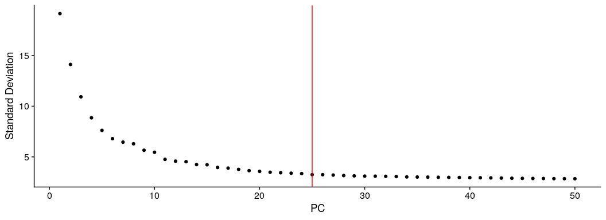
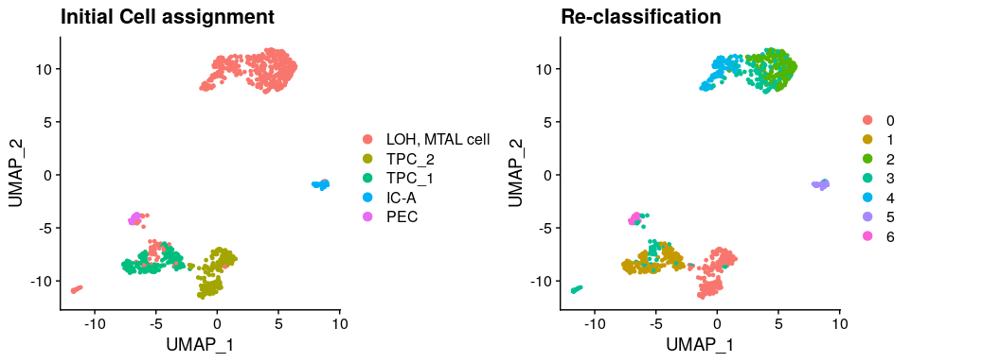
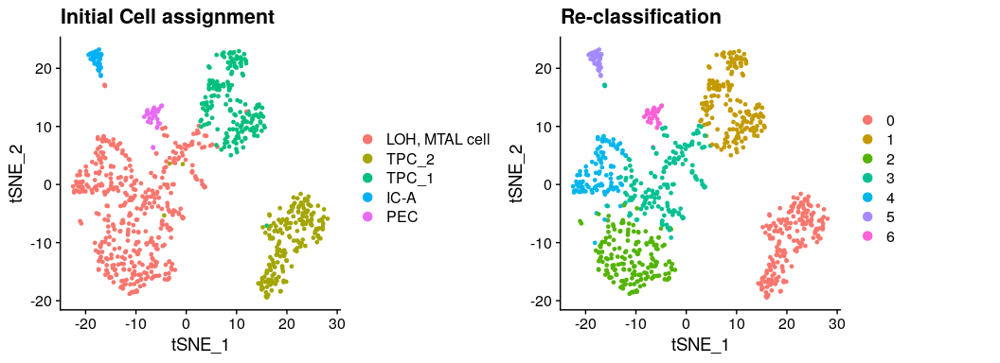

CK121 sorted CD24+ cells : Refine cell clustering
================
Javier Perales-Paton - <javier.perales@bioquant.uni-heidelberg.de>

## Load libraries and auxiliar functions

``` r
set.seed(1234)
suppressPackageStartupMessages(require(Seurat))
suppressPackageStartupMessages(require(ggplot2))
suppressPackageStartupMessages(require(GSEABase))
suppressPackageStartupMessages(require(dplyr))
suppressPackageStartupMessages(require(genesorteR))
suppressPackageStartupMessages(require(ComplexHeatmap))
suppressPackageStartupMessages(require(clustree))
suppressPackageStartupMessages(require(cowplot))
source("../src/seurat_fx.R")
```

## Load SeuratObject with initial clustering outcome

``` r
SeuratObject <- readRDS("./output/2_cell_assignment/data/SeuratObject.rds")
```

## Define output directory

``` r
# Define output directory
OUTDIR <- paste0("./output/3_refine_clustering/")
if(! dir.exists(OUTDIR)) dir.create(OUTDIR, recursive = TRUE)
```

## Re-clustering and high dim. reduction after filtering contaminant populations

To trace back previous cell boundaries, we store the outcome

``` r
if(!"init_seurat_clusters" %in% colnames(SeuratObject@meta.data))
  SeuratObject$init_seurat_clusters <- SeuratObject$seurat_clusters

if(!"init_assign" %in% colnames(SeuratObject@meta.data))
  SeuratObject$init_assign <- Idents(SeuratObject)
```

We remove several (5 hematopoietic and 1 endothelial) cell populations
that contaminant given the tubuloid-derived source of the cell sorting.
See `2_cell_assignment_CK121_CD24.Rmd` for a complete repoort.

``` r
# Remove original reference to clustering
SeuratObject <- SeuratObject[, !grepl("^(Exclude)", 
                                      Idents(SeuratObject))]
```

We proceed with the standard pipeline for cell clustering, over-written
previous outcome

``` r
## Feature selection
SeuratObject <- FindVariableFeatures(SeuratObject, selection.method = "vst", nfeatures = 2000)

## PCA 
SeuratObject <- RunPCA(SeuratObject, features = VariableFeatures(SeuratObject), npcs = 50)
```

    ## PC_ 1 
    ## Positive:  BTG1, LAPTM5, PTPRC, SRGN, RGS2, CD37, JUNB, FAM65B, CXCR4, TMSB4X 
    ##     SLC2A3, BTG2, CTSS, HLA-B, BASP1, NCF1, ARHGDIB, LCP1, MNDA, SELL 
    ##     CORO1A, GMFG, S100A8, LTB, S100A9, CD55, DUSP1, EVI2B, CD52, CD79A 
    ## Negative:  KRT18, KRT8, ITGB8, IGFBP7, TMEM176B, TPM1, CLDN3, TSPAN1, PIGR, ATP1B1 
    ##     CRYAB, CLU, CLDN4, SLC3A1, TMEM176A, SOX4, PDZK1IP1, CXCL14, ELF3, KRT7 
    ##     PDZK1, IL32, SOX9, MGST1, MT1E, UGT2A3, ANXA2, SPP1, TUBA1C, FAM134B 
    ## PC_ 2 
    ## Positive:  GATM, NAT8, ALDOB, LGALS2, GLYAT, ASS1, RBP5, PDZK1, BHMT, MIOX 
    ##     DPYS, UGT2B7, PDZK1IP1, GSTA1, DDC, AK4, KHK, FTCD, GLYATL1, MGST1 
    ##     MT1G, PEPD, GPX3, FBP1, PAH, CUBN, APOE, EHHADH, PRODH2, PRAP1 
    ## Negative:  MUC1, MAL, ERBB4, WFDC2, DEFB1, S100A2, TMPRSS4, KCNJ1, TACSTD2, TSPAN8 
    ##     ITGB6, MECOM, ITM2C, CLCNKB, SLC12A1, ATP6V1B1, BCAM, SFRP1, PAPPA2, IGFBP2 
    ##     CA12, CLDN16, CD9, TFCP2L1, TMEM213, LGALS3, TFAP2B, ITGA2, CASR, ATP6V0A4 
    ## PC_ 3 
    ## Positive:  BGN, COL8A1, SPARC, CLDN1, PTN, COL6A2, VCAM1, CFH, PDLIM3, C1S 
    ##     CTGF, VIM, SPON2, CDH6, MXRA8, ITGB8, SULT1C4, SBSPON, C1orf186, BAMBI 
    ##     FSTL3, TMSB4X, NBL1, NSG1, CDH2, FHL1, UGT2A3, HRH1, CALD1, COL12A1 
    ## Negative:  ALDOB, GSTA1, BBOX1, MIOX, GSTA2, PCK1, HPD, FABP1, PTH1R, CLCNKB 
    ##     CA12, GLYATL1, PRODH2, APOE, ALDH6A1, DPYS, AK4, KCNJ1, ATP6V1B1, KHK 
    ##     GPD1, ALB, TMEM213, CMBL, DDC, SLC13A3, SLC22A8, AGXT2, FOLR1, PLG 
    ## PC_ 4 
    ## Positive:  ATP6V0D2, DMRT2, LINC01187, ATP6V1C2, SLC26A7, ITIH5, ATP6V1G3, HEPACAM2, KIT, MUC20 
    ##     PACRG, ADGRF5, TMEM213, PTGER3, FOXI1, SMIM6, CA8, SPARCL1, RCAN2, C1orf64 
    ##     PDE1C, TMEM61, BSND, CLNK, ATP6V0A4, RHBG, ERP27, NXPH2, STAC2, FOXI2 
    ## Negative:  SLC12A1, TSPAN8, ITGB6, CLDN16, TMPRSS4, S100A2, PTH1R, PCSK1N, SLPI, CLDN10 
    ##     LAMC2, PAPPA2, AOC1, CASR, SOD3, LAMA3, AGR2, IGFBP6, CXCL14, IRX2 
    ##     PLCB1, KLHL13, BBOX1, C5orf38, CLDN14, GPC3, SFRP1, ERBB4, GNAI1, ACPP 
    ## PC_ 5 
    ## Positive:  CFH, LAMP5, CRB2, COL3A1, KLK6, IGFBP2, PTGDS, TCEAL2, COL6A2, AEBP1 
    ##     NTM, DPYSL3, TNNT2, BGN, LONRF2, CTGF, NID2, BMP7, COL1A1, MGP 
    ##     C1QL1, MYL9, GPX3, FOXC2, FXYD1, OLFML2B, F3, TSPAN5, MXRA8, GSTA1 
    ## Negative:  SLC44A4, UGT2A3, AKR1C1, C19orf33, REG1A, TSPAN1, CLDN4, CITED4, KRT8, PIGR 
    ##     EPS8, PROSER2, NSG1, PTN, TUBA1C, RP11-14N7.2, IL18, KRT80, CCDC146, BAMBI 
    ##     FAM134B, REG3G, SLC6A20, HS3ST1, PLLP, AR, KRT7, NAPSA, KRT18, SLC47A1

``` r
print(ElbowPlot(SeuratObject,ndims = 50) + geom_vline(xintercept = 25, col="red"))
```

<!-- -->

``` r
## Cell clustering
SeuratObject <- FindNeighbors(SeuratObject, dims = 1:25)
```

    ## Computing nearest neighbor graph

    ## Computing SNN

``` r
SeuratObject <- FindClusters(SeuratObject, resolution = 0.5)
```

    ## Modularity Optimizer version 1.3.0 by Ludo Waltman and Nees Jan van Eck
    ## 
    ## Number of nodes: 868
    ## Number of edges: 26911
    ## 
    ## Running Louvain algorithm...
    ## Maximum modularity in 10 random starts: 0.8439
    ## Number of communities: 7
    ## Elapsed time: 0 seconds

``` r
## Agreement with previous clustering
table("initial"=SeuratObject$init_seurat_clusters,
      "final"=SeuratObject$seurat_clusters)
```

    ##        final
    ## initial   0   1   2   3   4   5   6
    ##      0    0   0   0   0   0   0   0
    ##      1    0   0   0   0   0   0   0
    ##      2    0   4 174 160 107   0   0
    ##      3    0   0   0   0   0   0   0
    ##      4  178   0   0   3   0   0   0
    ##      5    1 174   0   1   0   0   0
    ##      6    0   0   0   0   0   0   0
    ##      7    0   0   0   0   0   0   0
    ##      8    0   0   0   0   0  35   0
    ##      9    0   0   0   1   0   0  30
    ##      10   0   0   0   0   0   0   0

``` r
table("Assigned"=SeuratObject$init_assign,
      "final"=SeuratObject$seurat_clusters)
```

    ##                        final
    ## Assigned                  0   1   2   3   4   5   6
    ##   Exclude_hematopoietic   0   0   0   0   0   0   0
    ##   LOH, MTAL cell          0   4 174 160 107   0   0
    ##   TPC_2                 178   0   0   3   0   0   0
    ##   TPC_1                   1 174   0   1   0   0   0
    ##   Exclude_endothelial     0   0   0   0   0   0   0
    ##   IC-A                    0   0   0   0   0  35   0
    ##   PEC                     0   0   0   1   0   0  30

``` r
## UMAP
SeuratObject <- RunUMAP(SeuratObject, dims = 1:25)
```

    ## Warning: The default method for RunUMAP has changed from calling Python UMAP via reticulate to the R-native UWOT using the cosine metric
    ## To use Python UMAP via reticulate, set umap.method to 'umap-learn' and metric to 'correlation'
    ## This message will be shown once per session

    ## 15:06:03 UMAP embedding parameters a = 0.9922 b = 1.112

    ## 15:06:03 Read 868 rows and found 25 numeric columns

    ## 15:06:03 Using Annoy for neighbor search, n_neighbors = 30

    ## 15:06:03 Building Annoy index with metric = cosine, n_trees = 50

    ## 0%   10   20   30   40   50   60   70   80   90   100%

    ## [----|----|----|----|----|----|----|----|----|----|

    ## **************************************************|
    ## 15:06:03 Writing NN index file to temp file /tmp/RtmpQNZugM/file7568149d4aa6
    ## 15:06:03 Searching Annoy index using 1 thread, search_k = 3000
    ## 15:06:03 Annoy recall = 100%
    ## 15:06:03 Commencing smooth kNN distance calibration using 1 thread
    ## 15:06:04 Initializing from normalized Laplacian + noise
    ## 15:06:04 Commencing optimization for 500 epochs, with 33220 positive edges
    ## 15:06:06 Optimization finished

``` r
d1 <- DimPlot(SeuratObject, group.by = "init_assign") + ggtitle("Initial Cell assignment")
d2 <- DimPlot(SeuratObject) + ggtitle("Re-classification")

print(CombinePlots(list(d1,d2)))
```

<!-- -->

``` r
## tSNE
SeuratObject <- RunTSNE(SeuratObject, dims = 1:25)
d1 <- DimPlot(SeuratObject, group.by = "init_assign", reduction="tsne") + ggtitle("Initial Cell assignment")
d2 <- DimPlot(SeuratObject, reduction="tsne") + ggtitle("Re-classification")

print(CombinePlots(list(d1,d2)))
```

<!-- -->

## Archive processed data for downstream analysis

``` r
# 1 Clustering outcome
write.table(SeuratObject@meta.data[,c(grep("^RNA_snn_res",
                                           colnames(SeuratObject@meta.data),
                                           value=TRUE),
                                      "seurat_clusters"),],
            file=paste0(OUTDIR,"/init_clustering.csv"),
            sep=",", col.names = NA, row.names=TRUE, quote=TRUE)

# 2 2nd round idents (same as seurat_clusters)
write.table(data.frame("Ident"=SeuratObject@active.ident),
            file=paste0(OUTDIR,"/active_idents.csv"),
            sep=",", col.names = NA, row.names = TRUE, quote=TRUE)
```

``` r
DATA_DIR <- paste0(OUTDIR,"/data")
if(!dir.exists(DATA_DIR)) dir.create(DATA_DIR)
```

``` r
saveRDS(SeuratObject, paste0(DATA_DIR,"/SeuratObject.rds"))
```

## Session info

``` r
sessionInfo()
```

    ## R version 3.6.1 (2019-07-05)
    ## Platform: x86_64-pc-linux-gnu (64-bit)
    ## Running under: Ubuntu 18.04.3 LTS
    ## 
    ## Matrix products: default
    ## BLAS:   /usr/lib/x86_64-linux-gnu/blas/libblas.so.3.7.1
    ## LAPACK: /usr/lib/x86_64-linux-gnu/lapack/liblapack.so.3.7.1
    ## 
    ## locale:
    ##  [1] LC_CTYPE=en_US.UTF-8       LC_NUMERIC=C              
    ##  [3] LC_TIME=en_GB.UTF-8        LC_COLLATE=en_US.UTF-8    
    ##  [5] LC_MONETARY=en_GB.UTF-8    LC_MESSAGES=en_US.UTF-8   
    ##  [7] LC_PAPER=en_GB.UTF-8       LC_NAME=C                 
    ##  [9] LC_ADDRESS=C               LC_TELEPHONE=C            
    ## [11] LC_MEASUREMENT=en_GB.UTF-8 LC_IDENTIFICATION=C       
    ## 
    ## attached base packages:
    ##  [1] grid      stats4    parallel  stats     graphics  grDevices utils    
    ##  [8] datasets  methods   base     
    ## 
    ## other attached packages:
    ##  [1] cowplot_1.0.0        clustree_0.4.1       ggraph_2.0.0.9000   
    ##  [4] ComplexHeatmap_2.0.0 genesorteR_0.3.1     Matrix_1.2-17       
    ##  [7] dplyr_0.8.3          GSEABase_1.46.0      graph_1.62.0        
    ## [10] annotate_1.62.0      XML_3.98-1.20        AnnotationDbi_1.46.1
    ## [13] IRanges_2.18.2       S4Vectors_0.22.1     Biobase_2.44.0      
    ## [16] BiocGenerics_0.30.0  ggplot2_3.2.1        Seurat_3.1.0        
    ## 
    ## loaded via a namespace (and not attached):
    ##   [1] Rtsne_0.15          colorspace_1.4-1    rjson_0.2.20       
    ##   [4] ggridges_0.5.1      mclust_5.4.5        circlize_0.4.7     
    ##   [7] GlobalOptions_0.1.0 clue_0.3-57         farver_1.1.0       
    ##  [10] leiden_0.3.1        listenv_0.7.0       npsurv_0.4-0       
    ##  [13] graphlayouts_0.5.0  ggrepel_0.8.1       bit64_0.9-7        
    ##  [16] RSpectra_0.15-0     codetools_0.2-16    splines_3.6.1      
    ##  [19] R.methodsS3_1.7.1   lsei_1.2-0          knitr_1.24         
    ##  [22] polyclip_1.10-0     zeallot_0.1.0       jsonlite_1.6       
    ##  [25] ica_1.0-2           cluster_2.1.0       png_0.1-7          
    ##  [28] R.oo_1.22.0         pheatmap_1.0.12     uwot_0.1.4         
    ##  [31] ggforce_0.3.1       sctransform_0.2.0   compiler_3.6.1     
    ##  [34] httr_1.4.1          backports_1.1.4     assertthat_0.2.1   
    ##  [37] lazyeval_0.2.2      tweenr_1.0.1        htmltools_0.3.6    
    ##  [40] tools_3.6.1         rsvd_1.0.2          igraph_1.2.4.1     
    ##  [43] gtable_0.3.0        glue_1.3.1          RANN_2.6.1         
    ##  [46] reshape2_1.4.3      Rcpp_1.0.2          vctrs_0.2.0        
    ##  [49] gdata_2.18.0        ape_5.3             nlme_3.1-141       
    ##  [52] gbRd_0.4-11         lmtest_0.9-37       xfun_0.9           
    ##  [55] stringr_1.4.0       globals_0.12.4      lifecycle_0.1.0    
    ##  [58] irlba_2.3.3         gtools_3.8.1        future_1.14.0      
    ##  [61] MASS_7.3-51.4       zoo_1.8-6           scales_1.0.0       
    ##  [64] tidygraph_1.1.2     RColorBrewer_1.1-2  yaml_2.2.0         
    ##  [67] memoise_1.1.0       reticulate_1.13     pbapply_1.4-2      
    ##  [70] gridExtra_2.3       stringi_1.4.3       RSQLite_2.1.2      
    ##  [73] caTools_1.17.1.2    bibtex_0.4.2        shape_1.4.4        
    ##  [76] Rdpack_0.11-0       SDMTools_1.1-221.1  rlang_0.4.0        
    ##  [79] pkgconfig_2.0.3     bitops_1.0-6        evaluate_0.14      
    ##  [82] lattice_0.20-38     ROCR_1.0-7          purrr_0.3.2        
    ##  [85] labeling_0.3        htmlwidgets_1.3     bit_1.1-14         
    ##  [88] tidyselect_0.2.5    RcppAnnoy_0.0.13    plyr_1.8.4         
    ##  [91] magrittr_1.5        R6_2.4.0            gplots_3.0.1.1     
    ##  [94] DBI_1.0.0           pillar_1.4.2        withr_2.1.2        
    ##  [97] fitdistrplus_1.0-14 survival_2.44-1.1   RCurl_1.95-4.12    
    ## [100] tibble_2.1.3        future.apply_1.3.0  tsne_0.1-3         
    ## [103] crayon_1.3.4        KernSmooth_2.23-16  plotly_4.9.0       
    ## [106] rmarkdown_1.15      viridis_0.5.1       GetoptLong_0.1.7   
    ## [109] data.table_1.12.8   blob_1.2.0          metap_1.1          
    ## [112] digest_0.6.21       xtable_1.8-4        tidyr_1.0.0        
    ## [115] R.utils_2.9.0       RcppParallel_4.4.3  munsell_0.5.0      
    ## [118] viridisLite_0.3.0

``` r
{                                                                                                                                                                                                           
sink(file=paste0(OUTDIR,"/sessionInfo.txt"))
print(sessionInfo())
sink()
}
```
