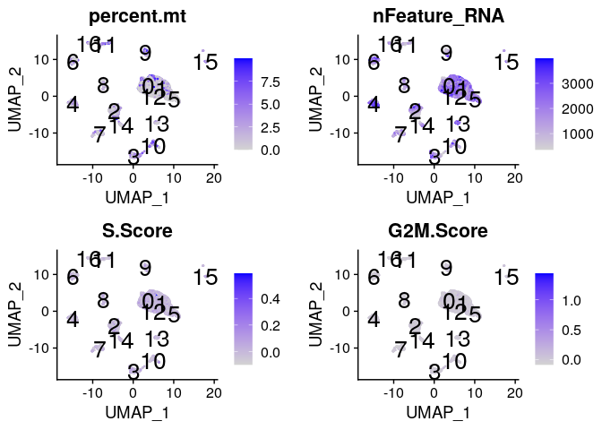
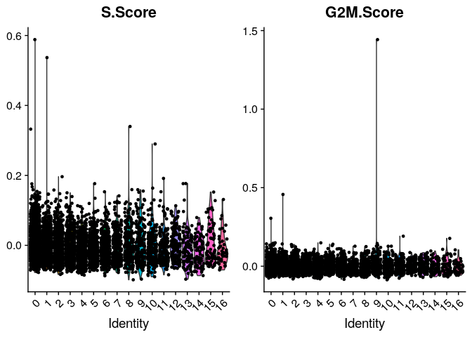
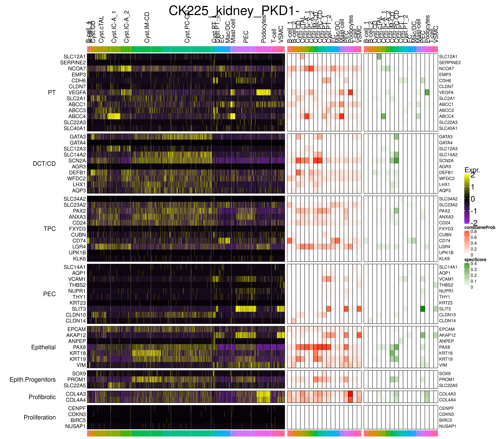
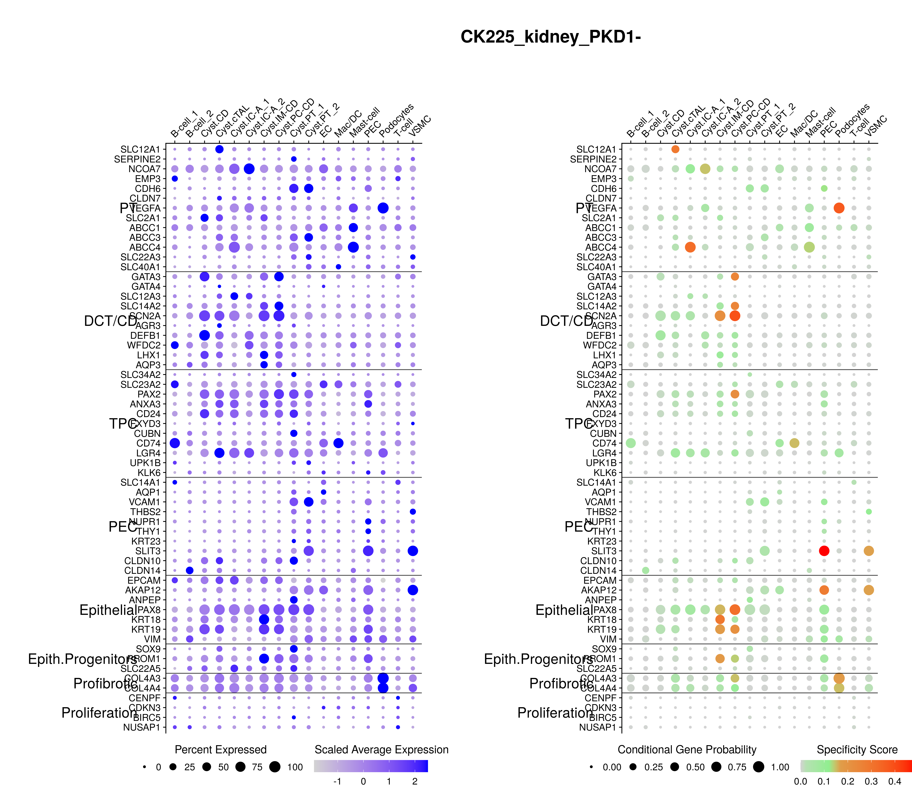
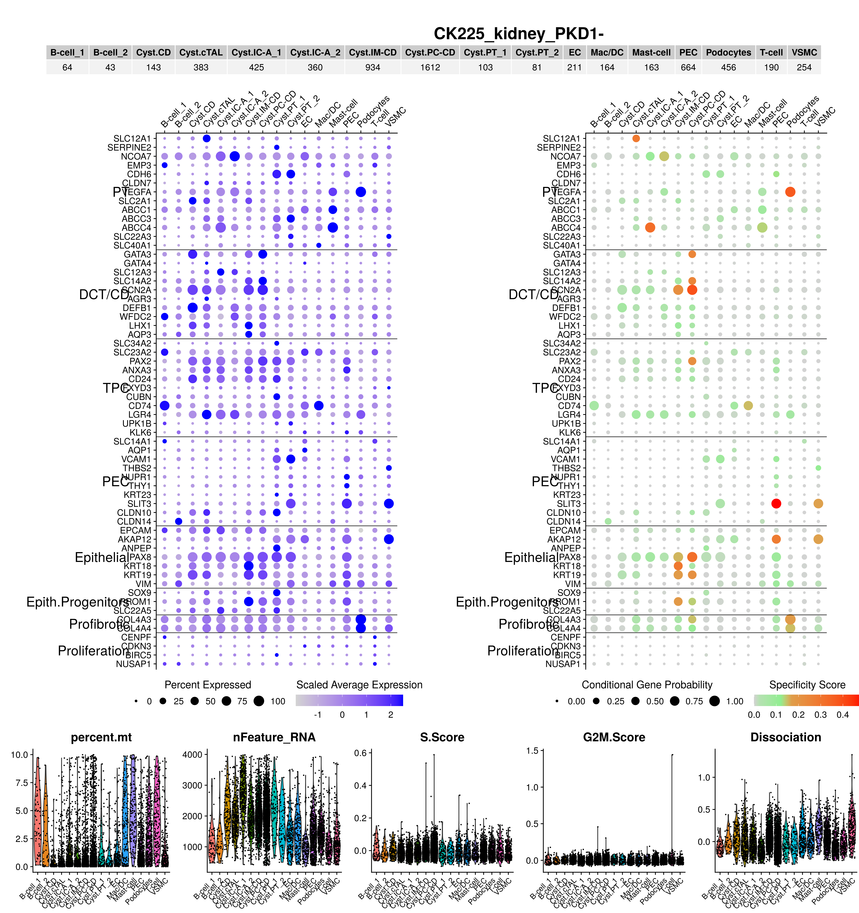
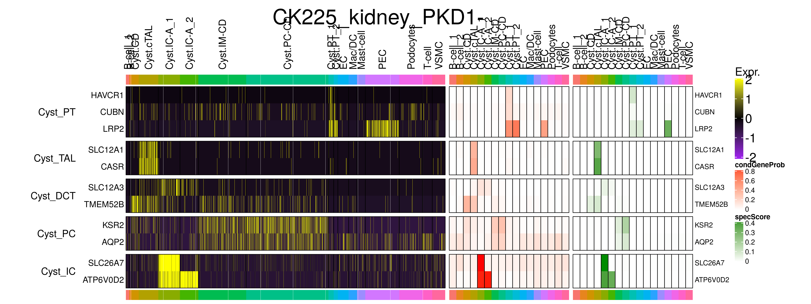
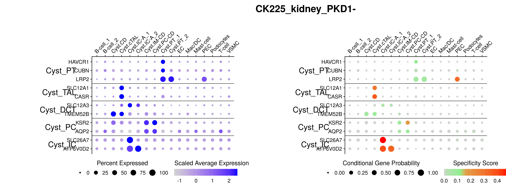
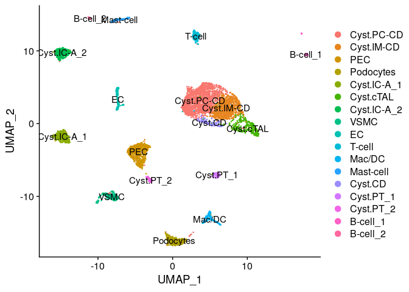

CK225 whole tissue biopsy, PKD1- genotype: cell assignment
================
Javier Perales-Paton - <javier.perales@bioquant.uni-heidelberg.de>

## Load libraries and auxiliar functions

``` r
set.seed(1234)
suppressPackageStartupMessages(require(Seurat))
suppressPackageStartupMessages(require(ggplot2))
suppressPackageStartupMessages(require(GSEABase))
suppressPackageStartupMessages(require(dplyr))
suppressPackageStartupMessages(require(genesorteR))
suppressPackageStartupMessages(require(ComplexHeatmap))
suppressPackageStartupMessages(require(clustree))
suppressPackageStartupMessages(require(cowplot))
suppressPackageStartupMessages(require(openxlsx))
source("../src/seurat_fx.R")
```

## Load SeuratObject with initial clustering outcome

``` r
SeuratObject <- readRDS("./output/1_initial_clustering/data/SeuratObject.rds")
```

## Define output directory

``` r
# Define output directory
OUTDIR <- paste0("./output/2_cell_assignment/")
if(! dir.exists(OUTDIR)) dir.create(OUTDIR, recursive = TRUE)
```

## Cell marker extraction

We are going to use two methods for the extraction of cell markers.  
1\. Differential gene expression using wilcox test from Seurat. Only
positive and consistent markers will be tested (with default
parameters).  
2\. GenesorteR to get posterior probabilities for each gene of observing
a certain cell population.

### 1 wilcox test

``` r
up <- setNames(vector("list",length=length(levels(SeuratObject))), 
               levels(SeuratObject))
for(idx in names(up)) {
  up.idx <- FindMarkers(SeuratObject,ident.1 = idx, 
                        ident.2 = setdiff(levels(SeuratObject), idx), only.pos=T)
  cols_names <- colnames(up.idx)
  
  # Add two extra cols
  up.idx$cluster <- idx
  up.idx$gene <- rownames(up.idx)
  
  up[[idx]] <- up.idx
}
```

### 2 Gene sorter

``` r
sg <- sortGenes(SeuratObject@assays$RNA@data, Idents(SeuratObject))
```

    ## Warning in sortGenes(SeuratObject@assays$RNA@data, Idents(SeuratObject)):
    ## A Friendly Warning: Some genes were removed because they were zeros in all
    ## cells after binarization. You probably don't need to do anything but you
    ## might want to look into this. Maybe you forgot to pre-filter the genes? You
    ## can also use a different binarization method. Excluded genes are available
    ## in the output under '$removed'.

Finally we save the markers for manual exploration:

``` r
saveMarkers.Excel(up, sg, SeuratObject, OUTDIR)
saveMarkers.CSV(up, OUTDIR)
saveMarkers.CSV(sg, OUTDIR)
```

## Cell assignment

``` r
FeaturePlot(SeuratObject, 
        features=c("percent.mt", "nFeature_RNA", 
               "S.Score", "G2M.Score"), 
        label=TRUE, label.size=7)
```

    ## Warning: Using `as.character()` on a quosure is deprecated as of rlang 0.3.0.
    ## Please use `as_label()` or `as_name()` instead.
    ## This warning is displayed once per session.

<!-- -->

``` r
VlnPlot(SeuratObject, features=c("S.Score", "G2M.Score"))
```

<!-- -->

Cluster 0 | cyst.PC-CD : SLC14A2, AQP2 |  
Cluster 1 | cyst.IM-CD : SLC14A2, AQP2, KRT18 |  
Cluster 2 | PEC : VCAM1, CLDN1 |  
Cluster 3 | Podocytes : NPHS1, WT1 |  
Cluster 4 | cyst.IC-A : SLC12A3, SLC4A1, SLC26A7, ATP6V0D2 |  
Cluster 5 | cyst.cTAL : SLC12A1, NOS1, CASR |  
Cluster 6 | cyst.IC-A : PTPRC, SLC12A3 |  
Cluster 7 | VSMC : CNN1 |  
Cluster 8 | EC : PECAM1, VCAM1, AQP2 |  
Cluster 9 | T-cells : PTPRC, AQP2 |  
cluster 10 | Macrophages/DC : PTPRC CD86 |  
cluster 11 | Mast-cell : CPA3 |  
cluster 12 | cyst.CD : AQP2, SLC4A4 |  
cluster 13 | cyst.PT\_1 : CUBN, HAVCR1 |  
cluster 14 | cyst.PT\_2 : VCAM1, SLC17A1, KSR2 |  
cluster 15 | B-cell : PTPRC, PAX5 |  
cluster 16 | B-cell : PECAM, AQP2 |

``` r
ren_id <- c("0"="Cyst.PC-CD",
            "1"="Cyst.IM-CD",
            "2"="PEC",
            "3"="Podocytes",
            "4"="Cyst.IC-A_1",
            "5"="Cyst.cTAL",
            "6"="Cyst.IC-A_2",
            "7"="VSMC",
            "8"="EC",
            "9"="T-cell",
            "10"="Mac/DC",
        "11"="Mast-cell",
        "12"="Cyst.CD",
        "13"="Cyst.PT_1",
        "14"="Cyst.PT_2",
        "15"="B-cell_1",
        "16"="B-cell_2")
stopifnot(!anyDuplicated(ren_id))
print(ren_id)
```

    ##             0             1             2             3             4 
    ##  "Cyst.PC-CD"  "Cyst.IM-CD"         "PEC"   "Podocytes" "Cyst.IC-A_1" 
    ##             5             6             7             8             9 
    ##   "Cyst.cTAL" "Cyst.IC-A_2"        "VSMC"          "EC"      "T-cell" 
    ##            10            11            12            13            14 
    ##      "Mac/DC"   "Mast-cell"     "Cyst.CD"   "Cyst.PT_1"   "Cyst.PT_2" 
    ##            15            16 
    ##    "B-cell_1"    "B-cell_2"

``` r
stopifnot(length(ren_id)==length(levels(SeuratObject)))
```

``` r
stopifnot(all(names(ren_id) %in% levels(SeuratObject)))
stopifnot(length(ren_id) == length(levels(SeuratObject)))

SeuratObject <- RenameIdents(SeuratObject, ren_id)
SeuratObject$init_assign <- factor(as.character(Idents(SeuratObject)))

colnames(sg$condGeneProb) <- ren_id[colnames(sg$condGeneProb)]
colnames(sg$specScore) <- ren_id[colnames(sg$specScore)]
```

## Kidney markers

``` r
AdultOrganoid <- getGmt("../data/Prior/adultorganoid_markers.gmt")
AdultOrganoid <- GeneSetCollection(lapply(AdultOrganoid, function(GS) {
              GS@geneIds <- intersect(GS@geneIds, rownames(SeuratObject))
              GS@geneIds <- intersect(GS@geneIds, rownames(sg$condGeneProb))
              return(GS)
        }))
AdultOrganoid <- AdultOrganoid[unlist(lapply(geneIds(AdultOrganoid), length)) > 0]
```

``` r
DoMultiHeatmap(SeuratObject, sg, GSC = AdultOrganoid, assay = "RNA", show_plot = TRUE)
```

<!-- -->

    ## NULL

``` r
DoMultiDotPlot(SeuratObject, sg, GSC = AdultOrganoid)
```

    ## Scale for 'size' is already present. Adding another scale for 'size',
    ## which will replace the existing scale.

<!-- -->

``` r
DoClustReport(SeuratObject, sg, AdultOrganoid, show_NCells=TRUE)
```

    ## Scale for 'size' is already present. Adding another scale for 'size',
    ## which will replace the existing scale.

    ## Loading required package: gridExtra

    ## 
    ## Attaching package: 'gridExtra'

    ## The following object is masked from 'package:dplyr':
    ## 
    ##     combine

    ## The following object is masked from 'package:Biobase':
    ## 
    ##     combine

    ## The following object is masked from 'package:BiocGenerics':
    ## 
    ##     combine

<!-- -->

## Cyst markers

``` r
Cyst <- getGmt("../data/Prior/cyst.gmt")
Cyst <- GeneSetCollection(lapply(Cyst, function(GS) {
              GS@geneIds <- intersect(GS@geneIds, rownames(SeuratObject))
              GS@geneIds <- intersect(GS@geneIds, rownames(sg$condGeneProb))
              return(GS)
        }))
Cyst <- Cyst[unlist(lapply(geneIds(Cyst), length)) > 0]
```

``` r
DoMultiHeatmap(SeuratObject, sg, GSC = Cyst, assay = "RNA", show_plot = TRUE)
```

<!-- -->

    ## NULL

``` r
DoMultiDotPlot(SeuratObject, sg, GSC = Cyst)
```

    ## Scale for 'size' is already present. Adding another scale for 'size',
    ## which will replace the existing scale.

<!-- -->

## UMAP plot

``` r
DimPlot(SeuratObject, reduction = "umap", label=TRUE)
```

<!-- -->

## Archive processed data for downstream analysis

``` r
# new idents
write.table(data.frame("Ident"=SeuratObject@active.ident),
            file=paste0(OUTDIR,"/active_idents.tsv"),
            sep="\t", col.names = NA, row.names = TRUE, quote=TRUE)
```

``` r
DATA_DIR <- paste0(OUTDIR,"/data")
if(!dir.exists(DATA_DIR)) dir.create(DATA_DIR)
```

``` r
saveRDS(SeuratObject, paste0(DATA_DIR,"/SeuratObject.rds"))
saveRDS(up, file=paste0(OUTDIR,"/wilcox_up.rds"))
saveRDS(sg, file=paste0(OUTDIR,"/genesorter_out.rds"))

# After Rename Idents
saveMarkers.Excel(up, sg, SeuratObject, OUTDIR)
```

## Session info

``` r
sessionInfo()
```

    ## R version 3.6.1 (2019-07-05)
    ## Platform: x86_64-pc-linux-gnu (64-bit)
    ## Running under: Ubuntu 18.04.3 LTS
    ## 
    ## Matrix products: default
    ## BLAS:   /usr/lib/x86_64-linux-gnu/blas/libblas.so.3.7.1
    ## LAPACK: /usr/lib/x86_64-linux-gnu/lapack/liblapack.so.3.7.1
    ## 
    ## locale:
    ##  [1] LC_CTYPE=en_US.UTF-8       LC_NUMERIC=C              
    ##  [3] LC_TIME=en_GB.UTF-8        LC_COLLATE=en_US.UTF-8    
    ##  [5] LC_MONETARY=en_GB.UTF-8    LC_MESSAGES=en_US.UTF-8   
    ##  [7] LC_PAPER=en_GB.UTF-8       LC_NAME=C                 
    ##  [9] LC_ADDRESS=C               LC_TELEPHONE=C            
    ## [11] LC_MEASUREMENT=en_GB.UTF-8 LC_IDENTIFICATION=C       
    ## 
    ## attached base packages:
    ##  [1] grid      stats4    parallel  stats     graphics  grDevices utils    
    ##  [8] datasets  methods   base     
    ## 
    ## other attached packages:
    ##  [1] gridExtra_2.3        openxlsx_4.2.3       cowplot_1.0.0       
    ##  [4] clustree_0.4.1       ggraph_2.0.0.9000    ComplexHeatmap_2.0.0
    ##  [7] genesorteR_0.3.1     Matrix_1.2-17        dplyr_0.8.3         
    ## [10] GSEABase_1.46.0      graph_1.62.0         annotate_1.62.0     
    ## [13] XML_3.98-1.20        AnnotationDbi_1.46.1 IRanges_2.18.2      
    ## [16] S4Vectors_0.22.1     Biobase_2.44.0       BiocGenerics_0.30.0 
    ## [19] ggplot2_3.3.3        Seurat_3.1.0         rmarkdown_1.15      
    ## [22] nvimcom_0.9-82      
    ## 
    ## loaded via a namespace (and not attached):
    ##   [1] backports_1.1.4     circlize_0.4.7      plyr_1.8.4         
    ##   [4] igraph_1.2.4.1      lazyeval_0.2.2      splines_3.6.1      
    ##   [7] listenv_0.7.0       digest_0.6.21       htmltools_0.3.6    
    ##  [10] viridis_0.5.1       gdata_2.18.0        magrittr_1.5       
    ##  [13] memoise_1.1.0       cluster_2.1.0       ROCR_1.0-7         
    ##  [16] globals_0.12.4      graphlayouts_0.5.0  RcppParallel_4.4.3 
    ##  [19] R.utils_2.9.0       colorspace_1.4-1    blob_1.2.0         
    ##  [22] ggrepel_0.8.1       xfun_0.9            crayon_1.3.4       
    ##  [25] RCurl_1.95-4.12     jsonlite_1.6        zeallot_0.1.0      
    ##  [28] survival_2.44-1.1   zoo_1.8-6           ape_5.3            
    ##  [31] glue_1.3.1          polyclip_1.10-0     gtable_0.3.0       
    ##  [34] leiden_0.3.1        GetoptLong_0.1.7    future.apply_1.3.0 
    ##  [37] shape_1.4.4         scales_1.0.0        pheatmap_1.0.12    
    ##  [40] DBI_1.0.0           bibtex_0.4.2        Rcpp_1.0.2         
    ##  [43] metap_1.1           viridisLite_0.3.0   xtable_1.8-4       
    ##  [46] clue_0.3-57         reticulate_1.13     bit_1.1-14         
    ##  [49] rsvd_1.0.2          mclust_5.4.5        SDMTools_1.1-221.1 
    ##  [52] tsne_0.1-3          htmlwidgets_1.3     httr_1.4.1         
    ##  [55] gplots_3.0.1.1      RColorBrewer_1.1-2  ica_1.0-2          
    ##  [58] pkgconfig_2.0.3     R.methodsS3_1.7.1   farver_1.1.0       
    ##  [61] uwot_0.1.4          labeling_0.3        tidyselect_0.2.5   
    ##  [64] rlang_0.4.0         reshape2_1.4.3      munsell_0.5.0      
    ##  [67] tools_3.6.1         RSQLite_2.1.2       ggridges_0.5.1     
    ##  [70] evaluate_0.14       stringr_1.4.0       yaml_2.2.0         
    ##  [73] npsurv_0.4-0        knitr_1.24          bit64_0.9-7        
    ##  [76] fitdistrplus_1.0-14 tidygraph_1.1.2     zip_2.1.1          
    ##  [79] caTools_1.17.1.2    purrr_0.3.2         RANN_2.6.1         
    ##  [82] pbapply_1.4-2       future_1.14.0       nlme_3.1-141       
    ##  [85] R.oo_1.22.0         compiler_3.6.1      plotly_4.9.0       
    ##  [88] png_0.1-7           lsei_1.2-0          tibble_2.1.3       
    ##  [91] tweenr_1.0.1        stringi_1.4.3       lattice_0.20-38    
    ##  [94] vctrs_0.2.0         pillar_1.4.2        lifecycle_0.1.0    
    ##  [97] Rdpack_0.11-0       lmtest_0.9-37       GlobalOptions_0.1.0
    ## [100] RcppAnnoy_0.0.13    data.table_1.12.8   bitops_1.0-6       
    ## [103] irlba_2.3.3         gbRd_0.4-11         R6_2.4.0           
    ## [106] KernSmooth_2.23-16  codetools_0.2-16    MASS_7.3-51.4      
    ## [109] gtools_3.8.1        assertthat_0.2.1    rjson_0.2.20       
    ## [112] withr_2.1.2         sctransform_0.2.0   tidyr_1.0.0        
    ## [115] Rtsne_0.15          ggforce_0.3.1

``` r
{                                                                                                                                                                                                           
sink(file=paste0(OUTDIR,"/sessionInfo.txt"))
print(sessionInfo())
sink()
}
```
