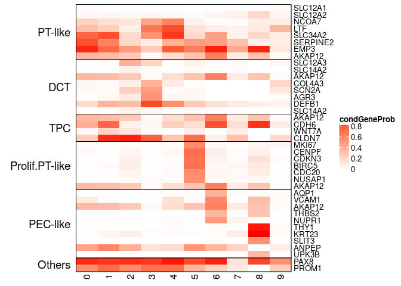
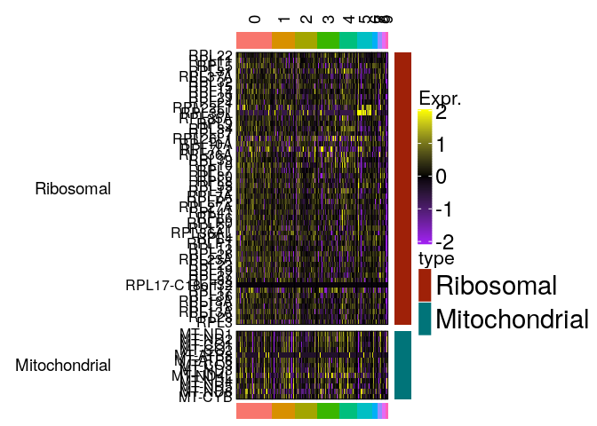

CK5 early organoid : cell assignment
================
Javier Perales-Paton - <javier.perales@bioquant.uni-heidelberg.de>

## Load libraries and auxiliar functions

``` r
set.seed(1234)
suppressPackageStartupMessages(require(Seurat))
suppressPackageStartupMessages(require(ggplot2))
suppressPackageStartupMessages(require(GSEABase))
suppressPackageStartupMessages(require(dplyr))
suppressPackageStartupMessages(require(genesorteR))
suppressPackageStartupMessages(require(ComplexHeatmap))
suppressPackageStartupMessages(require(clustree))
suppressPackageStartupMessages(require(cowplot))
source("../src/seurat_fx.R")
```

## Load SeuratObject with initial clustering outcome

``` r
SeuratObject <- readRDS("./output/1_initial_clustering/data/SeuratObject.rds")
```

## Define output directory

``` r
# Define output directory
OUTDIR <- paste0("./output/2_cell_assignment/")
if(! dir.exists(OUTDIR)) dir.create(OUTDIR, recursive = TRUE)
```

## Cell marker extraction

We are going to use two methods for the extraction of cell markers.  
1\. Differential gene expression using wilcox test from Seurat. Only
positive and consistent markers will be tested (with default
parameters).  
2\. GenesorteR to get posterior probabilities for each gene of observing
a certain cell population.

### 1 wilcox test

``` r
up <- setNames(vector("list",length=length(levels(SeuratObject))), 
               levels(SeuratObject))
for(idx in names(up)) {
  up.idx <- FindMarkers(SeuratObject,ident.1 = idx, 
                        ident.2 = setdiff(levels(SeuratObject), idx), only.pos=T)
  cols_names <- colnames(up.idx)
  
  # Add two extra cols
  up.idx$cluster <- idx
  up.idx$gene <- rownames(up.idx)
  
  up[[idx]] <- up.idx
}
```

### 2 Gene sorter

``` r
sg <- sortGenes(SeuratObject@assays$RNA@data, Idents(SeuratObject))
```

    ## Warning in sortGenes(SeuratObject@assays$RNA@data, Idents(SeuratObject)):
    ## A Friendly Warning: Some genes were removed because they were zeros in all
    ## cells after binarization. You probably don't need to do anything but you
    ## might want to look into this. Maybe you forgot to pre-filter the genes? You
    ## can also use a different binarization method. Excluded genes are available
    ## in the output under '$removed'.

``` r
#define a small set of markers
#mm = getMarkers(sg, quant = 0.975)

#cluster genes and make a heatmap
#pp = plotMarkerHeat(sg$inputMat, sg$inputClass, mm$markers, clusterGenes=TRUE, outs = TRUE)

#pp$gene_class_info #gene clusters

#the top 25 genes for each cluster by specificity scores
top_markers = apply(sg$specScore, 2, function(x) names(head(sort(x, decreasing = TRUE), n = 25)))
```

Finally we save the markers for manual exploration:

``` r
MARKERS_OUTDIR <- paste0(OUTDIR,"/Markers")
if(! dir.exists(MARKERS_OUTDIR)) dir.create(MARKERS_OUTDIR, recursive = TRUE)

# Wilcox
for(idx in names(up)) {
  write.table(up[[idx]][,c("cluster", "gene", cols_names)],
              file = paste0(MARKERS_OUTDIR,"/cluster",idx,".tsv"),
              sep="\t",col.names = TRUE, row.names = FALSE, quote=FALSE
  )
}
saveRDS(up, file=paste0(MARKERS_OUTDIR,"/wilcox_up.rds"))

# Genesorter
saveRDS(sg, file=paste0(MARKERS_OUTDIR,"/genesorter_out.rds"))
write.table(as.matrix(sg$specScore), paste0(MARKERS_OUTDIR,"/specScore.tsv"),
            sep="\t",row.names = TRUE,col.names = NA,quote=FALSE)

write.table(as.matrix(sg$condGeneProb), paste0(MARKERS_OUTDIR,"/condGeneProb.tsv"),
            sep="\t",row.names = TRUE,col.names = NA,quote=FALSE)
```

## Cell assignment

We took a look at the markers from the different clusters from previous
section. These can be found in the ./output/2\_cell\_assignment//Markers
directory.

We took a look at the markes from previous section, making the following
summary

|  Cluster  |                                                             rational                                                              |
| :-------: | :-------------------------------------------------------------------------------------------------------------------------------: |
| Cluster 0 |                                 SLC34a2 high, SERPINE2+, EMP3+ proximal tubule AKAP12 25% PT like                                 |
| Cluster 1 |                                35% SLC12a3, SLC14a2 5%, Distal Convoluted Tubule (DCT) AKAP12 25%                                 |
| Cluster 2 |                                        AKAP12 68%, CDH6+, WNT7a+, CLDN7+, AKAP12 68% TPCs                                         |
| Cluster 3 |                                     3% SLC12a1, SLC34a2 high, NCOA7+, LTF+ AKAP12 15% PT like                                     |
| Cluster 4 |                                  NEAT1+, XIST+, MALAT1+, AKAP12 16% delete mito genes, looks odd                                  |
| Cluster 5 | 25% SLC12a3 Distal Convoluted Tubule,Col4a3+, Col4a4+, SCN2a+ AGR3+, DEFB1+, SLC14a2 3%, Distal Convoluted Tubule (DCT) no AKAP12 |
| Cluster 6 |                          MKI67+, , CENPF, CDKN3, BIRC5, CDC20, NUSAP1, AKAP12 30% proliferating PT-like                           |
| Cluster 7 |                                     37% AQP1+, VCAM1 59%, AKAP12 60%, THBS2+, NUPR1+ PEC like                                     |
| Cluster 8 |          no Pax8, CD133 (PROM1) 13%, no high spec score, ALDH1A3, AKAP12 11% (exclude high ribosomal probably garbadge)           |
| Cluster 9 |                    CD133 0%, VCAM1 33%, THY1+, KRT23, SLIT3, CD13 (ANPEP), UPK3B, AKAP12 28%, EPCAM +PEC like                     |

``` r
reporters <- list("PT-like"=c("SLC12A1", "SLC12A2", "NCOA7", "LTF",
                              "SLC34A2", "SERPINE2", "EMP3", "AKAP12"),
                  "DCT"=c("SLC12A3", "SLC14A2", "AKAP12",
                          "COL4A3", "SCN2A", "AGR3", "DEFB1", "SLC14A2"),
                  "TPC"=c("AKAP12", "CDH6", "WNT7A", "CLDN7"),
                  "Prolif.PT-like"=c("MKI67", "CENPF", "CDKN3", "BIRC5", "CDC20",
                                     "NUSAP1", "AKAP12"),
                  "PEC-like"=c("AQP1", "VCAM1", "AKAP12", "THBS2", "NUPR1",
                               "THY1", "KRT23","SLIT3", "ANPEP", "UPK3B"),
                  "Others"=c("PAX8", "PROM1"))
```

``` r
# condGeneProb from genesorteR
Heatmap(as.matrix(sg$condGeneProb)[unlist(reporters),], name="condGeneProb",
        col=c("white","red"),row_names_gp = gpar(fontsize=10),
        cluster_rows = FALSE, cluster_columns = FALSE,
        split = factor(unlist(sapply(names(reporters), function(z) rep(z,length(reporters[[z]])))),
                       levels=names(reporters)),
        row_title_rot = 0,row_gap = unit(0, "mm"),border=TRUE
        )
```

<!-- -->

``` r
DoHeatmap2(SeuratObject, 
           GS=GeneSetCollection(sapply(names(reporters), 
                                       function(gs) GeneSet(unique(reporters[[gs]]), 
                                                            setName=gs))),
           assay = "RNA", res = 0.5
           )
```

<!-- -->

Expression of mitochondrial and ribosomal genes are going to discard
cluster 4 and 8, respectively. Moreover, Cluster 8 has no PAX8
expression (kidney marker), resulting in an aberrant cell population
unexpected in this context (contaminant).

``` r
DoHeatmap2(SeuratObject, 
           GS=GeneSetCollection(GeneSet(grep("^RPL",rownames(SeuratObject), value=TRUE), 
                                        setName="Ribosomal"),
                                GeneSet(grep("^MT-", rownames(SeuratObject), value=TRUE), 
                                        setName="Mitochondrial")),
           assay = "RNA", res = 0.5
           )
```

<!-- -->

``` r
ren_id <- c("0"="PT-like_1",
            "1"="DCT_1",
            "2"="TPC",
            "3"="PT-like_2",
            "4"="Exclude_highmito",
            "5"="DCT_2",
            "6"="Proliferating_PT-like",
            "7"="PEC-like_1",
            "8"="Exclude_highribosomal",
            "9"="PEC-like_2")
```

``` r
SeuratObject <- RenameIdents(SeuratObject, ren_id)
SeuratObject$init_assign <- Idents(SeuratObject)
```

## UMAP plot

``` r
DimPlot(SeuratObject, reduction = "umap", label=TRUE)
```

    ## Warning: Using `as.character()` on a quosure is deprecated as of rlang 0.3.0.
    ## Please use `as_label()` or `as_name()` instead.
    ## This warning is displayed once per session.

<!-- -->

## Archive processed data for downstream analysis

``` r
# new idents
write.table(data.frame("Ident"=SeuratObject@active.ident),
            file=paste0(OUTDIR,"/active_idents.tsv"),
            sep="\t", col.names = NA, row.names = TRUE, quote=TRUE)
```

``` r
DATA_DIR <- paste0(OUTDIR,"/data")
if(!dir.exists(DATA_DIR)) dir.create(DATA_DIR)
```

``` r
saveRDS(SeuratObject, paste0(DATA_DIR,"/SeuratObject.rds"))
```

## Session info

``` r
sessionInfo()
```

    ## R version 3.6.1 (2019-07-05)
    ## Platform: x86_64-pc-linux-gnu (64-bit)
    ## Running under: Ubuntu 18.04.3 LTS
    ## 
    ## Matrix products: default
    ## BLAS:   /usr/lib/x86_64-linux-gnu/blas/libblas.so.3.7.1
    ## LAPACK: /usr/lib/x86_64-linux-gnu/lapack/liblapack.so.3.7.1
    ## 
    ## locale:
    ##  [1] LC_CTYPE=en_US.UTF-8       LC_NUMERIC=C              
    ##  [3] LC_TIME=en_GB.UTF-8        LC_COLLATE=en_US.UTF-8    
    ##  [5] LC_MONETARY=en_GB.UTF-8    LC_MESSAGES=en_US.UTF-8   
    ##  [7] LC_PAPER=en_GB.UTF-8       LC_NAME=C                 
    ##  [9] LC_ADDRESS=C               LC_TELEPHONE=C            
    ## [11] LC_MEASUREMENT=en_GB.UTF-8 LC_IDENTIFICATION=C       
    ## 
    ## attached base packages:
    ##  [1] grid      stats4    parallel  stats     graphics  grDevices utils    
    ##  [8] datasets  methods   base     
    ## 
    ## other attached packages:
    ##  [1] cowplot_1.0.0        clustree_0.4.1       ggraph_2.0.0.9000   
    ##  [4] ComplexHeatmap_2.0.0 genesorteR_0.3.1     Matrix_1.2-17       
    ##  [7] dplyr_0.8.3          GSEABase_1.46.0      graph_1.62.0        
    ## [10] annotate_1.62.0      XML_3.98-1.20        AnnotationDbi_1.46.1
    ## [13] IRanges_2.18.2       S4Vectors_0.22.1     Biobase_2.44.0      
    ## [16] BiocGenerics_0.30.0  ggplot2_3.2.1        Seurat_3.1.0        
    ## 
    ## loaded via a namespace (and not attached):
    ##   [1] Rtsne_0.15          colorspace_1.4-1    rjson_0.2.20       
    ##   [4] ggridges_0.5.1      mclust_5.4.5        circlize_0.4.7     
    ##   [7] GlobalOptions_0.1.0 clue_0.3-57         farver_1.1.0       
    ##  [10] leiden_0.3.1        listenv_0.7.0       npsurv_0.4-0       
    ##  [13] graphlayouts_0.5.0  ggrepel_0.8.1       bit64_0.9-7        
    ##  [16] codetools_0.2-16    splines_3.6.1       R.methodsS3_1.7.1  
    ##  [19] lsei_1.2-0          knitr_1.24          polyclip_1.10-0    
    ##  [22] zeallot_0.1.0       jsonlite_1.6        ica_1.0-2          
    ##  [25] cluster_2.1.0       png_0.1-7           R.oo_1.22.0        
    ##  [28] pheatmap_1.0.12     uwot_0.1.4          ggforce_0.3.1      
    ##  [31] sctransform_0.2.0   compiler_3.6.1      httr_1.4.1         
    ##  [34] backports_1.1.4     assertthat_0.2.1    lazyeval_0.2.2     
    ##  [37] tweenr_1.0.1        htmltools_0.3.6     tools_3.6.1        
    ##  [40] rsvd_1.0.2          igraph_1.2.4.1      gtable_0.3.0       
    ##  [43] glue_1.3.1          RANN_2.6.1          reshape2_1.4.3     
    ##  [46] Rcpp_1.0.2          vctrs_0.2.0         gdata_2.18.0       
    ##  [49] ape_5.3             nlme_3.1-141        gbRd_0.4-11        
    ##  [52] lmtest_0.9-37       xfun_0.9            stringr_1.4.0      
    ##  [55] globals_0.12.4      lifecycle_0.1.0     irlba_2.3.3        
    ##  [58] gtools_3.8.1        future_1.14.0       MASS_7.3-51.4      
    ##  [61] zoo_1.8-6           scales_1.0.0        tidygraph_1.1.2    
    ##  [64] RColorBrewer_1.1-2  yaml_2.2.0          memoise_1.1.0      
    ##  [67] reticulate_1.13     pbapply_1.4-2       gridExtra_2.3      
    ##  [70] stringi_1.4.3       RSQLite_2.1.2       caTools_1.17.1.2   
    ##  [73] bibtex_0.4.2        shape_1.4.4         Rdpack_0.11-0      
    ##  [76] SDMTools_1.1-221.1  rlang_0.4.0         pkgconfig_2.0.3    
    ##  [79] bitops_1.0-6        evaluate_0.14       lattice_0.20-38    
    ##  [82] ROCR_1.0-7          purrr_0.3.2         labeling_0.3       
    ##  [85] htmlwidgets_1.3     bit_1.1-14          tidyselect_0.2.5   
    ##  [88] RcppAnnoy_0.0.13    plyr_1.8.4          magrittr_1.5       
    ##  [91] R6_2.4.0            gplots_3.0.1.1      DBI_1.0.0          
    ##  [94] pillar_1.4.2        withr_2.1.2         fitdistrplus_1.0-14
    ##  [97] survival_2.44-1.1   RCurl_1.95-4.12     tibble_2.1.3       
    ## [100] future.apply_1.3.0  tsne_0.1-3          crayon_1.3.4       
    ## [103] KernSmooth_2.23-16  plotly_4.9.0        rmarkdown_1.15     
    ## [106] viridis_0.5.1       GetoptLong_0.1.7    data.table_1.12.2  
    ## [109] blob_1.2.0          metap_1.1           digest_0.6.21      
    ## [112] xtable_1.8-4        tidyr_1.0.0         R.utils_2.9.0      
    ## [115] RcppParallel_4.4.3  munsell_0.5.0       viridisLite_0.3.0

``` r
{                                                                                                                                                                                                           
sink(file=paste0(OUTDIR,"/sessionInfo.txt"))
print(sessionInfo())
sink()
}
```
