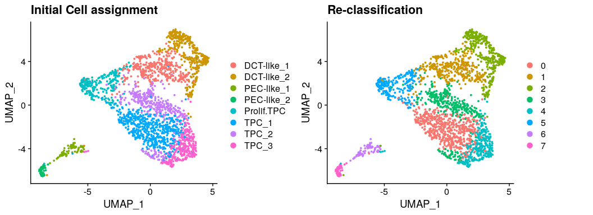

CK5 early organoid : Refine cell clustering
================
Javier Perales-Paton - <javier.perales@bioquant.uni-heidelberg.de>

## Load libraries and auxiliar functions

``` r
set.seed(1234)
suppressPackageStartupMessages(require(Seurat))
suppressPackageStartupMessages(require(ggplot2))
suppressPackageStartupMessages(require(GSEABase))
suppressPackageStartupMessages(require(dplyr))
suppressPackageStartupMessages(require(genesorteR))
suppressPackageStartupMessages(require(ComplexHeatmap))
suppressPackageStartupMessages(require(clustree))
suppressPackageStartupMessages(require(cowplot))
source("../src/seurat_fx.R")
```

## Load SeuratObject with initial clustering outcome

``` r
SeuratObject <- readRDS("./output/2_cell_assignment/data/SeuratObject.rds")
```

## Define output directory

``` r
# Define output directory
OUTDIR <- paste0("./output/3_refine_clustering/")
if(! dir.exists(OUTDIR)) dir.create(OUTDIR, recursive = TRUE)
```

## Re-clustering and high dim. reduction after filtering contaminant populations

To trace back previous cell boundaries, we store the outcome

``` r
if(!"init_seurat_clusters" %in% colnames(SeuratObject@meta.data))
  SeuratObject$init_seurat_clusters <- SeuratObject$seurat_clusters

if(!"init_assign" %in% colnames(SeuratObject@meta.data))
  SeuratObject$init_assign <- Idents(SeuratObject)
```

We remove two cell populations that present with over-expression of
genes related to bad quality cells. We observed that cluster 5
over-express high mitochondrial genes, whereas cluster 9 over-express
ribosomal genes.

``` r
# Remove original reference to clustering
SeuratObject <- SeuratObject[, !grepl("^(Exclude)", 
                                      Idents(SeuratObject))]
```

We proceed with the standard pipeline for cell clustering, over-written
previous outcome

``` r
## Feature selection
SeuratObject <- FindVariableFeatures(SeuratObject, selection.method = "vst", nfeatures = 2000)

## PCA 
SeuratObject <- RunPCA(SeuratObject, features = VariableFeatures(SeuratObject), npcs = 50)
```

    ## PC_ 1 
    ## Positive:  TUBA1B, CENPW, BIRC5, CDKN3, TK1, H2AFZ, DTYMK, CKS1B, CDC20, PCLAF 
    ##     MKI67, TUBB, CENPF, UBE2S, TUBB4B, HMGA1, RANBP1, CCNB1, KRT18, UBE2T 
    ##     ZWINT, CENPM, PBK, LSM4, NUSAP1, LRRC59, TUBA1C, RAN, JPT1, CKS2 
    ## Negative:  CLU, SPP1, NEAT1, SLC34A2, LTF, SLPI, C3, MUC1, SOD2, ADAMTS1 
    ##     SERPING1, WFDC2, CP, SAA1, SAA2, SLC3A1, KCNQ1OT1, IFITM3, C1R, NCOA7 
    ##     LCN2, SERPINA1, ANXA4, TMEM37, CDH16, PIGR, TFPI, C1S, GPNMB, RETREG1 
    ## PC_ 2 
    ## Positive:  SPARC, FN1, FLG, RAB3B, MAP1B, THY1, KRT23, IL32, SLIT3, CDH2 
    ##     CDH6, MFGE8, C6orf99, TPM1, PTGIS, TUBA1A, CYTL1, ITIH5, AKAP12, DCBLD2 
    ##     SPOCK2, GLIPR2, TM4SF4, IGFBP4, CALD1, UPK1B, CD70, CD14, CTGF, BCAT1 
    ## Negative:  WFDC2, HMGB2, NUSAP1, MKI67, TOP2A, CENPF, AGR2, DEFB1, DLGAP5, CDCA3 
    ##     PBK, PLK1, UBE2C, CDC20, GTSE1, DEPDC1, SPP1, AURKB, LCN2, HMMR 
    ##     ASPM, CCNB1, MNS1, TPX2, CCNA2, BIRC5, CCNB2, NUF2, CDKN3, NEK2 
    ## PC_ 3 
    ## Positive:  SPARC, FLG, THY1, CENPF, SLIT3, ITIH5, MKI67, NUSAP1, PTGIS, CDH2 
    ##     ASPM, CD70, DEPDC1, CYTL1, GTSE1, TOP2A, CRB2, HMGB2, CDC20, PLK1 
    ##     KIF4A, SEPT4, IGFBP4, UBE2C, HMMR, SPC25, PBK, CD14, CDKN3, NUF2 
    ## Negative:  CLDN7, RAB25, S100A14, TSPAN1, KRT7, TACSTD2, GPRC5A, CST6, TMPRSS4, CLDN4 
    ##     UCA1, ITGA2, PRSS8, EPCAM, MAL2, SFTA2, KRT19, SCEL, CDA, CDH1 
    ##     FOLR3, MACC1, F3, UCP2, SFN, WNT7A, VTCN1, LMTK3, AREG, GATA3 
    ## PC_ 4 
    ## Positive:  SERPINE2, PLAU, MT2A, GYPC, EMP3, CXCL14, GMDS, VIM, TRIM55, PKIB 
    ##     CLDN16, PHLDA1, MT1E, TPM1, XKR4, GLRX, ANPEP, TM4SF1, DCBLD2, ADIRF 
    ##     LGALS1, HTRA1, MSMP, IGFBP6, FGFR1, TGFBI, CRYAB, TNC, CAV1, FAM129A 
    ## Negative:  FLG, THY1, SLIT3, ITIH5, PTGIS, KRT23, CD14, CYTL1, SPARC, CRB2 
    ##     C6orf99, AP1M2, IGFBP4, KRT19, UPK3B, SEPT4, DEFB1, GATA3, TMOD1, FGF18 
    ##     PRRX2, BCAT1, AGR3, CFTR, CD74, KITLG, SNCA, RGS5, GSTM3, AC005482.1 
    ## PC_ 5 
    ## Positive:  LDHB, DBI, NNMT, ATP5F1B, SLC25A5, PRDX1, ACAT2, NQO1, PSMA3, CPVL 
    ##     HSPE1, EEF1B2, ENO1, MYL12B, ANXA4, NME1, NDUFA9, FDPS, GSTM3, FHL2 
    ##     HLA-DMB, UCHL1, FDFT1, PSMA7, GGH, SRSF3, MYL12A, HSPD1, RPL21, CCT2 
    ## Negative:  TOP2A, NEAT1, ASPM, PLK1, HSPG2, MKI67, KNL1, KIF23, UBE2C, GTSE1 
    ##     ANLN, NDRG1, CENPF, KLF6, CENPE, AURKB, DEPDC1, MMP14, CDH1, HJURP 
    ##     DLGAP5, TMEM132A, LAMB3, KIF2C, ONECUT2, MFGE8, CKAP2L, KIFC1, AREG, ITGB8

``` r
print(ElbowPlot(SeuratObject,ndims = 50) + geom_vline(xintercept = 25, col="red"))
```

<!-- -->

``` r
## Cell clustering
SeuratObject <- FindNeighbors(SeuratObject, dims = 1:25)
```

    ## Computing nearest neighbor graph

    ## Computing SNN

``` r
SeuratObject <- FindClusters(SeuratObject, resolution = 0.5)
```

    ## Modularity Optimizer version 1.3.0 by Ludo Waltman and Nees Jan van Eck
    ## 
    ## Number of nodes: 2338
    ## Number of edges: 80502
    ## 
    ## Running Louvain algorithm...
    ## Maximum modularity in 10 random starts: 0.8311
    ## Number of communities: 8
    ## Elapsed time: 0 seconds

``` r
## Agreement with previous clustering
table("initial"=SeuratObject$init_seurat_clusters,
      "final"=SeuratObject$seurat_clusters)
```

    ##        final
    ## initial   0   1   2   3   4   5   6   7
    ##       0 225  53   0   0 256   0   0   2
    ##       1   1   3 385   7   0   5   0   1
    ##       2   3 357   3   0   1   0   0   0
    ##       3 328   0   0   0   0   0   0   0
    ##       4   0   0   0   0   0   0   0   0
    ##       5   0   0   3 310   0   0   0   0
    ##       6   0   1   0   0   1 243   0   0
    ##       7   1   0   0   0   0   0  92   1
    ##       8   0   0   0   0   0   0   0   0
    ##       9   0   0   0   0   0   0   0  56

``` r
table("Assigned"=SeuratObject$init_assign,
      "final"=SeuratObject$seurat_clusters)
```

    ##                        final
    ## Assigned                  0   1   2   3   4   5   6   7
    ##   PT-like_1             225  53   0   0 256   0   0   2
    ##   DCT_1                   1   3 385   7   0   5   0   1
    ##   TPC                     3 357   3   0   1   0   0   0
    ##   PT-like_2             328   0   0   0   0   0   0   0
    ##   Exclude_highmito        0   0   0   0   0   0   0   0
    ##   DCT_2                   0   0   3 310   0   0   0   0
    ##   Proliferating_PT-like   0   1   0   0   1 243   0   0
    ##   PEC-like_1              1   0   0   0   0   0  92   1
    ##   Exclude_highribosomal   0   0   0   0   0   0   0   0
    ##   PEC-like_2              0   0   0   0   0   0   0  56

``` r
## UMAP
SeuratObject <- RunUMAP(SeuratObject, dims = 1:25)
```

    ## Warning: The default method for RunUMAP has changed from calling Python UMAP via reticulate to the R-native UWOT using the cosine metric
    ## To use Python UMAP via reticulate, set umap.method to 'umap-learn' and metric to 'correlation'
    ## This message will be shown once per session

    ## 15:20:59 UMAP embedding parameters a = 0.9922 b = 1.112

    ## 15:20:59 Read 2338 rows and found 25 numeric columns

    ## 15:20:59 Using Annoy for neighbor search, n_neighbors = 30

    ## 15:20:59 Building Annoy index with metric = cosine, n_trees = 50

    ## 0%   10   20   30   40   50   60   70   80   90   100%

    ## [----|----|----|----|----|----|----|----|----|----|

    ## **************************************************|
    ## 15:21:00 Writing NN index file to temp file /tmp/RtmpgN6ZJz/file7bde3582ec2a
    ## 15:21:00 Searching Annoy index using 1 thread, search_k = 3000
    ## 15:21:00 Annoy recall = 100%
    ## 15:21:01 Commencing smooth kNN distance calibration using 1 thread
    ## 15:21:01 Initializing from normalized Laplacian + noise
    ## 15:21:01 Commencing optimization for 500 epochs, with 92302 positive edges
    ## 15:21:06 Optimization finished

``` r
d1 <- DimPlot(SeuratObject, group.by = "init_assign") + ggtitle("Initial Cell assignment")
d2 <- DimPlot(SeuratObject) + ggtitle("Re-classification")

print(CombinePlots(list(d1,d2)))
```

<!-- -->

``` r
## tSNE
SeuratObject <- RunTSNE(SeuratObject, dims = 1:25)
d1 <- DimPlot(SeuratObject, group.by = "init_assign", reduction="tsne") + ggtitle("Initial Cell assignment")
d2 <- DimPlot(SeuratObject, reduction="tsne") + ggtitle("Re-classification")

print(CombinePlots(list(d1,d2)))
```

<!-- -->

## Archive processed data for downstream analysis

``` r
# 1 Clustering outcome
write.table(SeuratObject@meta.data[,c(grep("^RNA_snn_res",
                                           colnames(SeuratObject@meta.data),
                                           value=TRUE),
                                      "seurat_clusters"),],
            file=paste0(OUTDIR,"/init_clustering.csv"),
            sep=",", col.names = NA, row.names=TRUE, quote=TRUE)

# 2 2nd round idents (same as seurat_clusters)
write.table(data.frame("Ident"=SeuratObject@active.ident),
            file=paste0(OUTDIR,"/active_idents.csv"),
            sep=",", col.names = NA, row.names = TRUE, quote=TRUE)
```

``` r
DATA_DIR <- paste0(OUTDIR,"/data")
if(!dir.exists(DATA_DIR)) dir.create(DATA_DIR)
```

``` r
saveRDS(SeuratObject, paste0(DATA_DIR,"/SeuratObject.rds"))
```

## Session info

``` r
sessionInfo()
```

    ## R version 3.6.1 (2019-07-05)
    ## Platform: x86_64-pc-linux-gnu (64-bit)
    ## Running under: Ubuntu 18.04.3 LTS
    ## 
    ## Matrix products: default
    ## BLAS:   /usr/lib/x86_64-linux-gnu/blas/libblas.so.3.7.1
    ## LAPACK: /usr/lib/x86_64-linux-gnu/lapack/liblapack.so.3.7.1
    ## 
    ## locale:
    ##  [1] LC_CTYPE=en_US.UTF-8       LC_NUMERIC=C              
    ##  [3] LC_TIME=en_GB.UTF-8        LC_COLLATE=en_US.UTF-8    
    ##  [5] LC_MONETARY=en_GB.UTF-8    LC_MESSAGES=en_US.UTF-8   
    ##  [7] LC_PAPER=en_GB.UTF-8       LC_NAME=C                 
    ##  [9] LC_ADDRESS=C               LC_TELEPHONE=C            
    ## [11] LC_MEASUREMENT=en_GB.UTF-8 LC_IDENTIFICATION=C       
    ## 
    ## attached base packages:
    ##  [1] grid      stats4    parallel  stats     graphics  grDevices utils    
    ##  [8] datasets  methods   base     
    ## 
    ## other attached packages:
    ##  [1] cowplot_1.0.0        clustree_0.4.1       ggraph_2.0.0.9000   
    ##  [4] ComplexHeatmap_2.0.0 genesorteR_0.3.1     Matrix_1.2-17       
    ##  [7] dplyr_0.8.3          GSEABase_1.46.0      graph_1.62.0        
    ## [10] annotate_1.62.0      XML_3.98-1.20        AnnotationDbi_1.46.1
    ## [13] IRanges_2.18.2       S4Vectors_0.22.1     Biobase_2.44.0      
    ## [16] BiocGenerics_0.30.0  ggplot2_3.2.1        Seurat_3.1.0        
    ## 
    ## loaded via a namespace (and not attached):
    ##   [1] Rtsne_0.15          colorspace_1.4-1    rjson_0.2.20       
    ##   [4] ggridges_0.5.1      mclust_5.4.5        circlize_0.4.7     
    ##   [7] GlobalOptions_0.1.0 clue_0.3-57         farver_1.1.0       
    ##  [10] leiden_0.3.1        listenv_0.7.0       npsurv_0.4-0       
    ##  [13] graphlayouts_0.5.0  ggrepel_0.8.1       bit64_0.9-7        
    ##  [16] RSpectra_0.15-0     codetools_0.2-16    splines_3.6.1      
    ##  [19] R.methodsS3_1.7.1   lsei_1.2-0          knitr_1.24         
    ##  [22] polyclip_1.10-0     zeallot_0.1.0       jsonlite_1.6       
    ##  [25] ica_1.0-2           cluster_2.1.0       png_0.1-7          
    ##  [28] R.oo_1.22.0         pheatmap_1.0.12     uwot_0.1.4         
    ##  [31] ggforce_0.3.1       sctransform_0.2.0   compiler_3.6.1     
    ##  [34] httr_1.4.1          backports_1.1.4     assertthat_0.2.1   
    ##  [37] lazyeval_0.2.2      tweenr_1.0.1        htmltools_0.3.6    
    ##  [40] tools_3.6.1         rsvd_1.0.2          igraph_1.2.4.1     
    ##  [43] gtable_0.3.0        glue_1.3.1          RANN_2.6.1         
    ##  [46] reshape2_1.4.3      Rcpp_1.0.2          vctrs_0.2.0        
    ##  [49] gdata_2.18.0        ape_5.3             nlme_3.1-141       
    ##  [52] gbRd_0.4-11         lmtest_0.9-37       xfun_0.9           
    ##  [55] stringr_1.4.0       globals_0.12.4      lifecycle_0.1.0    
    ##  [58] irlba_2.3.3         gtools_3.8.1        future_1.14.0      
    ##  [61] MASS_7.3-51.4       zoo_1.8-6           scales_1.0.0       
    ##  [64] tidygraph_1.1.2     RColorBrewer_1.1-2  yaml_2.2.0         
    ##  [67] memoise_1.1.0       reticulate_1.13     pbapply_1.4-2      
    ##  [70] gridExtra_2.3       stringi_1.4.3       RSQLite_2.1.2      
    ##  [73] caTools_1.17.1.2    bibtex_0.4.2        shape_1.4.4        
    ##  [76] Rdpack_0.11-0       SDMTools_1.1-221.1  rlang_0.4.0        
    ##  [79] pkgconfig_2.0.3     bitops_1.0-6        evaluate_0.14      
    ##  [82] lattice_0.20-38     ROCR_1.0-7          purrr_0.3.2        
    ##  [85] labeling_0.3        htmlwidgets_1.3     bit_1.1-14         
    ##  [88] tidyselect_0.2.5    RcppAnnoy_0.0.13    plyr_1.8.4         
    ##  [91] magrittr_1.5        R6_2.4.0            gplots_3.0.1.1     
    ##  [94] DBI_1.0.0           pillar_1.4.2        withr_2.1.2        
    ##  [97] fitdistrplus_1.0-14 survival_2.44-1.1   RCurl_1.95-4.12    
    ## [100] tibble_2.1.3        future.apply_1.3.0  tsne_0.1-3         
    ## [103] crayon_1.3.4        KernSmooth_2.23-16  plotly_4.9.0       
    ## [106] rmarkdown_1.15      viridis_0.5.1       GetoptLong_0.1.7   
    ## [109] data.table_1.12.8   blob_1.2.0          metap_1.1          
    ## [112] digest_0.6.21       xtable_1.8-4        tidyr_1.0.0        
    ## [115] R.utils_2.9.0       RcppParallel_4.4.3  munsell_0.5.0      
    ## [118] viridisLite_0.3.0

``` r
{                                                                                                                                                                                                           
sink(file=paste0(OUTDIR,"/sessionInfo.txt"))
print(sessionInfo())
sink()
}
```
