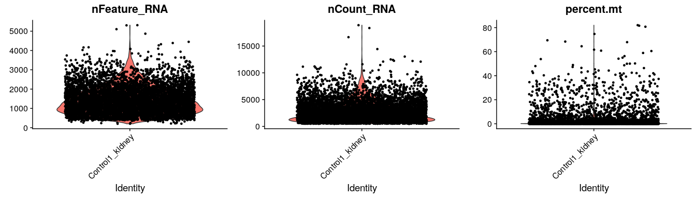
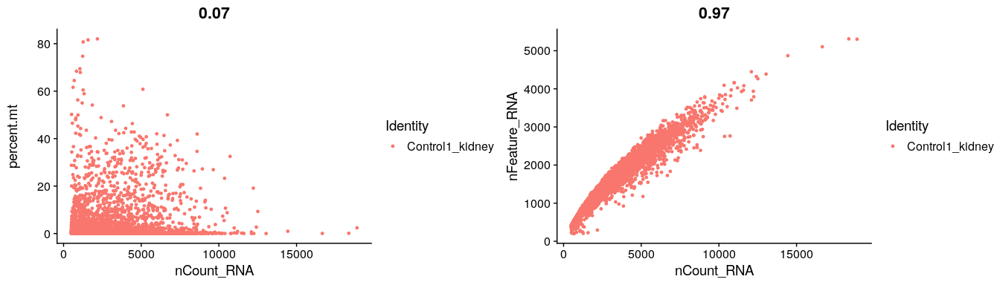
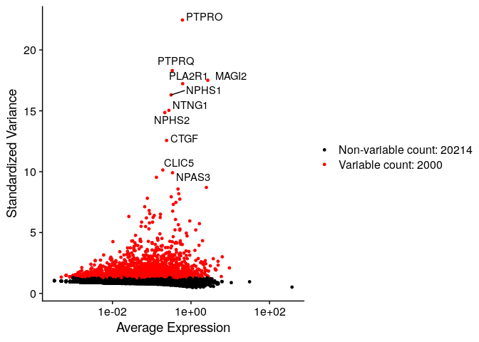
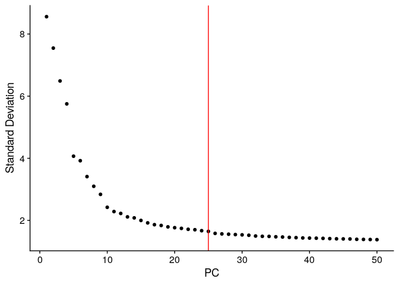
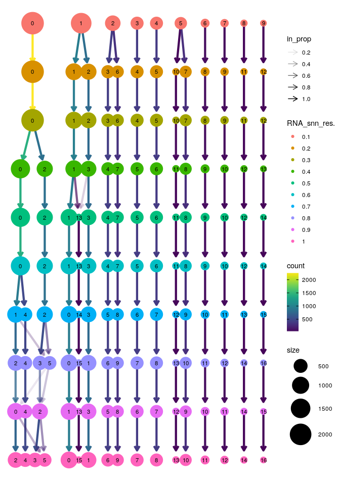
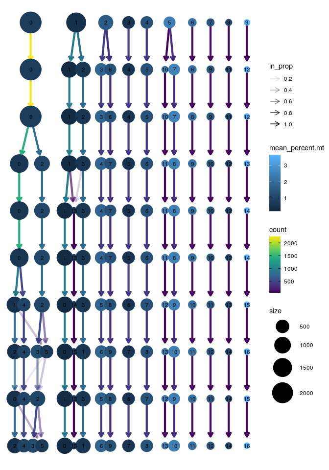
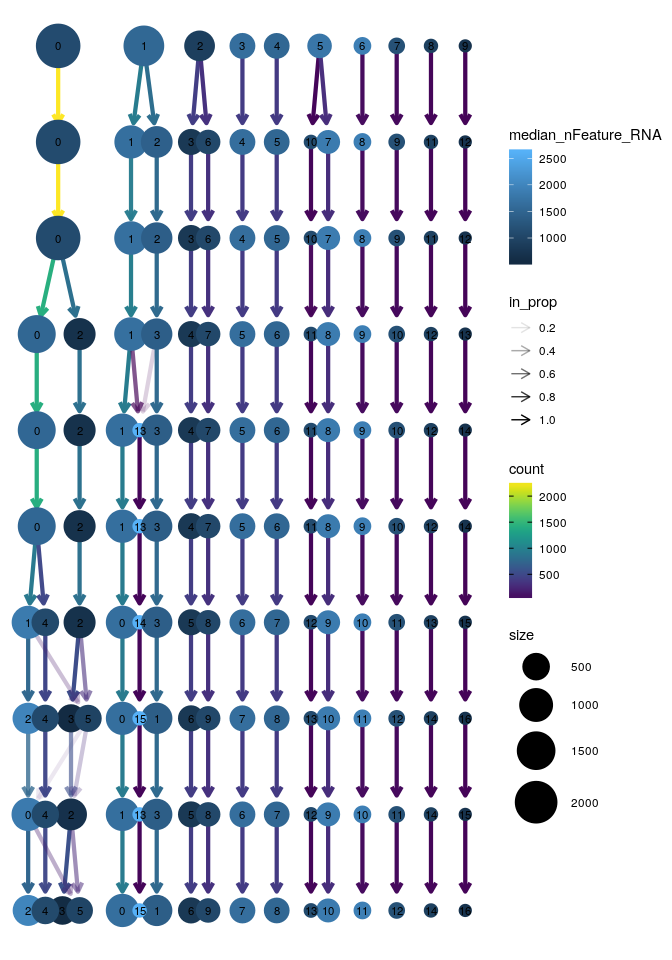
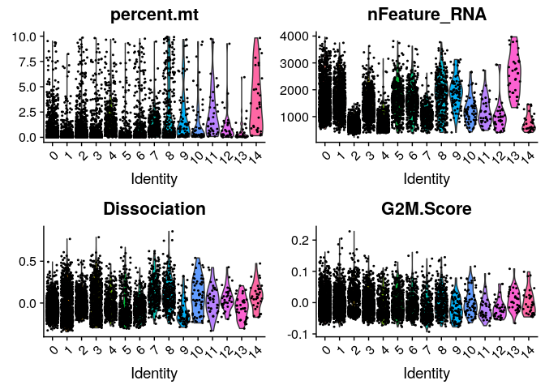
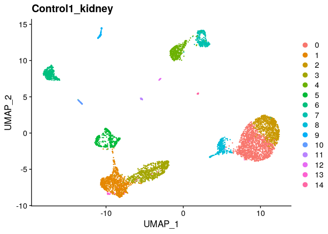

Control1 whole tissue biopsy, healthy: initial clustering
================
Javier Perales-Paton - <javier.perales@bioquant.uni-heidelberg.de>

## Load libraries and auxiliar functions

``` r
set.seed(1234)
suppressPackageStartupMessages(require(Seurat))
suppressPackageStartupMessages(require(ggplot2))
suppressPackageStartupMessages(require(clustree))
suppressPackageStartupMessages(require(cowplot))
source("../src/seurat_fx.R")
```

## Read data into a Seurat Object

``` r
SeuratObject <- getSeuratObject(path = "../data/sc/Control1/filtered_feature_bc_matrix/",
                     project_name = "Control1_kidney", 
                     mt.pattern = "^MT-", min.cells = 5, 
                     min.features = 200)
```

## Define output directory

``` r
# Define output directory
OUTDIR <- paste0("./output/1_initial_clustering/")
if(! dir.exists(OUTDIR)) dir.create(OUTDIR, recursive = TRUE)
```

## Quality control

``` r
print(VlnPlot(SeuratObject, features = c("nFeature_RNA", "nCount_RNA", "percent.mt"), ncol = 3))
```

<!-- -->

``` r
print(CombinePlots(plots = list(FeatureScatter(SeuratObject, 
                           feature1 = "nCount_RNA", 
                           feature2 = "percent.mt"),
                                FeatureScatter(SeuratObject, 
                           feature1 = "nCount_RNA", 
                           feature2 = "nFeature_RNA")))
)
```

<!-- -->

## Data cleasing: gene and cell filtering

To avoid unnecessary sparsity and noise in downstream analysis,  
\* We discard cells with low (\<200) and high (\>4000) number of genes
detected to avoid bad quality and doublets, repectively.  
\* We discard genes not detected across cells.  
In addition, we consider a thresholds of 10% for MT gene expression
since this is single-nucleus RNAseq but ambient RNA from cytoplasm has
contaminated the library. Later we will ignore remaining MT gene
expression because this cannot be derived from the nucleus.

``` r
nSamples_before <- ncol(SeuratObject)
SeuratObject <- subset(SeuratObject, nFeature_RNA > 200 & nFeature_RNA < 4000 & percent.mt < 10)
nSamples_after <- ncol(SeuratObject)
# Ignore MT genes
SeuratObject <- SeuratObject[grep("^MT-", rownames(SeuratObject), invert=TRUE),]
```

Doing so, 6045 out of an initial 6536 total were retrieve for the
analysis, thus discarding a 491 cells.

## Pre-processing the data for cell clustering and cell-type assignment

First, we normalize the data using default parameters

``` r
SeuratObject <- NormalizeData(SeuratObject)
```

Second, we perform a feature selection based on `vst` method to select
high variable genes (top 2000) for cell
clustering.

``` r
SeuratObject <- FindVariableFeatures(SeuratObject, selection.method = "vst", nfeatures = 2000)

print(LabelPoints(VariableFeaturePlot(SeuratObject),
                  points=VariableFeatures(SeuratObject)[1:10],repel = TRUE))
```

    ## Warning: Using `as.character()` on a quosure is deprecated as of rlang 0.3.0.
    ## Please use `as_label()` or `as_name()` instead.
    ## This warning is displayed once per session.

    ## When using repel, set xnudge and ynudge to 0 for optimal results

<!-- -->

Third, we center and scale the data prior PCA:

``` r
SeuratObject <- Seurat_scaledata(SeuratObject)
```

    ## Centering and scaling data matrix

Finally we perform PCA, selecting a number of PCs that are relevant
based on the elbow plot. We tested that our results are not sensitive to
this parameter, and the arbitrary selection of number of PCs do not
change final
conclusions.

``` r
SeuratObject <- RunPCA(SeuratObject, features = VariableFeatures(SeuratObject), npcs = 50)
```

    ## PC_ 1 
    ## Positive:  LRP2, SLC13A3, CUBN, SLC34A1, CNTNAP3B, RASSF4, ACSM2A, NOX4, CLDN10, GDA 
    ##     ANPEP, ACSM2B, SLC17A1, CDH6, BNC2, AC087762.1, DLG2, LINC00871, PAPPA, FTCD 
    ##     SLC4A4, C3, NLGN1, DPYS, MAN1C1, SLC5A12, ENPEP, TINAG, AC005699.1, KCNQ1OT1 
    ## Negative:  MECOM, AC019197.1, ERBB4, KCNIP4, EFNA5, COBLL1, PTGER3, NR3C2, SCN2A, OSBPL3 
    ##     ESRRG, COL4A3, PRKG1, CACNA2D3, CSGALNACT1, BACE2, PLCL1, ATP6V0A4, EGF, ACSL4 
    ##     NOS1AP, CCSER1, KAZN, ITPR1, SKAP1, TBC1D9, AC138305.1, COL4A4, GPC5, SIM1 
    ## PC_ 2 
    ## Positive:  LDB2, MEIS2, GNA14, EMCN, FLT1, ENG, PTPRB, EGFL7, ST6GALNAC3, RAPGEF4 
    ##     RAMP3, TCF4, HEG1, PECAM1, SLCO2A1, DOCK4, FBXL7, ELMO1, TEK, ERG 
    ##     SLC2A3, IGFBP5, PODXL, ZEB1, TGFBR2, FYN, PREX2, PLAT, GRB10, DYSF 
    ## Negative:  ESRRG, CCSER1, COBLL1, AC019197.1, SHROOM3, DCDC2, SAMD5, PTGER3, SAT1, EFNA5 
    ##     NHS, ITPR1, ERBB4, AGBL4, KCNJ16, ABCA5, CACNA2D3, SCN2A, MITF, FGF13 
    ##     TFCP2L1, CA12, SH3RF1, PPARGC1A, ARHGAP24, COL4A3, ABCC5, EGF, BLNK, FRAS1 
    ## PC_ 3 
    ## Positive:  LDB2, GNA14, EMCN, EGFL7, PTPRB, ENG, MEIS2, FLT1, SLCO2A1, RAPGEF4 
    ##     PECAM1, TCF4, HEG1, TEK, ERG, CHRM3, TGFBR2, IGFBP5, ELMO1, PRKCH 
    ##     FLI1, RAPGEF5, DYSF, EPAS1, PREX1, PREX2, GRB10, PLAT, AC010737.1, SLC2A3 
    ## Negative:  NPHS2, NPHS1, NTNG1, PTPRQ, PTPRO, ADAMTS19, FMN2, CLIC5, FGF1, ATP10A 
    ##     NFASC, WT1, TARID, PLCE1, TYRO3, AC092813.2, ZNF804A, AC109466.1, SPOCK2, PLA2R1 
    ##     PCOLCE2, LINC00839, ALS2CL, CTGF, NPAS3, CR1, F3, LMX1B, CCBE1, IGFBP2 
    ## PC_ 4 
    ## Positive:  CCSER1, CACNA2D3, ADAMTS9-AS2, GPC5, KCNIP4, DCDC2, CSGALNACT1, KCNJ16, SLC12A3, CNNM2 
    ##     FAM155A, ADAMTS16, ZDHHC14, TRPM6, ESRRB, CACNB4, TSC22D1, CPXM2, LINC01762, TEX41 
    ##     MID1, DNER, SFRP1, HS6ST2, AC005208.1, ADAMTS17, SLC24A3, MFHAS1, AC078980.1, DYNC2H1 
    ## Negative:  CLNK, LINC01187, SLC26A7, PDE1C, NRXN3, LEF1, NXPH2, KIT, ADGRF1, ATP6V0D2 
    ##     C12orf75, AC092422.1, CA8, PACRG, HS6ST3, ADGRF5, DMRT2, PSD3, VWA5B1, CACNB2 
    ##     AC023194.3, CPAMD8, IL18, SNTB1, LITAF, DOCK10, ATP6V1C2, LINC01230, LAMA2, AC112229.3 
    ## PC_ 5 
    ## Positive:  SLC12A1, CACNA2D3, CPM, CASR, ENOX1, PLCB1, SFRP1, NHS, SVIL, GPC5 
    ##     HS6ST2, ZDHHC14, KLHL13, ITGB6, GNAI1, LINC01606, CA10, SAMD4A, SIM2, CLDN10-AS1 
    ##     LINC01182, FGF13, TFAP2B, UMOD, ADAMTS17, SCHLAP1, PAPPA2, LINC02398, AC024022.1, DNER 
    ## Negative:  PWRN1, LINC01099, SLC8A1, LINC01098, BMPR1B, SCNN1G, TRPV5, SNTG1, SLC8A1-AS1, TEX41 
    ##     PWRN3, KRT19, PIK3C2G, SLC38A11, PFKFB3, KCNK13, HS6ST1, CRYBG1, LSAMP, BARX2 
    ##     MPPED2, AFAP1L2, KAZN, SCN2A, SCNN1B, SCN3A, SOX5, PCDH7, NRCAM, KCNIP1

``` r
print(ElbowPlot(SeuratObject,ndims = 50) + geom_vline(xintercept = 25, col="red"))
```

<!-- -->

We decided to use 25 PCs for the clustering.

We also calculate a dissociation
score

``` r
dissociation <- read.csv("../data/Prior/scrnaseq-digestion-paper_coregene_df-FALSE-v3.csv",
             stringsAsFactors=FALSE)
dissTop40 <- intersect(head(dissociation$gene_symbol, 40), rownames(SeuratObject))
SeuratObject <- AddModuleScore(SeuratObject, features = list("dissociation"=dissTop40))
colnames(SeuratObject@meta.data)[which(colnames(SeuratObject@meta.data)=="Cluster1")] <- "Dissociation"
```

And cellcycle phase

``` r
s.genes <- cc.genes$s.genes
g2m.genes <- cc.genes$g2m.genes
SeuratObject <- CellCycleScoring(SeuratObject,
                 s.features = s.genes,
                 g2m.features = g2m.genes)
```

## Cell clustering

We are going to use Shared-Nearest Neighbour with Graph partitioning for
cell clustering. We run the algorithm with multiple resolutions. Later
this is read-out to give an idea how these are consistent from a lower
to high number of expected cell populations in the
sample.

``` r
SeuratObject <- FindNeighbors(SeuratObject, dims = 1:25)
```

    ## Computing nearest neighbor graph

    ## Computing SNN

``` r
SeuratObject <- FindClusters(SeuratObject, resolution = seq(from=0.1, to=1, by=0.1))
```

    ## Modularity Optimizer version 1.3.0 by Ludo Waltman and Nees Jan van Eck
    ## 
    ## Number of nodes: 6045
    ## Number of edges: 230945
    ## 
    ## Running Louvain algorithm...
    ## Maximum modularity in 10 random starts: 0.9731
    ## Number of communities: 10
    ## Elapsed time: 0 seconds
    ## Modularity Optimizer version 1.3.0 by Ludo Waltman and Nees Jan van Eck
    ## 
    ## Number of nodes: 6045
    ## Number of edges: 230945
    ## 
    ## Running Louvain algorithm...
    ## Maximum modularity in 10 random starts: 0.9537
    ## Number of communities: 13
    ## Elapsed time: 0 seconds
    ## Modularity Optimizer version 1.3.0 by Ludo Waltman and Nees Jan van Eck
    ## 
    ## Number of nodes: 6045
    ## Number of edges: 230945
    ## 
    ## Running Louvain algorithm...
    ## Maximum modularity in 10 random starts: 0.9357
    ## Number of communities: 13
    ## Elapsed time: 0 seconds
    ## Modularity Optimizer version 1.3.0 by Ludo Waltman and Nees Jan van Eck
    ## 
    ## Number of nodes: 6045
    ## Number of edges: 230945
    ## 
    ## Running Louvain algorithm...
    ## Maximum modularity in 10 random starts: 0.9243
    ## Number of communities: 14
    ## Elapsed time: 0 seconds
    ## Modularity Optimizer version 1.3.0 by Ludo Waltman and Nees Jan van Eck
    ## 
    ## Number of nodes: 6045
    ## Number of edges: 230945
    ## 
    ## Running Louvain algorithm...
    ## Maximum modularity in 10 random starts: 0.9119
    ## Number of communities: 15
    ## Elapsed time: 0 seconds
    ## Modularity Optimizer version 1.3.0 by Ludo Waltman and Nees Jan van Eck
    ## 
    ## Number of nodes: 6045
    ## Number of edges: 230945
    ## 
    ## Running Louvain algorithm...
    ## Maximum modularity in 10 random starts: 0.8997
    ## Number of communities: 15
    ## Elapsed time: 0 seconds
    ## Modularity Optimizer version 1.3.0 by Ludo Waltman and Nees Jan van Eck
    ## 
    ## Number of nodes: 6045
    ## Number of edges: 230945
    ## 
    ## Running Louvain algorithm...
    ## Maximum modularity in 10 random starts: 0.8890
    ## Number of communities: 16
    ## Elapsed time: 0 seconds
    ## Modularity Optimizer version 1.3.0 by Ludo Waltman and Nees Jan van Eck
    ## 
    ## Number of nodes: 6045
    ## Number of edges: 230945
    ## 
    ## Running Louvain algorithm...
    ## Maximum modularity in 10 random starts: 0.8777
    ## Number of communities: 17
    ## Elapsed time: 0 seconds
    ## Modularity Optimizer version 1.3.0 by Ludo Waltman and Nees Jan van Eck
    ## 
    ## Number of nodes: 6045
    ## Number of edges: 230945
    ## 
    ## Running Louvain algorithm...
    ## Maximum modularity in 10 random starts: 0.8683
    ## Number of communities: 16
    ## Elapsed time: 0 seconds
    ## Modularity Optimizer version 1.3.0 by Ludo Waltman and Nees Jan van Eck
    ## 
    ## Number of nodes: 6045
    ## Number of edges: 230945
    ## 
    ## Running Louvain algorithm...
    ## Maximum modularity in 10 random starts: 0.8592
    ## Number of communities: 17
    ## Elapsed time: 0 seconds

``` r
# We redefine the final partitioning with resolution 0.5
SeuratObject$seurat_clusters <- SeuratObject$RNA_snn_res.0.5 
Idents(SeuratObject) <- SeuratObject$RNA_snn_res.0.5 
```

## Diagnostics of unsupervised clustering

We will investigate how the selection of multiple resolutions affects
the partition into individual cell clusters.

``` r
clustree(SeuratObject, prefix = "RNA_snn_res.")
```

<!-- -->

We also checked whether mithochondrial expression drives the clustering

``` r
clustree(SeuratObject, prefix = "RNA_snn_res.", 
     node_colour="percent.mt", node_colour_aggr="mean")
```

<!-- -->

``` r
clustree(SeuratObject, prefix = "RNA_snn_res.", 
     node_colour="nFeature_RNA", node_colour_aggr="median")
```

<!-- -->

``` r
VlnPlot(SeuratObject, 
    feature=c("percent.mt", "nFeature_RNA", 
        "Dissociation", "G2M.Score"), 
    pt.size=0.4,
    ncol=2)
```

<!-- -->

## Clustering decision

We decided to chose resolution 0.5 for the initial clustering. We will
save this output to archive the outcome. Herein, first column is the
cell barcode, and rest of columns are clusters where each cell belong to
across multiple resolutions. The ones that are active for the study are
those related to resolution 0.5 (`RNA_snn_res.0.5` and
`seurat_clusters`).

``` r
# 1 Clustering outcome
saveClusteringOutcome(SeuratObject , assay="RNA", fl=paste0(OUTDIR,"/init_clustering.tsv"))
```

    ## [WARN] Selected metacols for Clustering outcome:RNA_snn_res.0.1,RNA_snn_res.0.2,RNA_snn_res.0.3,RNA_snn_res.0.4,RNA_snn_res.0.5,RNA_snn_res.0.6,RNA_snn_res.0.7,RNA_snn_res.0.8,RNA_snn_res.0.9,RNA_snn_res.1,seurat_clusters

``` r
# 2 Initial idents (same as seurat_clusters)
saveActiveIdents(SeuratObject, fl=paste0(OUTDIR,"/active_idents.tsv"))
```

## Non-linear dim reduction (umap)

``` r
SeuratObject <- RunUMAP(SeuratObject, dims = 1:25)
```

    ## Warning: The default method for RunUMAP has changed from calling Python UMAP via reticulate to the R-native UWOT using the cosine metric
    ## To use Python UMAP via reticulate, set umap.method to 'umap-learn' and metric to 'correlation'
    ## This message will be shown once per session

    ## 07:20:21 UMAP embedding parameters a = 0.9922 b = 1.112

    ## 07:20:21 Read 6045 rows and found 25 numeric columns

    ## 07:20:21 Using Annoy for neighbor search, n_neighbors = 30

    ## 07:20:21 Building Annoy index with metric = cosine, n_trees = 50

    ## 0%   10   20   30   40   50   60   70   80   90   100%

    ## [----|----|----|----|----|----|----|----|----|----|

    ## **************************************************|
    ## 07:20:22 Writing NN index file to temp file /tmp/Rtmp5TG9Ij/file39cc7b4f7aae
    ## 07:20:22 Searching Annoy index using 1 thread, search_k = 3000
    ## 07:20:24 Annoy recall = 100%
    ## 07:20:24 Commencing smooth kNN distance calibration using 1 thread
    ## 07:20:25 Found 2 connected components, falling back to 'spca' initialization with init_sdev = 1
    ## 07:20:25 Initializing from PCA
    ## 07:20:25 PCA: 2 components explained 39.88% variance
    ## 07:20:25 Commencing optimization for 500 epochs, with 255354 positive edges
    ## 07:20:38 Optimization finished

``` r
DimPlot(SeuratObject, reduction="umap") + ggtitle(Project(SeuratObject))
```

<!-- -->

## Archive processed data for downstream analysis

``` r
DATA_DIR <- paste0(OUTDIR,"/data")
if(!dir.exists(DATA_DIR)) dir.create(DATA_DIR)
```

``` r
saveRDS(SeuratObject, paste0(DATA_DIR,"/SeuratObject.rds"))
```

## Session info

``` r
sessionInfo()
```

    ## R version 3.6.1 (2019-07-05)
    ## Platform: x86_64-pc-linux-gnu (64-bit)
    ## Running under: Ubuntu 18.04.3 LTS
    ## 
    ## Matrix products: default
    ## BLAS:   /usr/lib/x86_64-linux-gnu/blas/libblas.so.3.7.1
    ## LAPACK: /usr/lib/x86_64-linux-gnu/lapack/liblapack.so.3.7.1
    ## 
    ## locale:
    ##  [1] LC_CTYPE=en_US.UTF-8       LC_NUMERIC=C              
    ##  [3] LC_TIME=en_GB.UTF-8        LC_COLLATE=en_US.UTF-8    
    ##  [5] LC_MONETARY=en_GB.UTF-8    LC_MESSAGES=en_US.UTF-8   
    ##  [7] LC_PAPER=en_GB.UTF-8       LC_NAME=C                 
    ##  [9] LC_ADDRESS=C               LC_TELEPHONE=C            
    ## [11] LC_MEASUREMENT=en_GB.UTF-8 LC_IDENTIFICATION=C       
    ## 
    ## attached base packages:
    ## [1] stats     graphics  grDevices utils     datasets  methods   base     
    ## 
    ## other attached packages:
    ## [1] cowplot_1.0.0     clustree_0.4.1    ggraph_2.0.0.9000 ggplot2_3.2.1    
    ## [5] Seurat_3.1.0      rmarkdown_1.15    nvimcom_0.9-82   
    ## 
    ## loaded via a namespace (and not attached):
    ##   [1] tsne_0.1-3          nlme_3.1-141        bitops_1.0-6       
    ##   [4] RcppAnnoy_0.0.13    RColorBrewer_1.1-2  httr_1.4.1         
    ##   [7] sctransform_0.2.0   tools_3.6.1         backports_1.1.4    
    ##  [10] R6_2.4.0            irlba_2.3.3         KernSmooth_2.23-16 
    ##  [13] uwot_0.1.4          lazyeval_0.2.2      colorspace_1.4-1   
    ##  [16] withr_2.1.2         npsurv_0.4-0        gridExtra_2.3      
    ##  [19] tidyselect_0.2.5    compiler_3.6.1      plotly_4.9.0       
    ##  [22] labeling_0.3        checkmate_1.9.4     caTools_1.17.1.2   
    ##  [25] scales_1.0.0        lmtest_0.9-37       ggridges_0.5.1     
    ##  [28] pbapply_1.4-2       stringr_1.4.0       digest_0.6.21      
    ##  [31] R.utils_2.9.0       pkgconfig_2.0.3     htmltools_0.3.6    
    ##  [34] bibtex_0.4.2        htmlwidgets_1.3     rlang_0.4.0        
    ##  [37] farver_1.1.0        zoo_1.8-6           jsonlite_1.6       
    ##  [40] ica_1.0-2           gtools_3.8.1        dplyr_0.8.3        
    ##  [43] R.oo_1.22.0         magrittr_1.5        Matrix_1.2-17      
    ##  [46] Rcpp_1.0.2          munsell_0.5.0       viridis_0.5.1      
    ##  [49] ape_5.3             reticulate_1.13     lifecycle_0.1.0    
    ##  [52] R.methodsS3_1.7.1   stringi_1.4.3       yaml_2.2.0         
    ##  [55] gbRd_0.4-11         MASS_7.3-51.4       gplots_3.0.1.1     
    ##  [58] Rtsne_0.15          plyr_1.8.4          grid_3.6.1         
    ##  [61] parallel_3.6.1      gdata_2.18.0        listenv_0.7.0      
    ##  [64] ggrepel_0.8.1       crayon_1.3.4        lattice_0.20-38    
    ##  [67] graphlayouts_0.5.0  splines_3.6.1       SDMTools_1.1-221.1 
    ##  [70] zeallot_0.1.0       knitr_1.24          pillar_1.4.2       
    ##  [73] igraph_1.2.4.1      future.apply_1.3.0  reshape2_1.4.3     
    ##  [76] codetools_0.2-16    leiden_0.3.1        glue_1.3.1         
    ##  [79] evaluate_0.14       lsei_1.2-0          metap_1.1          
    ##  [82] RcppParallel_4.4.3  data.table_1.12.8   tweenr_1.0.1       
    ##  [85] vctrs_0.2.0         png_0.1-7           Rdpack_0.11-0      
    ##  [88] polyclip_1.10-0     gtable_0.3.0        RANN_2.6.1         
    ##  [91] purrr_0.3.2         tidyr_1.0.0         future_1.14.0      
    ##  [94] assertthat_0.2.1    ggforce_0.3.1       xfun_0.9           
    ##  [97] rsvd_1.0.2          tidygraph_1.1.2     survival_2.44-1.1  
    ## [100] viridisLite_0.3.0   tibble_2.1.3        cluster_2.1.0      
    ## [103] globals_0.12.4      fitdistrplus_1.0-14 ROCR_1.0-7

``` r
{                                                                                                                                                                                                           
sink(file=paste0(OUTDIR,"/sessionInfo.txt"))
print(sessionInfo())
sink()
}
```
