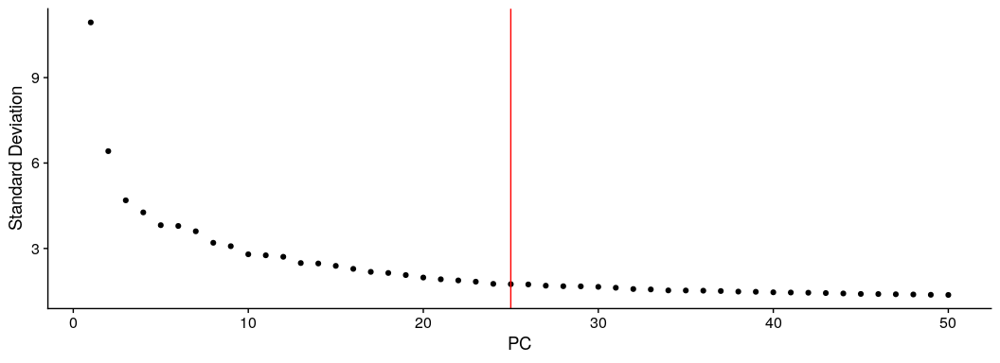

Organoid derived from CD24+ cells using H.Clevers protocol: Refine cell
clustering
================
Javier Perales-Paton - <javier.perales@bioquant.uni-heidelberg.de>

## Load libraries and auxiliar functions

``` r
set.seed(1234)
suppressPackageStartupMessages(require(Seurat))
suppressPackageStartupMessages(require(ggplot2))
suppressPackageStartupMessages(require(GSEABase))
suppressPackageStartupMessages(require(dplyr))
suppressPackageStartupMessages(require(genesorteR))
suppressPackageStartupMessages(require(ComplexHeatmap))
suppressPackageStartupMessages(require(clustree))
suppressPackageStartupMessages(require(cowplot))
source("../src/seurat_fx.R")
```

## Load SeuratObject with initial clustering outcome

``` r
SeuratObject <- readRDS("./output/2_cell_assignment/data/SeuratObject.rds")
```

## Define output directory

``` r
# Define output directory
OUTDIR <- paste0("./output/3_refine_clustering/")
if(! dir.exists(OUTDIR)) dir.create(OUTDIR, recursive = TRUE)
```

## Re-clustering and high dim. reduction after filtering contaminant populations

To trace back previous cell boundaries, we store the outcome

``` r
if(!"init_seurat_clusters" %in% colnames(SeuratObject@meta.data))
  SeuratObject$init_seurat_clusters <- SeuratObject$seurat_clusters

if(!"init_assign" %in% colnames(SeuratObject@meta.data))
  SeuratObject$init_assign <- Idents(SeuratObject)
```

We remove two cell populations that present with over-expression of
genes related to bad quality cells. We observed that cluster 5
over-express high mitochondrial genes, whereas cluster 9 over-express
ribosomal genes.

``` r
# Remove original reference to clustering
SeuratObject <- SeuratObject[, !grepl(":(High|Low)", 
                                      Idents(SeuratObject),
                      ignore.case=TRUE)]
```

We proceed with the standard pipeline for cell clustering, over-written
previous outcome

``` r
## Feature selection
SeuratObject <- FindVariableFeatures(SeuratObject, selection.method = "vst", nfeatures = 2000)

## PCA 
SeuratObject <- RunPCA(SeuratObject, features = VariableFeatures(SeuratObject), npcs = 50)
```

    ## PC_ 1 
    ## Positive:  WFDC2, CLU, SPP1, TXNIP, IGFBP3, CP, AGR3, SLPI, MALAT1, NEAT1 
    ##     CFTR, PIGR, NTRK2, ADAMTS1, CD74, FTL, GPNMB, GBP2, SOD2, SAT1 
    ##     ERBB4, LTF, SLC3A1, C3, SELENOM, TCIM, BTG2, SERPING1, TMEM101, HPN 
    ## Negative:  MT2A, TUBA1B, LGALS1, ACTB, HMGA1, CCND1, DCBLD2, KRT18, KRT8, ARL4C 
    ##     COTL1, PHLDA2, PCLAF, TNFRSF12A, PTTG1, SFRP1, CTNNAL1, EIF5A, ACAT2, C12orf75 
    ##     CDKN3, FDPS, S100A16, PHLDA1, SFN, UBE2S, ANXA3, MKI67, SQLE, BIRC5 
    ## PC_ 2 
    ## Positive:  CENPF, MKI67, ASPM, TOP2A, HMGB2, DLGAP5, HMMR, NUSAP1, UBE2C, CCNA2 
    ##     GTSE1, NUF2, PBK, TPX2, CENPA, KIF23, SGO2, CDC20, CDCA8, NCAPG 
    ##     PLK1, NDC80, DEPDC1, SPC25, TTK, CENPE, KIFC1, KIF4A, CEP55, ANLN 
    ## Negative:  S100A6, PLAU, TMSB10, HPGD, SFRP1, SYTL2, FHL2, LGALS1, EMP3, DPP4 
    ##     ANPEP, SH3BGRL3, FGFBP1, VIM, DCBLD2, CST6, PKIB, TUBA1A, ADIRF, CDA 
    ##     LOXL2, ANXA2, ITGB8, SERPINE2, FXYD2, TPM1, RND3, ANXA1, CCND1, S100A16 
    ## PC_ 3 
    ## Positive:  NDRG1, HILPDA, IGFBP5, VIM, ENO2, ERO1A, ANGPTL4, VEGFA, SLC2A1, P4HA1 
    ##     SNHG12, FTL, PLAUR, NEAT1, ANKRD37, LOX, CA9, ADM, CAV1, FTH1 
    ##     IGFBP2, GAPDH, KISS1R, MALAT1, AKAP12, CXCR4, TMSB10, PGK1, BTG1, BNIP3 
    ## Negative:  TNFRSF11B, LCN2, KITLG, TSPAN1, CPVL, DEFB1, S100A9, DBI, CD74, CFTR 
    ##     TNFSF10, DCDC2, TESC, C3, HLA-DMB, PIGR, ANXA4, SOD3, MMP7, C4orf48 
    ##     AGR2, VCAN, UTRN, IGFBP7, COL4A4, COL4A1, HOXA10, SCTR, DEPTOR, CTSH 
    ## PC_ 4 
    ## Positive:  ONECUT2, C2orf88, MEIS1, KANK4, SLC7A11, EFNB2, FAM111B, CP, CD55, IGFBP5 
    ##     CDC6, MUC16, MCM10, GPRC5A, CLSPN, DTL, HES4, S100A14, DHRS3, MCM3 
    ##     LYPD1, CDCA7, MMP10, SLC14A1, HNRNPAB, SOX17, CADM1, GINS2, FILIP1, TSHZ1 
    ## Negative:  IGFBP7, FXYD2, SPP1, PDZK1IP1, DBI, TNFSF10, PPP1R1A, HTRA1, TIMP1, BNIP3 
    ##     AKR1C3, CLU, TMEM213, TFAP2B, RETREG1, LTF, VIM, ANXA4, ACSL4, GAPDH 
    ##     NNMT, CEBPD, CITED2, RARRES2, EGR1, GLRX, LINC01781, GYPC, FOS, CKB 
    ## PC_ 5 
    ## Positive:  HTRA1, MT2A, SFRP1, TFAP2B, VIM, CDCA7, MT1E, FAM111B, MCM10, PEG10 
    ##     GYPC, AKR1C1, DTL, PCCA, CLSPN, TESC, CRNDE, GINS2, MCM3, MCM6 
    ##     MT1M, PLEKHA1, CCNE2, SERPINE2, TINAG, HELLS, NNMT, MCM5, CALB2, CDC6 
    ## Negative:  CLDN4, TACSTD2, S100A14, SLPI, SAA1, SAA2, RAP2B, CLDN7, RND3, LCN2 
    ##     AREG, EHF, GDF15, BBC3, ISG20, CD55, HLA-B, SAT1, IL32, GPRC5A 
    ##     PLAUR, MAL2, IRF6, KLK10, CXCL8, KRT19, LAMB3, ATF3, TPM4, C15orf48

``` r
print(ElbowPlot(SeuratObject,ndims = 50) + geom_vline(xintercept = 25, col="red"))
```

<!-- -->

``` r
## Cell clustering
SeuratObject <- FindNeighbors(SeuratObject, dims = 1:25)
```

    ## Computing nearest neighbor graph

    ## Computing SNN

``` r
SeuratObject <- FindClusters(SeuratObject, resolution = 0.5)
```

    ## Modularity Optimizer version 1.3.0 by Ludo Waltman and Nees Jan van Eck
    ## 
    ## Number of nodes: 5631
    ## Number of edges: 192953
    ## 
    ## Running Louvain algorithm...
    ## Maximum modularity in 10 random starts: 0.8664
    ## Number of communities: 11
    ## Elapsed time: 0 seconds

``` r
## Agreement with previous clustering
table("initial"=SeuratObject$init_seurat_clusters,
      "final"=SeuratObject$seurat_clusters)
```

    ##        final
    ## initial   0   1   2   3   4   5   6   7   8   9  10
    ##      0    0   0   0   0   0   0   0   0   0   0   0
    ##      1   12 679   1   4   4   5   3   3 401  10   0
    ##      2   41   1 657   2   0   0   0  17   0   1   0
    ##      3   73   1   0 613   0  11   1   3   1   0   0
    ##      4    0   5   0   2 567   0   7   0   1   1   0
    ##      5  576   3   0   0   0   0   0   4   0   0   0
    ##      6    0   1   0   7   8 556   0   0   0   3   0
    ##      7    0   0   0   1   1   2 507   0   0   1   0
    ##      8   10   6   8   0   0   0   0 461   0   0   0
    ##      9    0   0   0   0   0   0   0   0   0   0   0
    ##      10   0   0   1   0   0   1   0   0   0 246   0
    ##      11   0   0   0   0   0   0   0   0   0   0   0
    ##      12   0   0   0   0   1   0   0   0   0   0 100
    ##      13   0   0   0   0   0   0   0   0   0   0   0

``` r
table("Assigned"=SeuratObject$init_assign,
      "final"=SeuratObject$seurat_clusters)
```

    ##                  final
    ## Assigned            0   1   2   3   4   5   6   7   8   9  10
    ##   DCT-like_1       73   1   0 613   0  11   1   3   1   0   0
    ##   DCT-like_2        0   1   0   7   8 556   0   0   0   3   0
    ##   DCT/PC-like     576   3   0   0   0   0   0   4   0   0   0
    ##   diff.TPC:LowCov   0   0   0   0   0   0   0   0   0   0   0
    ##   Prolif.TPC_1      0   5   0   2 567   0   7   0   1   1   0
    ##   Prolif.TPC_2      0   0   0   1   1   2 507   0   0   1   0
    ##   PT-like           0   0   0   0   1   0   0   0   0   0 100
    ##   TAL-like          0   0   1   0   0   1   0   0   0 246   0
    ##   TPC_1:LowCov      0   0   0   0   0   0   0   0   0   0   0
    ##   TPC_2            12 679   1   4   4   5   3   3 401  10   0
    ##   TPC_3            41   1 657   2   0   0   0  17   0   1   0
    ##   TPC_4            10   6   8   0   0   0   0 461   0   0   0
    ##   TPC_5:LowCov      0   0   0   0   0   0   0   0   0   0   0
    ##   TPC_6:LowCov      0   0   0   0   0   0   0   0   0   0   0

``` r
## UMAP
SeuratObject <- RunUMAP(SeuratObject, dims = 1:25)
```

    ## Warning: The default method for RunUMAP has changed from calling Python UMAP via reticulate to the R-native UWOT using the cosine metric
    ## To use Python UMAP via reticulate, set umap.method to 'umap-learn' and metric to 'correlation'
    ## This message will be shown once per session

    ## 12:02:56 UMAP embedding parameters a = 0.9922 b = 1.112

    ## 12:02:56 Read 5631 rows and found 25 numeric columns

    ## 12:02:56 Using Annoy for neighbor search, n_neighbors = 30

    ## 12:02:56 Building Annoy index with metric = cosine, n_trees = 50

    ## 0%   10   20   30   40   50   60   70   80   90   100%

    ## [----|----|----|----|----|----|----|----|----|----|

    ## **************************************************|
    ## 12:02:57 Writing NN index file to temp file /tmp/RtmppF1O8d/file9f0203117aa
    ## 12:02:57 Searching Annoy index using 1 thread, search_k = 3000
    ## 12:02:58 Annoy recall = 100%
    ## 12:02:58 Commencing smooth kNN distance calibration using 1 thread
    ## 12:02:59 Initializing from normalized Laplacian + noise
    ## 12:02:59 Commencing optimization for 500 epochs, with 231140 positive edges
    ## 12:03:12 Optimization finished

``` r
d1 <- DimPlot(SeuratObject, group.by = "init_assign") + ggtitle("Initial Cell assignment")
d2 <- DimPlot(SeuratObject) + ggtitle("Re-classification")

print(CombinePlots(list(d1,d2)))
```

<!-- -->

## Diagnostics of unsupervised clustering

We will investigate how the selection of multiple resolutions affects
the partition into individual cell clusters.

``` r
clustree(SeuratObject, prefix = "RNA_snn_res.")
```

<!-- -->

We also checked whether mithochondrial expression drives the clustering

``` r
clustree(SeuratObject, prefix = "RNA_snn_res.", 
     node_colour="percent.mt", node_colour_aggr="mean")
```

<!-- -->

``` r
clustree(SeuratObject, prefix = "RNA_snn_res.", 
     node_colour="nFeature_RNA", node_colour_aggr="median")
```

<!-- -->

``` r
VlnPlot(SeuratObject, 
    feature=c("percent.mt", "nFeature_RNA", 
        "Dissociation", "G2M.Score"), 
    pt.size=0.4,
    ncol=2)
```

<!-- -->

## Archive processed data for downstream analysis

``` r
DATA_DIR <- paste0(OUTDIR,"/data")
if(!dir.exists(DATA_DIR)) dir.create(DATA_DIR)
```

``` r
# 1 Clustering outcome
saveClusteringOutcome(SeuratObject , assay="RNA", fl=paste0(OUTDIR,"/init_clustering.tsv"))
```

    ## [WARN] Selected metacols for Clustering outcome:RNA_snn_res.0.1,RNA_snn_res.0.2,RNA_snn_res.0.3,RNA_snn_res.0.4,RNA_snn_res.0.5,RNA_snn_res.0.6,RNA_snn_res.0.7,RNA_snn_res.0.8,RNA_snn_res.0.9,RNA_snn_res.1,seurat_clusters

``` r
# 2 Initial idents (same as seurat_clusters)
saveActiveIdents(SeuratObject, fl=paste0(OUTDIR,"/active_idents.tsv"))
```

``` r
saveRDS(SeuratObject, paste0(DATA_DIR,"/SeuratObject.rds"))
```

## Session info

``` r
sessionInfo()
```

    ## R version 3.6.1 (2019-07-05)
    ## Platform: x86_64-pc-linux-gnu (64-bit)
    ## Running under: Ubuntu 18.04.3 LTS
    ## 
    ## Matrix products: default
    ## BLAS:   /usr/lib/x86_64-linux-gnu/blas/libblas.so.3.7.1
    ## LAPACK: /usr/lib/x86_64-linux-gnu/lapack/liblapack.so.3.7.1
    ## 
    ## locale:
    ##  [1] LC_CTYPE=en_US.UTF-8       LC_NUMERIC=C              
    ##  [3] LC_TIME=en_GB.UTF-8        LC_COLLATE=en_US.UTF-8    
    ##  [5] LC_MONETARY=en_GB.UTF-8    LC_MESSAGES=en_US.UTF-8   
    ##  [7] LC_PAPER=en_GB.UTF-8       LC_NAME=C                 
    ##  [9] LC_ADDRESS=C               LC_TELEPHONE=C            
    ## [11] LC_MEASUREMENT=en_GB.UTF-8 LC_IDENTIFICATION=C       
    ## 
    ## attached base packages:
    ##  [1] grid      stats4    parallel  stats     graphics  grDevices utils    
    ##  [8] datasets  methods   base     
    ## 
    ## other attached packages:
    ##  [1] cowplot_1.0.0        clustree_0.4.1       ggraph_2.0.0.9000   
    ##  [4] ComplexHeatmap_2.0.0 genesorteR_0.3.1     Matrix_1.2-17       
    ##  [7] dplyr_0.8.3          GSEABase_1.46.0      graph_1.62.0        
    ## [10] annotate_1.62.0      XML_3.98-1.20        AnnotationDbi_1.46.1
    ## [13] IRanges_2.18.2       S4Vectors_0.22.1     Biobase_2.44.0      
    ## [16] BiocGenerics_0.30.0  ggplot2_3.2.1        Seurat_3.1.0        
    ## [19] rmarkdown_1.15       nvimcom_0.9-82      
    ## 
    ## loaded via a namespace (and not attached):
    ##   [1] backports_1.1.4     circlize_0.4.7      plyr_1.8.4         
    ##   [4] igraph_1.2.4.1      lazyeval_0.2.2      splines_3.6.1      
    ##   [7] listenv_0.7.0       digest_0.6.21       htmltools_0.3.6    
    ##  [10] viridis_0.5.1       gdata_2.18.0        checkmate_1.9.4    
    ##  [13] magrittr_1.5        memoise_1.1.0       cluster_2.1.0      
    ##  [16] ROCR_1.0-7          globals_0.12.4      graphlayouts_0.5.0 
    ##  [19] RcppParallel_4.4.3  R.utils_2.9.0       colorspace_1.4-1   
    ##  [22] blob_1.2.0          ggrepel_0.8.1       xfun_0.9           
    ##  [25] crayon_1.3.4        RCurl_1.95-4.12     jsonlite_1.6       
    ##  [28] zeallot_0.1.0       survival_2.44-1.1   zoo_1.8-6          
    ##  [31] ape_5.3             glue_1.3.1          polyclip_1.10-0    
    ##  [34] gtable_0.3.0        leiden_0.3.1        GetoptLong_0.1.7   
    ##  [37] future.apply_1.3.0  shape_1.4.4         scales_1.0.0       
    ##  [40] pheatmap_1.0.12     DBI_1.0.0           bibtex_0.4.2       
    ##  [43] Rcpp_1.0.2          metap_1.1           viridisLite_0.3.0  
    ##  [46] xtable_1.8-4        clue_0.3-57         reticulate_1.13    
    ##  [49] bit_1.1-14          rsvd_1.0.2          mclust_5.4.5       
    ##  [52] SDMTools_1.1-221.1  tsne_0.1-3          htmlwidgets_1.3    
    ##  [55] httr_1.4.1          gplots_3.0.1.1      RColorBrewer_1.1-2 
    ##  [58] ica_1.0-2           pkgconfig_2.0.3     R.methodsS3_1.7.1  
    ##  [61] farver_1.1.0        uwot_0.1.4          labeling_0.3       
    ##  [64] tidyselect_0.2.5    rlang_0.4.0         reshape2_1.4.3     
    ##  [67] munsell_0.5.0       tools_3.6.1         RSQLite_2.1.2      
    ##  [70] ggridges_0.5.1      evaluate_0.14       stringr_1.4.0      
    ##  [73] yaml_2.2.0          npsurv_0.4-0        knitr_1.24         
    ##  [76] bit64_0.9-7         fitdistrplus_1.0-14 tidygraph_1.1.2    
    ##  [79] caTools_1.17.1.2    purrr_0.3.2         RANN_2.6.1         
    ##  [82] pbapply_1.4-2       future_1.14.0       nlme_3.1-141       
    ##  [85] R.oo_1.22.0         compiler_3.6.1      plotly_4.9.0       
    ##  [88] png_0.1-7           lsei_1.2-0          tibble_2.1.3       
    ##  [91] tweenr_1.0.1        stringi_1.4.3       RSpectra_0.15-0    
    ##  [94] lattice_0.20-38     vctrs_0.2.0         pillar_1.4.2       
    ##  [97] lifecycle_0.1.0     Rdpack_0.11-0       lmtest_0.9-37      
    ## [100] GlobalOptions_0.1.0 RcppAnnoy_0.0.13    data.table_1.12.8  
    ## [103] bitops_1.0-6        irlba_2.3.3         gbRd_0.4-11        
    ## [106] R6_2.4.0            KernSmooth_2.23-16  gridExtra_2.3      
    ## [109] codetools_0.2-16    MASS_7.3-51.4       gtools_3.8.1       
    ## [112] assertthat_0.2.1    rjson_0.2.20        withr_2.1.2        
    ## [115] sctransform_0.2.0   tidyr_1.0.0         Rtsne_0.15         
    ## [118] ggforce_0.3.1

``` r
{                                                                                                                                                                                                           
sink(file=paste0(OUTDIR,"/sessionInfo.txt"))
print(sessionInfo())
sink()
}
```
