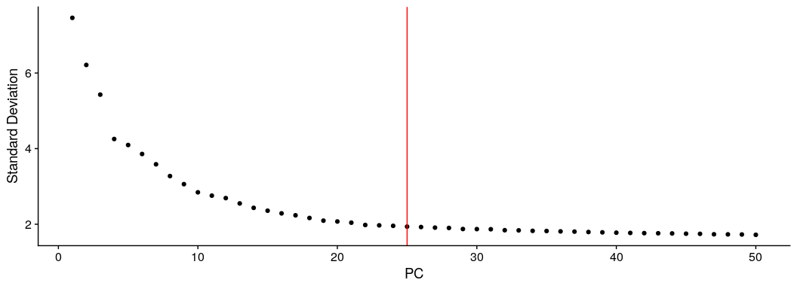
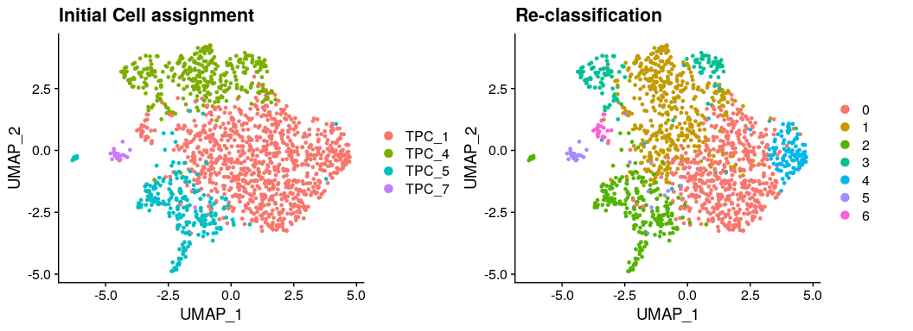
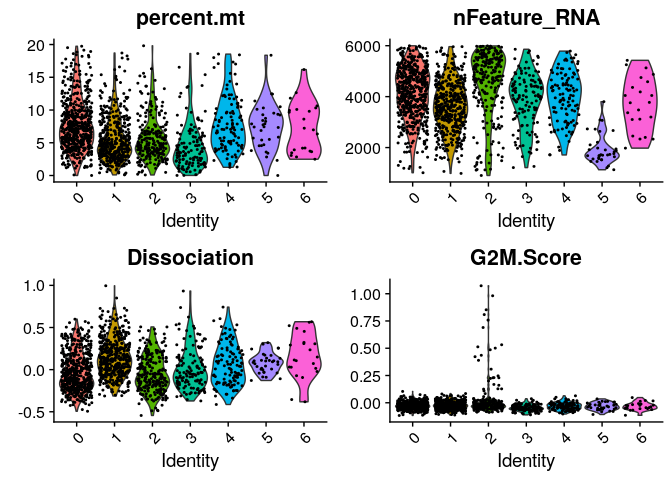

PKD2-KO organoid derived from human CD24+ cells : Refine cell clustering
================
Javier Perales-Paton - <javier.perales@bioquant.uni-heidelberg.de>

## Load libraries and auxiliar functions

``` r
set.seed(1234)
suppressPackageStartupMessages(require(Seurat))
suppressPackageStartupMessages(require(ggplot2))
suppressPackageStartupMessages(require(GSEABase))
suppressPackageStartupMessages(require(dplyr))
suppressPackageStartupMessages(require(genesorteR))
suppressPackageStartupMessages(require(ComplexHeatmap))
suppressPackageStartupMessages(require(clustree))
suppressPackageStartupMessages(require(cowplot))
source("../src/seurat_fx.R")
```

## Load SeuratObject with initial clustering outcome

``` r
SeuratObject <- readRDS("./output/2_cell_assignment/data/SeuratObject.rds")
```

## Define output directory

``` r
# Define output directory
OUTDIR <- paste0("./output/3_refine_clustering/")
if(! dir.exists(OUTDIR)) dir.create(OUTDIR, recursive = TRUE)
```

## Re-clustering and high dim. reduction after filtering contaminant populations

To trace back previous cell boundaries, we store the outcome

``` r
if(!"init_seurat_clusters" %in% colnames(SeuratObject@meta.data))
  SeuratObject$init_seurat_clusters <- SeuratObject$seurat_clusters

if(!"init_assign" %in% colnames(SeuratObject@meta.data))
  SeuratObject$init_assign <- Idents(SeuratObject)
```

We remove two cell populations that present with over-expression of
genes related to bad quality cells. We observed that cluster 5
over-express high mitochondrial genes, whereas cluster 9 over-express
ribosomal genes.

``` r
# Remove original reference to clustering
SeuratObject <- SeuratObject[, !grepl(":(High|Low)", 
                                      Idents(SeuratObject),
                      ignore.case=TRUE)]
```

We proceed with the standard pipeline for cell clustering, over-written
previous outcome

``` r
## Feature selection
SeuratObject <- FindVariableFeatures(SeuratObject, selection.method = "vst", nfeatures = 2000)

## PCA 
SeuratObject <- RunPCA(SeuratObject, features = VariableFeatures(SeuratObject), npcs = 50)
```

    ## PC_ 1 
    ## Positive:  RHOC, S100A16, RPS5, PPP1R14B, PFN1, SH3BGRL3, KRT19, YBX1, VDAC2, ANXA2 
    ##     RPSA, PLA2G16, RPL10A, TPI1, PRELID1, JPT1, PSMD7, AP2S1, LGALS1, EEF1B2 
    ##     OCIAD2, MAL2, EZR, TMSB4X, SLC25A5, S100A10, PHLDA2, HMGA1, SFN, HSPA8 
    ## Negative:  NEAT1, MT-ATP6, XIST, KCNQ1OT1, WSB1, FTX, TSIX, SPP1, SCN2A, LINC01320 
    ##     TMEM101, COL4A3, CCNL1, GABPB1-AS1, MTRNR2L12, CBLB, MT-ND6, FOSB, GABRE, ADAMTS1 
    ##     SLC8A1, POLR2J3.1, FAM20A, MEIS1, PCNX4, SRGAP3, LINC02532, TNFAIP2, MUC5B, MUC16 
    ## PC_ 2 
    ## Positive:  CFTR, HLA-DMB, SPP1, TESC, TMEM101, CPVL, CLU, LCN2, NOSTRIN, NNMT 
    ##     CD74, VCAN, LDHB, DBI, PIGR, HABP2, ASRGL1, HMGB1, PSAT1, HLA-DMA 
    ##     SLC40A1, HGD, AGR3, FAM20A, ACSL4, DHRS3, TNFRSF11B, HLA-DRA, MECOM, KITLG 
    ## Negative:  PLAUR, IGFBP5, NDRG1, ERO1A, ENO2, ANGPTL4, IL32, HILPDA, LOXL2, P4HA1 
    ##     SNHG12, SLC2A1, CAV1, F3, AL133453.1, PLAU, VKORC1, RAP2B, LGALS1, RND3 
    ##     CLDN4, MARCKS, SLCO4A1, CRABP2, PAG1, AKAP12, KISS1R, CD70, SLC5A3, DUSP5 
    ## PC_ 3 
    ## Positive:  CP, BTG1, NDRG1, FAM162A, BNIP3, TXNIP, ATP1B1, ZNF503, P4HA1, C4orf3 
    ##     C4BPA, CLU, HLA-DRB1, IL4I1, GPI, ADAMTS1, ZFP36L2, IGFBP3, TMC5, VKORC1 
    ##     PLOD2, PGK1, SOD2, SLC34A2, FTL, BIRC3, BNIP3L, ERO1A, IER5L, ALDOC 
    ## Negative:  FGFBP1, MT2A, ANXA3, BIRC5, KRT18, DKK1, CENPF, TROAP, COTL1, TNFRSF12A 
    ##     CCND1, KRT8, CENPW, HMMR, CCNB2, PHLDA2, PCLAF, PLAU, CXCL5, KRT23 
    ##     CDC20, DLGAP5, HMGA1, CDKN3, EREG, KIF20A, DEPDC1, SCEL, AREG, CCNB1 
    ## PC_ 4 
    ## Positive:  GAPDH, HMMR, VKORC1, BIRC5, CENPF, CCNB1, FTH1, DEPDC1, TPX2, DLGAP5 
    ##     CDC20, CENPW, TPI1, KIF20A, FAM162A, PRR11, FTL, TROAP, BUB1, CCNB2 
    ##     NEK2, PTTG1, TK1, LGALS1, ASPM, BNIP3, RPS12, STMN1, LDHA, KIF14 
    ## Negative:  SLC7A11, LDLR, CLDN1, CEACAM5, SLC7A5, MT-ATP6, NEAT1, ITGB8, C3, XIST 
    ##     EREG, CEACAM7, JAG1, TMEM154, CCND1, SEMA3A, GPRC5A, LAMC2, GARS, WARS 
    ##     FLNA, CXCL8, TNFAIP2, PLEC, POLR2J3.1, BACH1, CYR61, ITGB4, PCDH7, C6orf132 
    ## PC_ 5 
    ## Positive:  C15orf48, ISG15, SAA1, IL32, IFIT3, SAA2, IFIT1, RSAD2, AC025580.1, MDK 
    ##     PTGES, LCN2, CMPK2, OAS1, HLA-DRA, TICAM1, IFI6, RARRES3, FTH1, CXCL16 
    ##     CDKN2A, ISG20, MX1, ASS1, SAT1, OASL, CD74, IFIT2, ICAM1, PSMB9 
    ## Negative:  IGFBP5, VIM, LGALS1, ONECUT2, FABP5, FLNA, COL17A1, ID4, ASPH, P4HA1 
    ##     ARL4C, SCD, LOXL2, CENPF, SIGLEC15, CP, AHNAK2, PEMT, JAG1, DLGAP5 
    ##     KITLG, HMMR, ASPM, ID1, PLK1, EGLN3, PHLDA1, LMNB1, TROAP, CENPW

``` r
print(ElbowPlot(SeuratObject,ndims = 50) + geom_vline(xintercept = 25, col="red"))
```

<!-- -->

``` r
## Cell clustering
SeuratObject <- FindNeighbors(SeuratObject, dims = 1:25)
```

    ## Computing nearest neighbor graph

    ## Computing SNN

``` r
SeuratObject <- FindClusters(SeuratObject, resolution = 0.5)
```

    ## Modularity Optimizer version 1.3.0 by Ludo Waltman and Nees Jan van Eck
    ## 
    ## Number of nodes: 1483
    ## Number of edges: 57417
    ## 
    ## Running Louvain algorithm...
    ## Maximum modularity in 10 random starts: 0.7188
    ## Number of communities: 7
    ## Elapsed time: 0 seconds

``` r
## Agreement with previous clustering
table("initial"=SeuratObject$init_seurat_clusters,
      "final"=SeuratObject$seurat_clusters)
```

    ##        final
    ## initial   0   1   2   3   4   5   6
    ##       0 515 223   9   3 107   8  22
    ##       1   0   0   0   0   0   0   0
    ##       2   0   0   0   0   0   0   0
    ##       3   1 207   0 121   0   0   0
    ##       4   8   4 227   0   2   1   0
    ##       5   0   0   0   0   0   0   0
    ##       6   0   0   0   0   0  25   0

``` r
table("Assigned"=SeuratObject$init_assign,
      "final"=SeuratObject$seurat_clusters)
```

    ##               final
    ## Assigned         0   1   2   3   4   5   6
    ##   TPC_1        515 223   9   3 107   8  22
    ##   TPC_2:LowCov   0   0   0   0   0   0   0
    ##   TPC_3:HighMT   0   0   0   0   0   0   0
    ##   TPC_4          1 207   0 121   0   0   0
    ##   TPC_5          8   4 227   0   2   1   0
    ##   TPC_6:lowCov   0   0   0   0   0   0   0
    ##   TPC_7          0   0   0   0   0  25   0

``` r
## UMAP
SeuratObject <- RunUMAP(SeuratObject, dims = 1:25)
```

    ## 12:56:31 UMAP embedding parameters a = 0.9922 b = 1.112

    ## 12:56:31 Read 1483 rows and found 25 numeric columns

    ## 12:56:31 Using Annoy for neighbor search, n_neighbors = 30

    ## 12:56:31 Building Annoy index with metric = cosine, n_trees = 50

    ## 0%   10   20   30   40   50   60   70   80   90   100%

    ## [----|----|----|----|----|----|----|----|----|----|

    ## **************************************************|
    ## 12:56:31 Writing NN index file to temp file /tmp/RtmptCajlg/file19877b7c78d
    ## 12:56:31 Searching Annoy index using 1 thread, search_k = 3000
    ## 12:56:31 Annoy recall = 100%
    ## 12:56:32 Commencing smooth kNN distance calibration using 1 thread
    ## 12:56:32 Initializing from normalized Laplacian + noise
    ## 12:56:33 Commencing optimization for 500 epochs, with 58616 positive edges
    ## 12:56:36 Optimization finished

``` r
d1 <- DimPlot(SeuratObject, group.by = "init_assign") + ggtitle("Initial Cell assignment")
d2 <- DimPlot(SeuratObject) + ggtitle("Re-classification")

print(CombinePlots(list(d1,d2)))
```

<!-- -->

## Diagnostics of unsupervised clustering

``` r
VlnPlot(SeuratObject, 
    feature=c("percent.mt", "nFeature_RNA", 
        "Dissociation", "G2M.Score"), 
    pt.size=0.4,
    ncol=2)
```

<!-- -->

## Archive processed data for downstream analysis

``` r
DATA_DIR <- paste0(OUTDIR,"/data")
if(!dir.exists(DATA_DIR)) dir.create(DATA_DIR)
```

``` r
# 1 Clustering outcome
saveClusteringOutcome(SeuratObject , assay="RNA", fl=paste0(OUTDIR,"/init_clustering.tsv"))
```

    ## [WARN] Selected metacols for Clustering outcome:RNA_snn_res.0.1,RNA_snn_res.0.2,RNA_snn_res.0.3,RNA_snn_res.0.4,RNA_snn_res.0.5,RNA_snn_res.0.6,RNA_snn_res.0.7,RNA_snn_res.0.8,RNA_snn_res.0.9,RNA_snn_res.1,seurat_clusters

``` r
# 2 Initial idents (same as seurat_clusters)
saveActiveIdents(SeuratObject, fl=paste0(OUTDIR,"/active_idents.tsv"))
```

``` r
saveRDS(SeuratObject, paste0(DATA_DIR,"/SeuratObject.rds"))
```

## Session info

``` r
sessionInfo()
```

    ## R version 3.6.1 (2019-07-05)
    ## Platform: x86_64-pc-linux-gnu (64-bit)
    ## Running under: Ubuntu 18.04.3 LTS
    ## 
    ## Matrix products: default
    ## BLAS:   /usr/lib/x86_64-linux-gnu/blas/libblas.so.3.7.1
    ## LAPACK: /usr/lib/x86_64-linux-gnu/lapack/liblapack.so.3.7.1
    ## 
    ## locale:
    ##  [1] LC_CTYPE=en_US.UTF-8       LC_NUMERIC=C              
    ##  [3] LC_TIME=en_GB.UTF-8        LC_COLLATE=en_US.UTF-8    
    ##  [5] LC_MONETARY=en_GB.UTF-8    LC_MESSAGES=en_US.UTF-8   
    ##  [7] LC_PAPER=en_GB.UTF-8       LC_NAME=C                 
    ##  [9] LC_ADDRESS=C               LC_TELEPHONE=C            
    ## [11] LC_MEASUREMENT=en_GB.UTF-8 LC_IDENTIFICATION=C       
    ## 
    ## attached base packages:
    ##  [1] grid      stats4    parallel  stats     graphics  grDevices utils    
    ##  [8] datasets  methods   base     
    ## 
    ## other attached packages:
    ##  [1] cowplot_1.0.0        clustree_0.4.1       ggraph_2.0.0.9000   
    ##  [4] ComplexHeatmap_2.0.0 genesorteR_0.3.1     Matrix_1.2-17       
    ##  [7] dplyr_0.8.3          GSEABase_1.46.0      graph_1.62.0        
    ## [10] annotate_1.62.0      XML_3.98-1.20        AnnotationDbi_1.46.1
    ## [13] IRanges_2.18.2       S4Vectors_0.22.1     Biobase_2.44.0      
    ## [16] BiocGenerics_0.30.0  ggplot2_3.2.1        Seurat_3.1.0        
    ## [19] rmarkdown_1.15       nvimcom_0.9-82      
    ## 
    ## loaded via a namespace (and not attached):
    ##   [1] backports_1.1.4     circlize_0.4.7      plyr_1.8.4         
    ##   [4] igraph_1.2.4.1      lazyeval_0.2.2      splines_3.6.1      
    ##   [7] listenv_0.7.0       digest_0.6.21       htmltools_0.3.6    
    ##  [10] viridis_0.5.1       gdata_2.18.0        checkmate_1.9.4    
    ##  [13] magrittr_1.5        memoise_1.1.0       cluster_2.1.0      
    ##  [16] ROCR_1.0-7          globals_0.12.4      graphlayouts_0.5.0 
    ##  [19] RcppParallel_4.4.3  R.utils_2.9.0       colorspace_1.4-1   
    ##  [22] blob_1.2.0          ggrepel_0.8.1       xfun_0.9           
    ##  [25] crayon_1.3.4        RCurl_1.95-4.12     jsonlite_1.6       
    ##  [28] zeallot_0.1.0       survival_2.44-1.1   zoo_1.8-6          
    ##  [31] ape_5.3             glue_1.3.1          polyclip_1.10-0    
    ##  [34] gtable_0.3.0        leiden_0.3.1        GetoptLong_0.1.7   
    ##  [37] future.apply_1.3.0  shape_1.4.4         scales_1.0.0       
    ##  [40] pheatmap_1.0.12     DBI_1.0.0           bibtex_0.4.2       
    ##  [43] Rcpp_1.0.2          metap_1.1           viridisLite_0.3.0  
    ##  [46] xtable_1.8-4        clue_0.3-57         reticulate_1.13    
    ##  [49] bit_1.1-14          rsvd_1.0.2          mclust_5.4.5       
    ##  [52] SDMTools_1.1-221.1  tsne_0.1-3          htmlwidgets_1.3    
    ##  [55] httr_1.4.1          gplots_3.0.1.1      RColorBrewer_1.1-2 
    ##  [58] ica_1.0-2           pkgconfig_2.0.3     R.methodsS3_1.7.1  
    ##  [61] farver_1.1.0        uwot_0.1.4          tidyselect_0.2.5   
    ##  [64] labeling_0.3        rlang_0.4.0         reshape2_1.4.3     
    ##  [67] munsell_0.5.0       tools_3.6.1         RSQLite_2.1.2      
    ##  [70] ggridges_0.5.1      evaluate_0.14       stringr_1.4.0      
    ##  [73] yaml_2.2.0          npsurv_0.4-0        knitr_1.24         
    ##  [76] bit64_0.9-7         fitdistrplus_1.0-14 tidygraph_1.1.2    
    ##  [79] caTools_1.17.1.2    purrr_0.3.2         RANN_2.6.1         
    ##  [82] pbapply_1.4-2       future_1.14.0       nlme_3.1-141       
    ##  [85] R.oo_1.22.0         compiler_3.6.1      plotly_4.9.0       
    ##  [88] png_0.1-7           lsei_1.2-0          tibble_2.1.3       
    ##  [91] tweenr_1.0.1        stringi_1.4.3       RSpectra_0.15-0    
    ##  [94] lattice_0.20-38     vctrs_0.2.0         pillar_1.4.2       
    ##  [97] lifecycle_0.1.0     Rdpack_0.11-0       lmtest_0.9-37      
    ## [100] GlobalOptions_0.1.0 RcppAnnoy_0.0.13    data.table_1.12.8  
    ## [103] bitops_1.0-6        irlba_2.3.3         gbRd_0.4-11        
    ## [106] R6_2.4.0            KernSmooth_2.23-16  gridExtra_2.3      
    ## [109] codetools_0.2-16    MASS_7.3-51.4       gtools_3.8.1       
    ## [112] assertthat_0.2.1    rjson_0.2.20        withr_2.1.2        
    ## [115] sctransform_0.2.0   tidyr_1.0.0         Rtsne_0.15         
    ## [118] ggforce_0.3.1

``` r
{                                                                                                                                                                                                           
sink(file=paste0(OUTDIR,"/sessionInfo.txt"))
print(sessionInfo())
sink()
}
```
