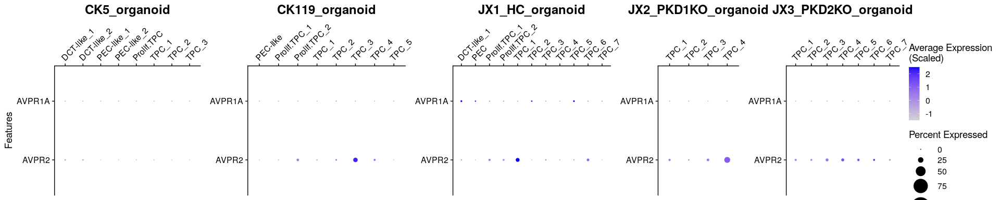

Check vassopressin receptor expression
================
Javier Perales-Patón - <javier.perales@bioquant.uni-heidelberg.de>

``` r
options(stringsAsFactors = FALSE)
# Seed number
set.seed(1234)
# Output directory
OUTDIR <- "./AVP/"
if(!dir.exists(OUTDIR)) dir.create(OUTDIR);

# Figures
FIGDIR <- paste0(OUTDIR, "/figures/")
knitr::opts_chunk$set(fig.path=FIGDIR)
knitr::opts_chunk$set(dev=c('png','pdf'))
# Data
DATADIR <- paste0(OUTDIR, "/data/")
if(!dir.exists(DATADIR)) dir.create(DATADIR);
```

``` r
suppressPackageStartupMessages(require(Seurat))
suppressPackageStartupMessages(require(GSEABase))
suppressPackageStartupMessages(require(ggplot2))
suppressPackageStartupMessages(require(cowplot))
suppressPackageStartupMessages(require(ComplexHeatmap))
source("../src/seurat_fx.R")
```

## Combine samples

Load and merge the individual samples from the
project

``` r
list_rds <- c("CK5_organoid"="../Individual_analysis_CK5_early_organoid/output/4_final_assignment/data/SeuratObject.rds",
          "CK119_organoid"="../Individual_analysis_CK119_late_organoid/output/4_final_assignment/data/SeuratObject.rds",
          "JX1_HC_organoid"="../Individual_analysis_JX1_HC_organoid/output/4_final_assignment/data/SeuratObject.rds",
          "JX2_PDK1KO_organoid"="../Individual_analysis_JX2_PKD1KO_organoid/output/4_final_assignment/data/SeuratObject.rds",
          "JX3_PDK2KO_organoid"="../Individual_analysis_JX3_PKD2KO_organoid/output/4_final_assignment/data/SeuratObject.rds")

# Load individual SeuratObjects
for(sname in names(list_rds)) {
  cat(paste0("Loading ",sname, "'s SeuratObject","\n"), file=stdout())
  SObj <- readRDS(list_rds[[sname]])
  # Scale data
  SObj <- ScaleData(SObj, verbose = FALSE)
  
  SObj$proj_ident <- paste0("[",Project(SObj),"] ",Idents(SObj))
  SObj$ident_proj <- paste0(Idents(SObj), " [",Project(SObj),"]")
  # Rename idents incl
  assign(sname, SObj)
  rm(SObj)
}
```

    ## Loading CK5_organoid's SeuratObject
    ## Loading CK119_organoid's SeuratObject
    ## Loading JX1_HC_organoid's SeuratObject
    ## Loading JX2_PDK1KO_organoid's SeuratObject
    ## Loading JX3_PDK2KO_organoid's SeuratObject

``` r
(snames <- names(list_rds))
```

    ## [1] "CK5_organoid"        "CK119_organoid"      "JX1_HC_organoid"    
    ## [4] "JX2_PDK1KO_organoid" "JX3_PDK2KO_organoid"

## individual UMAPs per sample

``` r
cols <- readRDS(file="./output/color_scheme.rds")
```

# Merge samples

``` r
# Merge ind
SeuratObject <- merge(x=get(x = snames[1]), y=sapply(snames[-1], get), add.cell.ids = snames)
# Clean mem
rm(list = snames)
```

### DotPlots of context-specific biomarkers

``` r
context_genes <- c("AVPR1A","AVPR2")
```

``` r
plots <- DotPlot_panel(SeuratObject, assay = "RNA",
                       context_genes, dot.scale = 12,
              scale.min = 0, scale.max = 100, col.min = -2.5, col.max = 2.5)

# # Reorder plots
# plots <- plots[c("CK5_organoid",
#                      "CK119_organoid",
#                      "CK120_CD13",
#                      "CK121_CD24")]
# Common scale
plots <- lapply(plots, function(gg) {
  gg + coord_flip() + scale_y_discrete(position = "right") +
    
  # This is extremely important to use same scaling color for all samples
  scale_color_gradient(low="lightgrey", high = "blue",limits=c(-1.5, 2.5)) +
      
  theme(axis.text.x = element_text(angle = 45, hjust = 0),
        plot.title = element_text(size=18, hjust = 0.5))
  })
```

    ## Scale for 'colour' is already present. Adding another scale for
    ## 'colour', which will replace the existing scale.
    ## Scale for 'colour' is already present. Adding another scale for
    ## 'colour', which will replace the existing scale.
    ## Scale for 'colour' is already present. Adding another scale for
    ## 'colour', which will replace the existing scale.
    ## Scale for 'colour' is already present. Adding another scale for
    ## 'colour', which will replace the existing scale.
    ## Scale for 'colour' is already present. Adding another scale for
    ## 'colour', which will replace the existing scale.

``` r
# Remove xlab
plots <- lapply(plots, function(gg) gg + theme(axis.title.x = element_blank()))

# Remove legend from the first three ones
plots[1:4] <- lapply(plots[1:4], function(gg) gg + NoLegend())
# Remove y axis title from the last three ones
plots[-1] <- lapply(plots[-1], function(gg) gg + theme(axis.title.y = element_blank()))

CombinePlots(plots,
            rel_widths=c(8, 8, 8, 5, 10),
             ncol = 5)
```

    ## Warning: Graphs cannot be vertically aligned unless the axis parameter is
    ## set. Placing graphs unaligned.

<!-- -->
