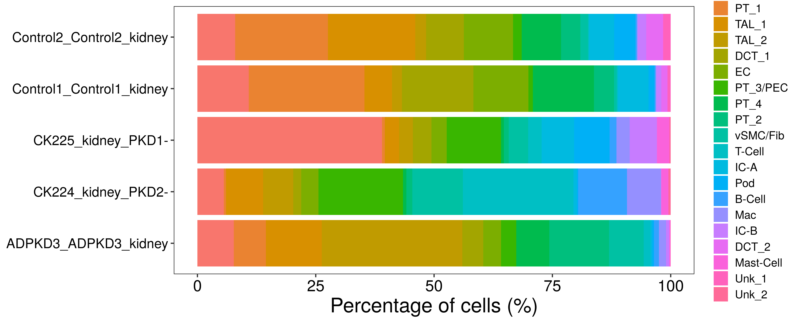

Number of cells during filtering in tissue
================
Javier Perales-Paton

``` r
set.seed(1234)
suppressPackageStartupMessages(require(Seurat))
suppressPackageStartupMessages(require(reshape2))
suppressPackageStartupMessages(require(dplyr))
suppressPackageStartupMessages(require(ggplot2))
suppressPackageStartupMessages(require(ggrepel))
suppressPackageStartupMessages(require(cowplot))
suppressPackageStartupMessages(require(ComplexHeatmap))
suppressPackageStartupMessages(require(cowplot))
source("../src/seurat_fx.R")
```

## Prepare environment

Define the output directory for figures and tables

``` r
OUTDIR <- "./NumberOfCells/"
if(!dir.exists(OUTDIR)) dir.create(OUTDIR)
```

## Read raw data is in original analysis

``` r
tissue <- c("CK224_PT25_PKD2-",
           "CK225_PT8_PKD1-",
           "ADPKD3",
           "Control1",
           "Control2")

cnts <- c("Initial", "afterQC", "Final")

res <- matrix(NA, nrow=length(cnts), ncol=length(tissue),
          dimnames=list(cnts, tissue))
```

``` r
rawDat_dirs <- c("CK224_PT25_PKD2-"="../data/sc/CK224_PT25_PKD2-/filtered_feature_bc_matrix/",
         "CK225_PT8_PKD1-"="../data/sc/CK225_PT8_PKD1-/filtered_feature_bc_matrix/",
         "ADPKD3"="../data/sc/ADPKD3/filtered_feature_bc_matrix/",
         "Control1"="../data/sc/Control1/filtered_feature_bc_matrix/",
         "Control2"="../data/sc/Control2/filtered_feature_bc_matrix/")
stopifnot(all(names(rawDat_dirs)==colnames(res)))

res[1:2,] <- sapply(names(rawDat_dirs), function(sid) {
           cat(paste0("Reading:",sid,"\n"), file=stdout())
        S <- getSeuratObject(path=rawDat_dirs[sid],
                project_name = sid,
                mt.pattern = "^MT-", min.cells=5,
                min.features=200)
        nCells <- ncol(S)
        QC <- ncol(subset(S, nFeature_RNA > 200 & nFeature_RNA < 4000 & percent.mt < 10))
        c(nCells,QC)
         })
```

    ## Reading:CK224_PT25_PKD2-
    ## Reading:CK225_PT8_PKD1-
    ## Reading:ADPKD3
    ## Reading:Control1
    ## Reading:Control2

``` r
final_list <- c("CK224_PT25_PKD2-"="../Individual_analysis_CK224_PT25_PKD2-/output/2_cell_assignment/active_idents.tsv",
          "CK225_PT8_PKD1-"="../Individual_analysis_CK225_PT8_PKD1-/output/2_cell_assignment/active_idents.tsv",
          "ADPKD3"="../Individual_analysis_ADPKD3/output/2_cell_assignment/active_idents.tsv",
          "Control1"="../Individual_analysis_Control1/output/2_cell_assignment/active_idents.tsv",
          "Control2"="../Individual_analysis_Control2/output/2_cell_assignment/active_idents.tsv")
stopifnot(all(names(final_list)==colnames(res)))
res[3,] <- sapply(names(final_list), function(sid) {
        cat(paste0("Reading:", sid, "\n"), file=stdout())
        tab <- read.table(final_list[sid], sep=",", header=TRUE, stringsAsFactors=FALSE)
        return(nrow(tab))
          })
```

    ## Reading:CK224_PT25_PKD2-
    ## Reading:CK225_PT8_PKD1-
    ## Reading:ADPKD3
    ## Reading:Control1
    ## Reading:Control2

## Save table

``` r
write.table(res, file=paste0(OUTDIR,"/NumberOfCells_tissue.csv"), 
        sep=",", row.names=TRUE, col.names=NA, quote=FALSE)
```

## Barplot

``` r
library(Seurat)
S <- readRDS(file=paste0("../Cystic_signature/01_harmony_integration/data","/S.rds"))
Project(S) <- "Integrated_tissue"
```

``` r
ren_id <- c("0"="PC-CD/CNT",
        "1"="PT_1",
        "2"="TAL_1",
        "3"="TAL_2",
        "4"="DCT_1",
        "5"="EC",
        "6"="PT_3/PEC",
        "7"="PT_4",
        "8"="PT_2",
        "9"="vSMC/Fib",
        "10"="T-Cell",
        "11"="IC-A",
        "12"="Pod", # Podocytes
        "13"="B-Cell",
        "14"="Mac",
        "15"="IC-B",
        "16"="DCT_2",
        "17"="Mast-Cell",
        "18"="Unk_1",
        "19"="Unk_2")
# ren_id <- factor(ren_id, levels=ren_id)
S$idx <- Idents(S)
S$ann <- ren_id[Idents(S)]
```

``` r
stopifnot(all(names(ren_id) %in% levels(S)))
stopifnot(length(ren_id) == length(levels(S)))

S <- RenameIdents(S, ren_id)
```

``` r
cell_pop <- table(S$orig.ident,Idents(S))
cell_pop_perc <- (sweep(cell_pop,MARGIN = 1, STATS = rowSums(cell_pop), FUN = "/")) * 100
cell_pop_perc2 <- reshape2::melt(cell_pop_perc)

ggplot(cell_pop_perc2, aes(x= Var1, fill=Var2, y=value)) +
    geom_col(position = position_stack(reverse=TRUE)) + 
#        scale_fill_manual(values = cols[levels(cell_pop_perc2$Var2)]) +
  labs(y="Percentage of cells (%)") + theme_bw() + coord_flip() +
  theme(legend.title = element_blank(),legend.text = element_text(size=10),
    legend.key.size = unit(0.5, "cm"),
        axis.title.x = element_text(size=18, color = "black"), axis.title.y = element_blank(),
        axis.text.x = element_text(size=14, color = "black"),
        axis.text.y = element_text(size=12, color = "black"),
        panel.grid = element_blank())
```

<!-- -->

``` r
# Create output table
colnames(cell_pop_perc2) <- c("sample", "population", "percentage")

cell_pop2 <- reshape2::melt(cell_pop)

colnames(cell_pop2) <- c("sample", "population", "num_cells")


# Reorder
stopifnot(dim(cell_pop2) == dim(cell_pop_perc2))

cell_pop2 <- cell_pop2[order(cell_pop2$sample,
                             cell_pop2$population), ]
cell_pop_perc2 <- cell_pop_perc2[order(cell_pop_perc2$sample,
                                       cell_pop_perc2$population), ]

# Both tables must be same order
stopifnot( all( (cell_pop2$sample == cell_pop_perc2$sample) & 
                  (cell_pop2$population == cell_pop_perc2$population))
)

cell_pop_tab <- cbind(cell_pop2, percentage=cell_pop_perc2$percentage)
# Remove absent populations from the tab
cell_pop_tab <- cell_pop_tab[cell_pop_tab$num_cells!=0, ]

write.table(cell_pop_tab,
            file= paste0(OUTDIR,"/IntegratedTissue_cell_populations_desc.csv"), sep=",",
            row.names = FALSE, col.names = TRUE, quote=TRUE)
```
