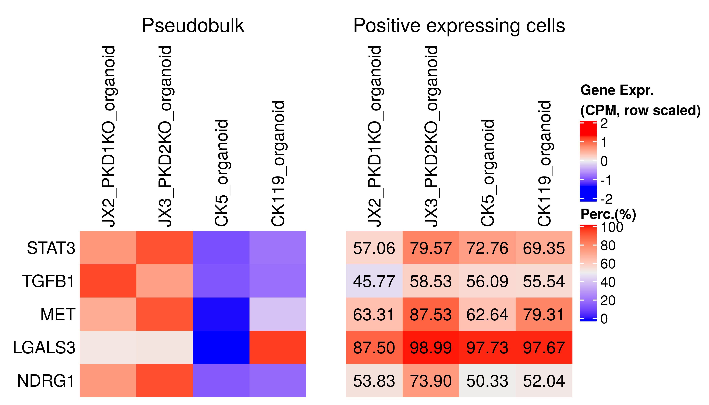

PKD marker expression from PKD organoids
================
Javier Perales-Paton - <javier.perales@bioquant.uni-heidelberg.de>

## Load libraries and auxiliar functions

``` r
set.seed(1234)
suppressPackageStartupMessages(require(Seurat))
suppressPackageStartupMessages(require(ggplot2))
suppressPackageStartupMessages(require(cowplot))
suppressPackageStartupMessages(require(ComplexHeatmap))
suppressPackageStartupMessages(require(GSEABase))
source("../src/seurat_fx.R")
```

## Load SeuratObject with initial clustering outcome

``` r
early <- readRDS(paste0("../Individual_analysis_CK5_early_organoid/",
            "output/4_final_assignment/data/SeuratObject.rds")
)
early$final_Ident <- Idents(early)

late <- readRDS(paste0("../Individual_analysis_CK119_late_organoid/",
            "output/4_final_assignment/data/SeuratObject.rds")
)
late$final_Ident <- Idents(late)

HC <- readRDS(paste0("../Individual_analysis_JX1_HC_organoid/",
             "output/4_final_assignment/data/SeuratObject.rds")
)
HC$final_Ident <- Idents(HC)

ADPKD_PDK1KO <- readRDS(paste0("../Individual_analysis_JX2_PKD1KO_organoid/",
                "output/4_final_assignment/data/SeuratObject.rds"))
ADPKD_PDK1KO$final_Ident <- Idents(ADPKD_PDK1KO)

ADPKD_PDK2KO <- readRDS(paste0("..//Individual_analysis_JX3_PKD2KO_organoid/",
                "output/4_final_assignment/data/SeuratObject.rds"))
ADPKD_PDK2KO$final_Ident <- Idents(ADPKD_PDK2KO)
```

## Selection of PKD markers

``` r
S <- merge(early, list(late, HC, ADPKD_PDK1KO, ADPKD_PDK2KO))
```

    ## Warning in CheckDuplicateCellNames(object.list = objects): Some cell names
    ## are duplicated across objects provided. Renaming to enforce unique cell
    ## names.

``` r
# Curated list of PKD markers from literature
genes <- c("STAT3", "TGFB1", "MET", "LGALS3", "NDRG1")

plots <- DotPlot_panel(S, assay = "RNA",
                       intersect(genes, rownames(S)), 
               dot.scale = 12,
              scale.min = 0, scale.max = 100, col.min = -2.5, col.max = 2.5)

# Common scale
plots <- lapply(plots, function(gg) {
  gg + coord_flip() + scale_y_discrete(position = "right") +
    
  # This is extremely important to use same scaling color for all samples
  scale_color_gradient(low="lightgrey", high = "blue",limits=c(-1.5, 2.5)) +
      
  theme(axis.text.x = element_text(angle = 45, hjust = 0),
        plot.title = element_text(size=18, hjust = 0.5))
  })
```

    ## Scale for 'colour' is already present. Adding another scale for
    ## 'colour', which will replace the existing scale.
    ## Scale for 'colour' is already present. Adding another scale for
    ## 'colour', which will replace the existing scale.
    ## Scale for 'colour' is already present. Adding another scale for
    ## 'colour', which will replace the existing scale.
    ## Scale for 'colour' is already present. Adding another scale for
    ## 'colour', which will replace the existing scale.
    ## Scale for 'colour' is already present. Adding another scale for
    ## 'colour', which will replace the existing scale.

``` r
# Remove xlab
plots <- lapply(plots, function(gg) gg + theme(axis.title.x = element_blank()))

# Remove legend from the first three ones
plots[1:4] <- lapply(plots[1:4], function(gg) gg + NoLegend())
# Remove y axis title from the last three ones
plots[-1] <- lapply(plots[-1], function(gg) gg + theme(axis.title.y = element_blank()))

CombinePlots(plots,
            rel_widths=c(6, 6, 7, 4, 9),
             ncol = 5)
```

    ## Warning: Graphs cannot be vertically aligned unless the axis parameter is
    ## set. Placing graphs unaligned.

<!-- -->

## Heatmap

``` r
cols <- readRDS(file="./output/color_scheme.rds")
```

``` r
Sx<- S[intersect(rownames(S), genes), ]
Sx<- ScaleData(Sx, verbose = FALSE)

GSC <- GeneSetCollection(GeneSet(genes, setName=" "))

CK5_hp <- DoHeatmap2(SeuratObject = subset(Sx, orig.ident=="CK5_organoid"),
        row_names_fontisze=12,
           res=NULL, cols=cols,
           assay="RNA", width = unit(41,"mm"),name="",
           show_hr = FALSE,
           GSC=GSC)

CK119_hp <- DoHeatmap2(SeuratObject = subset(Sx, orig.ident=="CK119_organoid"),
        row_names_fontisze=12,
           res=NULL, cols=cols,
           assay="RNA", width = unit(41,"mm"),name="",
           show_hr = FALSE,
           GSC=GSC)
JX2_hp <- DoHeatmap2(SeuratObject = subset(Sx, orig.ident=="JX2_PKD1KO_organoid"),
        row_names_fontisze=12,
           res=NULL, cols=cols,
           assay="RNA", width = unit(41,"mm"),name="",
           show_hr = FALSE,
           GSC=GSC)
JX3_hp <- DoHeatmap2(SeuratObject = subset(Sx, orig.ident=="JX3_PKD2KO_organoid"),
        row_names_fontisze=12,
           res=NULL, cols=cols,
           assay="RNA", width = unit(41,"mm"),name="",
           show_hr = FALSE,
           GSC=GSC)


ht_list <-  JX2_hp + JX3_hp + CK5_hp + CK119_hp 
```

    ## Warning: Heatmap/annotation names are duplicated:

    ## Warning: Heatmap/annotation names are duplicated: ,

    ## Warning: Heatmap/annotation names are duplicated: , ,

``` r
# draw(ht_list, ht_gap = unit(10, "mm"))
draw(ht_list, ht_gap = unit(10, "mm"), 
    column_title = "PKD1-KO and PKD2-KO (PKD), Early and late control organoids", 
    column_title_gp = gpar(fontsize = 16))
```

<!-- -->

## Pseudobulking

We collapse single-cell information to express it as a pseudobulk
profile for simplicity.

``` r
mat <- scater::sumCountsAcrossCells(as.matrix(S@assays$RNA@counts),
                         ids = S$orig.ident
                         )
CPM <- edgeR::cpm(mat)[genes, ]

# NOTE: this is same outcome as 
#   genesorteR::sortGenes(S@assays$RNA@counts, S$orig.ident)$condGeneProb[genes,]
PCT <- lapply(SplitObject(S, split.by="orig.ident"), function(Sj) { 
        rowSums(Sj@assays$RNA@counts[genes, ] > 0)/ncol(Sj)
                         })
PCT <- t(do.call("rbind", PCT)) * 100

# Same order
ord <- c("JX2_PKD1KO_organoid", "JX3_PKD2KO_organoid",
     "CK5_organoid", "CK119_organoid") # drop JX1, PKD-ctrl order
CPM <- CPM[, ord]
PCT <- PCT[, ord]
```

``` r
hp1 <-Heatmap(t(scale(t(CPM))),
          name="Gene Expr.\n(CPM, row scaled)",
    column_title = "Pseudobulk",
    cluster_rows = FALSE, cluster_columns = FALSE,
    row_names_side = "left", column_names_side = "top",
    row_names_gp = gpar(fontsize=12))

col_fun <- circlize::colorRamp2(c(0,100), c("white", "green4"))
hp2 <- Heatmap(PCT, col=col_fun,
    column_title = "Positive expressing cells",
     cluster_rows = FALSE, cluster_columns = FALSE,
     row_names_side = "left", column_names_side="top", 
     row_names_gp = gpar(fontsize = 10),
     cell_fun = function(j, i, x, y, width, height, fill) {
         grid.text(paste0(sprintf("%.2f", PCT[i, j])),
               x, y, 
              gp = gpar(fontsize = 12))
             } ,
             name="Perc.(%)")
draw(hp1 + hp2, ht_gap = unit(10, "mm"))
```

<!-- -->
