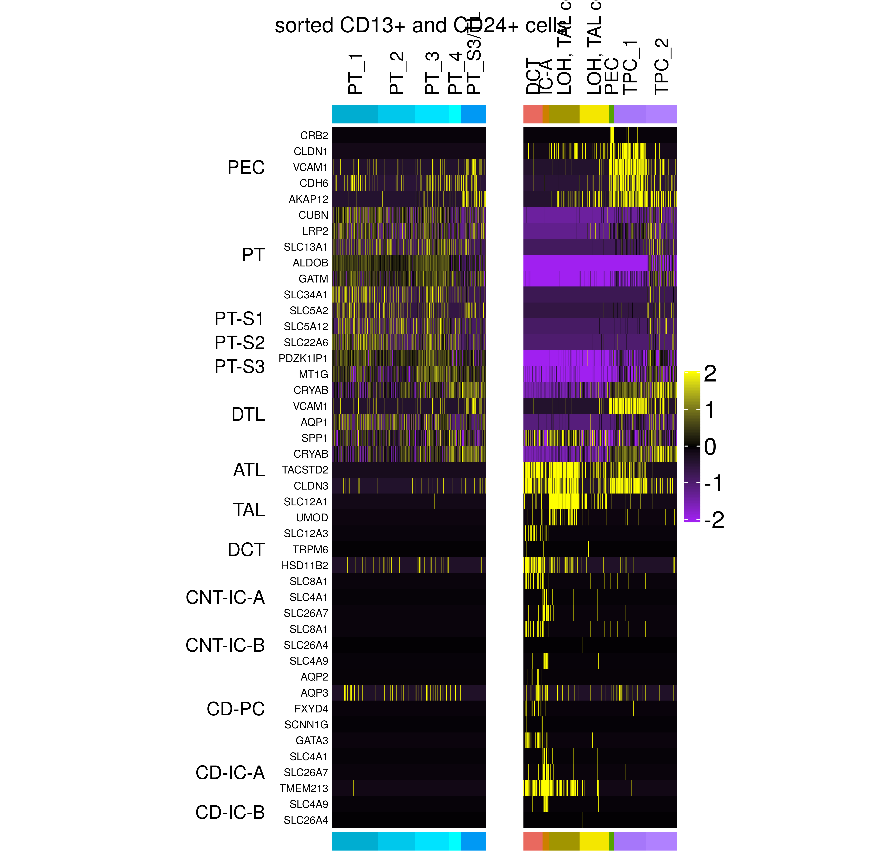
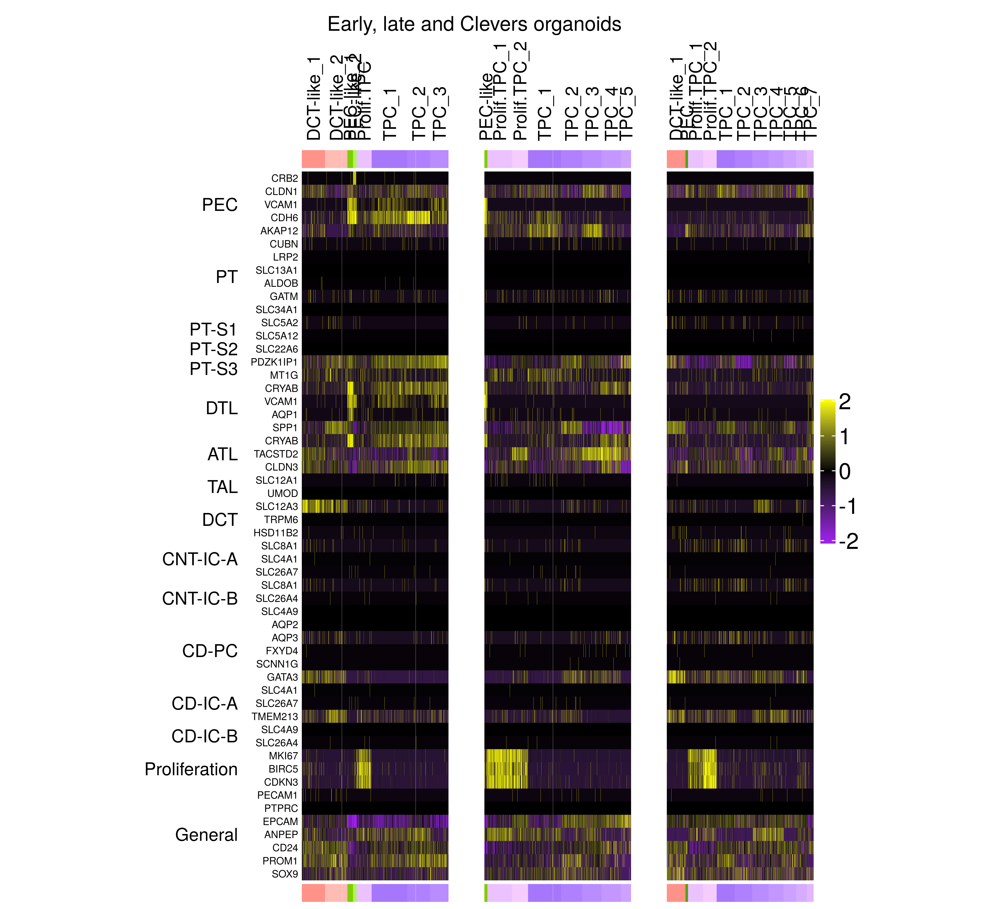

Cell type marker expression for renal corpuscle and tubule populations
================
Javier Perales-Paton - <javier.perales@bioquant.uni-heidelberg.de>

## Load libraries and auxiliar functions

``` r
set.seed(1234)
suppressPackageStartupMessages(require(Seurat))
suppressPackageStartupMessages(require(ggplot2))
suppressPackageStartupMessages(require(cowplot))
suppressPackageStartupMessages(require(ComplexHeatmap))
suppressPackageStartupMessages(require(GSEABase))
source("../src/seurat_fx.R")
```

# Organoids

## Load SeuratObject with initial clustering outcome

``` r
list_rds <- c("CK5_organoid"="../Individual_analysis_CK5_early_organoid/output/4_final_assignment/data/SeuratObject.rds",
          "CK119_organoid"="../Individual_analysis_CK119_late_organoid/output/4_final_assignment/data/SeuratObject.rds",
          "JX1_HC_organoid"="../Individual_analysis_JX1_HC_organoid/output/4_final_assignment/data/SeuratObject.rds",
          "JX2_PKD1KO_organoid"="../Individual_analysis_JX2_PKD1KO_organoid/output/4_final_assignment/data/SeuratObject.rds",
          "JX3_PKD2KO_organoid"="../Individual_analysis_JX3_PKD2KO_organoid/output/4_final_assignment/data/SeuratObject.rds",
          "CK120_CD13"="../Individual_analysis_CK120_CD13/output/4_final_assignment/data/SeuratObject.rds",
          "CK121_CD24"="../Individual_analysis_CK121_CD24/output/4_final_assignment/data/SeuratObject.rds")

# Load individual SeuratObjects
for(sname in names(list_rds)) {
  cat(paste0("Loading ",sname, "'s SeuratObject","\n"), file=stdout())
  SObj <- readRDS(list_rds[[sname]])
  # Scale data
  SObj <- ScaleData(SObj, verbose = FALSE)
  
  SObj$proj_ident <- paste0("[",Project(SObj),"] ",Idents(SObj))
  SObj$ident_proj <- paste0(Idents(SObj), " [",Project(SObj),"]")
  # Rename idents incl
  assign(sname, SObj)
  rm(SObj)
}
```

    ## Loading CK5_organoid's SeuratObject
    ## Loading CK119_organoid's SeuratObject
    ## Loading JX1_HC_organoid's SeuratObject
    ## Loading JX2_PKD1KO_organoid's SeuratObject
    ## Loading JX3_PKD2KO_organoid's SeuratObject
    ## Loading CK120_CD13's SeuratObject
    ## Loading CK121_CD24's SeuratObject

``` r
(snames <- names(list_rds))
```

    ## [1] "CK5_organoid"        "CK119_organoid"      "JX1_HC_organoid"    
    ## [4] "JX2_PKD1KO_organoid" "JX3_PKD2KO_organoid" "CK120_CD13"         
    ## [7] "CK121_CD24"

# Merged-sample report

``` r
# Merge ind
S<- merge(x=get(x = snames[1]), y=sapply(snames[-1], get), add.cell.ids = snames)
# Clean mem
rm(list = snames)
```

## Gene Set Collection

``` r
# GSC <- getGmt("../data/Prior/celltypes_RenalcorpuscleTubule_KPMP.gmt")
# genes <- unlist(geneIds(GSC))
```

## Heatmap

``` r
cols <- readRDS(file="./output/color_scheme.rds")
```

``` r
# Gene Set collection
GSC <- getGmt("../data/Prior/celltypes_RK_sorted.gmt")
genes <- unlist(geneIds(GSC))

# Selected samples
samples_sel <- c("CK120_CD13", "CK121_CD24")

# Subset cells
Sx<- S[intersect(rownames(S), genes), S$orig.ident %in% samples_sel]
Sx<- ScaleData(Sx, verbose = FALSE)

# Heatmaps
CK120_hp <- DoHeatmap2(SeuratObject = subset(Sx, orig.ident=="CK120_CD13"),
        row_names_fontisze=8,
           res=NULL, cols=cols,
           assay="RNA", width = unit(41,"mm"),name="",
           show_hr = FALSE,
       row_gap_mm = 0,
       border_boolean=FALSE,
           GSC=GSC)

CK121_hp <- DoHeatmap2(SeuratObject = subset(Sx, orig.ident=="CK121_CD24"),
        row_names_fontisze=8,
           res=NULL, cols=cols,
           assay="RNA", width = unit(41,"mm"),name="",
           show_hr = FALSE,
       row_gap_mm = 0,
       border_boolean=FALSE,
           GSC=GSC)

draw(CK120_hp + CK121_hp, ht_gap = unit(10, "mm"), 
    column_title = "sorted CD13+ and CD24+ cells", 
    column_title_gp = gpar(fontsize = 16))
```

<!-- -->

``` r
# Gene Set collection
GSC <- getGmt("../data/Prior/celltypes_RK_organoids.gmt")
genes <- unlist(geneIds(GSC))

# Selected samples
samples_sel <- c("CK5_organoid", "CK119_organoid", "JX1_HC_organoid")

# Subset cells
Sx<- S[intersect(rownames(S), genes), S$orig.ident %in% samples_sel]
Sx<- ScaleData(Sx, verbose = FALSE)

# Heatmaps
CK5_hp <- DoHeatmap2(SeuratObject = subset(Sx, orig.ident=="CK5_organoid"),
        row_names_fontisze=8,
           res=NULL, cols=cols,
           assay="RNA", width = unit(41,"mm"),name="",
           show_hr = FALSE,
       row_gap_mm = 0,
       border_boolean=FALSE,
           GSC=GSC)

CK119_hp <- DoHeatmap2(SeuratObject = subset(Sx, orig.ident=="CK119_organoid"),
        row_names_fontisze=8,
           res=NULL, cols=cols,
           assay="RNA", width = unit(41,"mm"),name="",
           show_hr = FALSE,
       row_gap_mm = 0,
       border_boolean=FALSE,
           GSC=GSC)

JX1_hp <- DoHeatmap2(SeuratObject = subset(Sx, orig.ident=="JX1_HC_organoid"),
        row_names_fontisze=8,
           res=NULL, cols=cols,
           assay="RNA", width = unit(41,"mm"),name="",
           show_hr = FALSE,
       row_gap_mm = 0,
       border_boolean=FALSE,
           GSC=GSC)


draw(CK5_hp + CK119_hp + JX1_hp, ht_gap = unit(10, "mm"), 
    column_title = "Early, late and Clevers organoids", 
    column_title_gp = gpar(fontsize = 16))
```

<!-- -->

``` r
# Gene Set collection
GSC <- getGmt("../data/Prior/celltypes_RK_supplements.gmt")
genes <- unlist(geneIds(GSC))

Sx <- S[intersect(rownames(S), genes), ]
Sx<- ScaleData(Sx, verbose = FALSE)
 
# Heatmaps
CK120_hp <- DoHeatmap2(SeuratObject = subset(Sx, orig.ident=="CK120_CD13"),
        row_names_fontisze=8,
           res=NULL, cols=cols,
           assay="RNA", width = unit(41,"mm"),name="",
           show_hr = FALSE,
       row_gap_mm = 0,
       border_boolean=FALSE,
           GSC=GSC)

CK121_hp <- DoHeatmap2(SeuratObject = subset(Sx, orig.ident=="CK121_CD24"),
        row_names_fontisze=8,
           res=NULL, cols=cols,
           assay="RNA", width = unit(41,"mm"),name="",
           show_hr = FALSE,
       row_gap_mm = 0,
       border_boolean=FALSE,
           GSC=GSC)

CK5_hp <- DoHeatmap2(SeuratObject = subset(Sx, orig.ident=="CK5_organoid"),
        row_names_fontisze=8,
           res=NULL, cols=cols,
           assay="RNA", width = unit(41,"mm"),name="",
           show_hr = FALSE,
       row_gap_mm = 0,
       border_boolean=FALSE,
           GSC=GSC)

CK119_hp <- DoHeatmap2(SeuratObject = subset(Sx, orig.ident=="CK119_organoid"),
        row_names_fontisze=8,
           res=NULL, cols=cols,
           assay="RNA", width = unit(41,"mm"),name="",
           show_hr = FALSE,
       row_gap_mm = 0,
       border_boolean=FALSE,
           GSC=GSC)

JX1_hp <- DoHeatmap2(SeuratObject = subset(Sx, orig.ident=="JX1_HC_organoid"),
        row_names_fontisze=8,
           res=NULL, cols=cols,
           assay="RNA", width = unit(41,"mm"),name="",
           show_hr = FALSE,
       row_gap_mm = 0,
       border_boolean=FALSE,
           GSC=GSC)

JX2_hp <- DoHeatmap2(SeuratObject = subset(Sx, orig.ident=="JX2_PKD1KO_organoid"),
        row_names_fontisze=8,
           res=NULL, cols=cols,
           assay="RNA", width = unit(41,"mm"),name="",
           show_hr = FALSE,
       row_gap_mm = 0,
       border_boolean=FALSE,
           GSC=GSC)

JX3_hp <- DoHeatmap2(SeuratObject = subset(Sx, orig.ident=="JX3_PKD2KO_organoid"),
        row_names_fontisze=8,
           res=NULL, cols=cols,
           assay="RNA", width = unit(41,"mm"),name="",
           show_hr = FALSE,
       row_gap_mm = 0,
       border_boolean=FALSE,
           GSC=GSC)


draw(CK120_hp + CK121_hp + CK5_hp + CK119_hp + JX1_hp + JX2_hp + JX3_hp, 
    column_title = "sorted CD13+, sorted CD24+, Early, late and Clevers organoids", 
     ht_gap = unit(10, "mm"), 
    column_title_gp = gpar(fontsize = 16))
```

<!-- -->

# Tissue samples

## Load SeuratObject with initial clustering outcome

``` r
list_rds <- c("CK224_PT25_PKD2-"="../Individual_analysis_CK224_PT25_PKD2-/output/2_cell_assignment/data/SeuratObject.rds",
          "CK225_PT8_PKD1-"="../Individual_analysis_CK225_PT8_PKD1-/output/2_cell_assignment/data/SeuratObject.rds",
          "ADPKD3"="../Individual_analysis_ADPKD3/output/2_cell_assignment/data/SeuratObject.rds",
          "Control1"="../Individual_analysis_Control1/output/2_cell_assignment/data/SeuratObject.rds",
          "Control2"="../Individual_analysis_Control2/output/2_cell_assignment/data/SeuratObject.rds")

# Load individual SeuratObjects
for(sname in names(list_rds)) {
  cat(paste0("Loading ",sname, "'s SeuratObject","\n"), file=stdout())
  SObj <- readRDS(list_rds[[sname]])
  # Scale data
  SObj <- ScaleData(SObj, verbose = FALSE)
  
  SObj$proj_ident <- paste0("[",Project(SObj),"] ",Idents(SObj))
  SObj$ident_proj <- paste0(Idents(SObj), " [",Project(SObj),"]")
  # Rename idents incl
  assign(sname, SObj)
  rm(SObj)
}
```

    ## Loading CK224_PT25_PKD2-'s SeuratObject
    ## Loading CK225_PT8_PKD1-'s SeuratObject
    ## Loading ADPKD3's SeuratObject
    ## Loading Control1's SeuratObject
    ## Loading Control2's SeuratObject

``` r
(snames <- names(list_rds))
```

    ## [1] "CK224_PT25_PKD2-" "CK225_PT8_PKD1-"  "ADPKD3"          
    ## [4] "Control1"         "Control2"

# Merged-sample report

``` r
# Merge ind
S<- merge(x=get(x = snames[1]), y=sapply(snames[-1], get), add.cell.ids = snames)
# Clean mem
rm(list = snames)
```

``` r
# Gene Set collection
GSC <- getGmt("../data/Prior/celltypes_RK_supplements.gmt")
genes <- unlist(geneIds(GSC))

#NOTE: This is whole tissue, shall we scaled across samples when within sample is
#   heterogeneous enough??
Sx <- S[intersect(rownames(S), genes), ]
Sx<- ScaleData(Sx, verbose = FALSE)
 
# Heatmaps
CK224_hp <- DoHeatmap2(SeuratObject = subset(Sx, orig.ident=="CK224_kidney_PKD2-"),
        row_names_fontisze=8,
           res=NULL,
           assay="RNA", width = unit(41,"mm"),name="",
           show_hr = FALSE,
       row_gap_mm = 0,
       border_boolean=FALSE,
           GSC=GSC)

CK225_hp <- DoHeatmap2(SeuratObject = subset(Sx, orig.ident=="CK225_kidney_PKD1-"),
        row_names_fontisze=8,
           res=NULL,
           assay="RNA", width = unit(41,"mm"),name="",
           show_hr = FALSE,
       row_gap_mm = 0,
       border_boolean=FALSE,
           GSC=GSC)

ADPKD3_hp <- DoHeatmap2(SeuratObject = subset(Sx, orig.ident=="ADPKD3_kidney"),
        row_names_fontisze=8,
           res=NULL,
           assay="RNA", width = unit(41,"mm"),name="",
           show_hr = FALSE,
       row_gap_mm = 0,
       border_boolean=FALSE,
           GSC=GSC)

Control1_hp <- DoHeatmap2(SeuratObject = subset(Sx, orig.ident=="Control1_kidney"),
        row_names_fontisze=8,
           res=NULL,
           assay="RNA", width = unit(41,"mm"),name="",
           show_hr = FALSE,
       row_gap_mm = 0,
       border_boolean=FALSE,
           GSC=GSC)

Control2_hp <- DoHeatmap2(SeuratObject = subset(Sx, orig.ident=="Control2_kidney"),
        row_names_fontisze=8,
           res=NULL,
           assay="RNA", width = unit(41,"mm"),name="",
           show_hr = FALSE,
       row_gap_mm = 0,
       border_boolean=FALSE,
           GSC=GSC)


draw(Control1_hp + Control2_hp + CK224_hp + CK225_hp + ADPKD3_hp, ht_gap = unit(10, "mm"), 
    column_title = "Control1, Control2, CK224, CK225, ADPKD3", 
    column_title_gp = gpar(fontsize = 16))
```

<!-- -->
