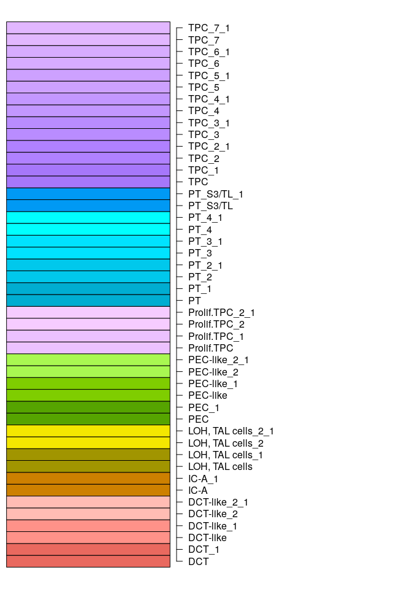

create\_color\_palette
================
Javier Perales-Paton

``` r
set.seed(1234)
suppressPackageStartupMessages(require(Seurat))
suppressPackageStartupMessages(require(ggplot2))
source("../src/seurat_fx.R")
```

## Prepare environment

Define the output directory for figures and tables

``` r
OUTDIR <- "./output/"
if(!dir.exists(OUTDIR)) dir.create(OUTDIR)
```

## Combine samples

Load and merge the individual samples from the
project

``` r
list_rds <- c("CK5_organoid"="../Individual_analysis_CK5_early_organoid/output/4_final_assignment/data/SeuratObject.rds",
              "CK119_organoid"="../Individual_analysis_CK119_late_organoid/output/4_final_assignment/data/SeuratObject.rds",
          "JX1_HC_organoid"="../Individual_analysis_JX1_HC_organoid/output/4_final_assignment/data/SeuratObject.rds",
          "ADPKD_PDK1KO " = paste0("../Individual_analysis_JX2_PKD1KO_organoid/",
                "output/4_final_assignment/data/SeuratObject.rds"),
    "ADPKD_PDK2KO" = paste0("..//Individual_analysis_JX3_PKD2KO_organoid/",
                "output/4_final_assignment/data/SeuratObject.rds"),
              "CK120_CD13"="../Individual_analysis_CK120_CD13/output/4_final_assignment/data/SeuratObject.rds",
              "CK121_CD24"="../Individual_analysis_CK121_CD24/output/4_final_assignment/data/SeuratObject.rds")

# Load individual SeuratObjects
for(sname in names(list_rds)) {
  cat(paste0("Loading ",sname, "'s SeuratObject","\n"), file=stdout())
  SObj <- readRDS(list_rds[[sname]])
  # Scale data
  SObj <- ScaleData(SObj, verbose = FALSE)
  
  SObj$proj_ident <- paste0("[",Project(SObj),"] ",Idents(SObj))
  SObj$ident_proj <- paste0(Idents(SObj), " [",Project(SObj),"]")
  # Rename idents incl
  assign(sname, SObj)
  rm(SObj)
}
```

    ## Loading CK5_organoid's SeuratObject
    ## Loading CK119_organoid's SeuratObject
    ## Loading JX1_HC_organoid's SeuratObject
    ## Loading ADPKD_PDK1KO 's SeuratObject
    ## Loading ADPKD_PDK2KO's SeuratObject
    ## Loading CK120_CD13's SeuratObject
    ## Loading CK121_CD24's SeuratObject

``` r
(snames <- names(list_rds))
```

    ## [1] "CK5_organoid"    "CK119_organoid"  "JX1_HC_organoid" "ADPKD_PDK1KO "  
    ## [5] "ADPKD_PDK2KO"    "CK120_CD13"      "CK121_CD24"

## create palette based on present cell type classes

``` r
# ggplot2 colors given a set of n groups
gg_color_hues <- function(split_classes) {
  n <- length(split_classes)
  hues = setNames(seq(15, 375, length = n + 1),
                  names(split_classes))
  
  cols <- sapply(names(split_classes), function(cl) {
    subcl <- split_classes[[cl]]
    cols <- hcl(h=hues[cl],
                l=seq(60,90, length=length(subcl)),
                c=100)
    return(cols)
  }, simplify = FALSE)
  return(cols)
}

# All classes in all 4 samples
classes_level2 <- sort(unique(unlist(sapply(snames, function(sname) levels(Idents(get(sname)))))))
# Many times, same class between samples are named with an optional _1
classes_level2 <- unique(gsub("_1$","",classes_level2))
# Count how many of the same type
classes_level1 <- gsub("_(S[0-9](_[0-9])?|[0-9]+)$","",classes_level2)
# classes_level1 <- gsub("Prolif_", "", classes_level1)
split_classes <- split(classes_level2, classes_level1)
unk <- split_classes[grepl("unk", names(split_classes), ignore.case = TRUE)]
cols_unk <- sapply(names(unk), function(z) "grey")

split_classes <- split_classes[!grepl("unk", names(split_classes), ignore.case = TRUE)]


# Minor manual change: add prolif_PT-like[/TPC] to their corresponding upper groups.

# Why Manually? Actually this hue palette was obtained by chance
# for this many number of classes. Later we observed that we shoud group proliferating
# with their upper classes for visualization purposes: there are too many cell types 
# across the 4 samples, and these are very related to each other. 
# So we decided to merge them manually and create dummy classes to keep the 
# original number of classes for color palette generation, so those dummies are only preserved
# for generating the palette, and removed afterwards

# How to integrate alternative indexes from two vectors,
# source: https://stackoverflow.com/questions/25961897/how-to-merge-2-vectors-alternating-indexes
#a1 <- c(split_classes$`PT-like/TPC`)
#a2 <- c(split_classes$`TPC`,
#        split_classes$`Prolif.TPC`)
#split_classes$`TPC` <- c(a1, a2)[order(c(seq_along(a1)*2 - 1, seq_along(a2)*2))]
#split_classes$`PT-like` <- "DUMMY1"


split_classes$`TPC` <- c(split_classes$`TPC`, split_classes$`Prolif.TPC`)
split_classes$`PEC` <- c(split_classes$`PEC`, split_classes$`PEC-like`)
split_classes$`DCT` <- c(split_classes$`DCT`, split_classes$`DCT-like`)
split_classes$`PT` <- c(split_classes$`PT`, split_classes$`PT-like`)
split_classes$`LOH, TAL cells` <- c(split_classes$`LOH, TAL cells`, split_classes$`TAL-like`)

split_classes$`PT-like` <- "DUMMY"
split_classes$`TAL-like` <- "DUMMY"


# We keep the original number of classes to match across samples, creating a dummy class
# This dummy color never shows up in any plot
prolif_idx <- grep("Prolif", names(split_classes))
names(split_classes)[prolif_idx] <- paste0("DUMMY", prolif_idx)
split_classes[grep("DUMMY", names(split_classes))] <- paste0("DUMMY",prolif_idx)

split_classes$`PEC-like` <- "DUMMY1" # Leave it but remove afterwards
split_classes$`DCT-like` <- NULL # Rmove it

# Generate the palette
cols <- gg_color_hues(split_classes)
cols <- c(cols,cols_unk)
# Concatenate colors from unknown and known classes
split_classes <- c(split_classes, unk)

# Convert the list to a vector named
cols <- setNames(unlist(cols), unlist(split_classes))
cols <- cols[sort(names(cols))]
cols <- c(cols,setNames(cols, paste0(names(cols),"_1")))
# Remove the dummies
cols <- cols[!grepl("DUMMY", names(cols))]
cols <- cols[sort(names(cols))]
# TAL-like gets purple, similar to TPC pink. So over-write

# Save the palette
saveRDS(cols, file="./output/color_scheme.rds")
```

``` r
# Source : https://stackoverflow.com/questions/25726276/visualize-a-list-of-colors-palette-in-r
par(mar=c(0,0,0,20))
plot(NA, xlim=c(0,1), ylim=c(0, length(cols)),
     xaxt="n", yaxt="n", xlab="",ylab="", bty="n")

for (i in 1:length(cols)) {
  color <- cols[i]
  polygon(y=c(i-1, i, i, i-1), x=c(0, 0, 1, 1), col = color)
}
axis(side = 4, labels = names(cols), at = (1:length(cols)) -0.5, las=1)
```

<!-- -->
