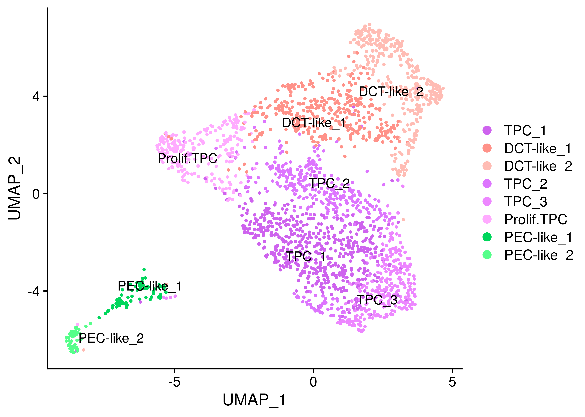
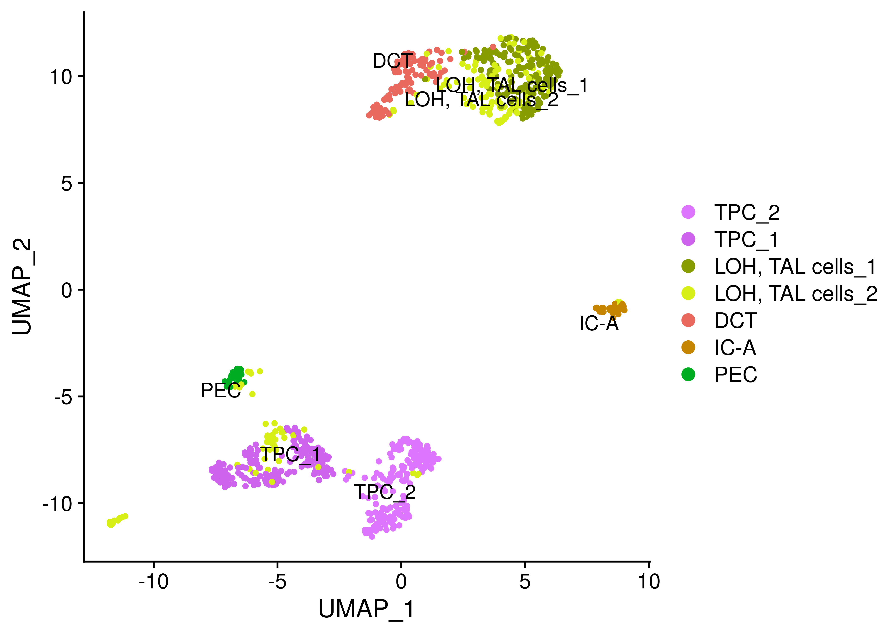
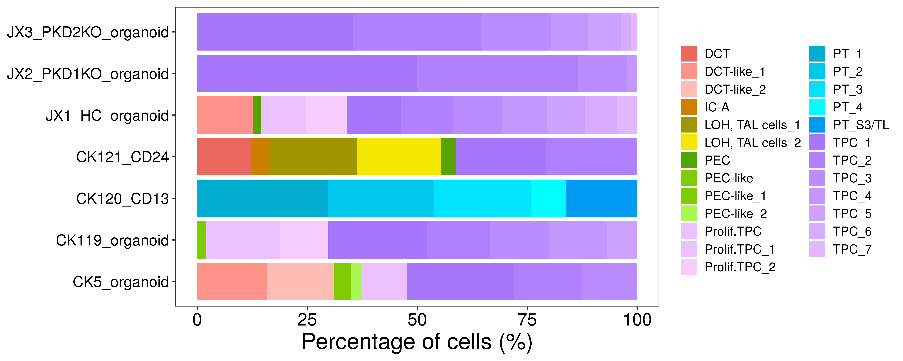
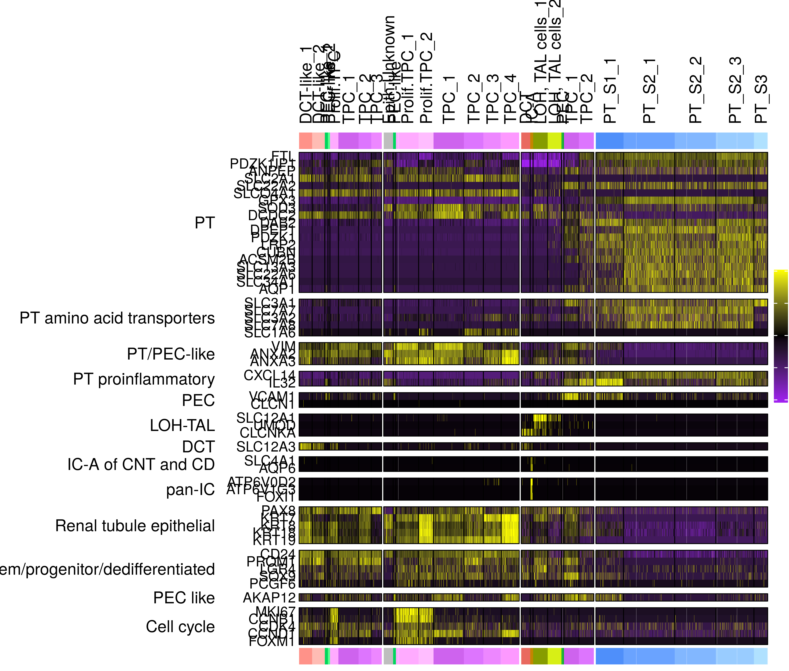

merge\_individuals
================
Javier Perales-Paton

``` r
set.seed(1234)
suppressPackageStartupMessages(require(Seurat))
suppressPackageStartupMessages(require(GSEABase))
suppressPackageStartupMessages(require(ggplot2))
suppressPackageStartupMessages(require(cowplot))
suppressPackageStartupMessages(require(ComplexHeatmap))
source("../src/seurat_fx.R")
```

## Prepare environment

Define the output directory for figures and tables

``` r
OUTDIR <- "./output/"
if(!dir.exists(OUTDIR)) dir.create(OUTDIR)

FIGSDIR <- paste(OUTDIR,"/figs")
TABSDIR <- paste(OUTDIR,"/tabs")
```

## Combine samples

Load and merge the individual samples from the
project

``` r
list_rds <- c("CK5_organoid"="../Individual_analysis_CK5_early_organoid/output/4_final_assignment/data/SeuratObject.rds",
          "CK119_organoid"="../Individual_analysis_CK119_late_organoid/output/2_cell_assignment/data/SeuratObject.rds",
          "CK120_CD13"="../Individual_analysis_CK120_CD13/output/4_final_assignment/data/SeuratObject.rds",
          "CK121_CD24"="../Individual_analysis_CK121_CD24/output/4_final_assignment/data/SeuratObject.rds")

# Load individual SeuratObjects
for(sname in names(list_rds)) {
  cat(paste0("Loading ",sname, "'s SeuratObject","\n"), file=stdout())
  SObj <- readRDS(list_rds[[sname]])
  # Scale data
  SObj <- ScaleData(SObj, verbose = FALSE)
  
  SObj$proj_ident <- paste0("[",Project(SObj),"] ",Idents(SObj))
  SObj$ident_proj <- paste0(Idents(SObj), " [",Project(SObj),"]")
  # Rename idents incl
  assign(sname, SObj)
  rm(SObj)
}
```

    ## Loading CK5_organoid's SeuratObject
    ## Loading CK119_organoid's SeuratObject
    ## Loading CK120_CD13's SeuratObject
    ## Loading CK121_CD24's SeuratObject

``` r
(snames <- names(list_rds))
```

    ## [1] "CK5_organoid"   "CK119_organoid" "CK120_CD13"     "CK121_CD24"

## individual UMAPs per sample

``` r
cols <- readRDS(file="./output/color_scheme.rds")
```

``` r
umap_cols <- cols[levels(get("CK5_organoid")@active.ident)]
DimPlot(get("CK5_organoid"), reduction="umap", cols = umap_cols[], label=TRUE)
```

    ## Warning: Using `as.character()` on a quosure is deprecated as of rlang 0.3.0.
    ## Please use `as_label()` or `as_name()` instead.
    ## This warning is displayed once per session.

<!-- -->

``` r
umap_cols <- cols[levels(get("CK119_organoid")@active.ident)]
DimPlot(get("CK119_organoid"), reduction="umap", cols = umap_cols[], label = TRUE)
```

<!-- -->

``` r
umap_cols <- cols[levels(get("CK120_CD13")@active.ident)]
DimPlot(get("CK120_CD13"), reduction="umap", cols = umap_cols[], label=TRUE)
```

<!-- -->

``` r
umap_cols <- cols[levels(get("CK121_CD24")@active.ident)]
DimPlot(get("CK121_CD24"), reduction="umap", cols = umap_cols[], label=TRUE)
```

<!-- -->

# Merge samples

``` r
# Merge ind
SeuratObject <- merge(x=get(x = snames[1]), y=sapply(snames[-1], get), add.cell.ids = snames)
# Clean mem
rm(list = snames)
```

``` r
pop_clss <- setNames(gsub("-like","",gsub("_[0-9]+$","",levels(Idents(SeuratObject)))),
                     levels(Idents(SeuratObject)))
```

## Figures

``` r
if(! dir.exists(FIGSDIR)) dir.create(FIGSDIR, recursive = TRUE)
```

``` r
cell_pop <- table(SeuratObject$orig.ident,pop_clss[Idents(SeuratObject)])
cell_pop_perc <- (sweep(cell_pop,MARGIN = 1, STATS = rowSums(cell_pop), FUN = "/")) * 100
cell_pop_perc2 <- reshape2::melt(cell_pop_perc)
cell_pop_perc2$Var1 <- relevel(cell_pop_perc2$Var1, ref = "CK5_organoid")
cell_pop_perc2$Var2 <- relevel(cell_pop_perc2$Var2, ref="Unknown")

ggplot(cell_pop_perc2, aes(x= Var1, fill=Var2, y=value)) +
    geom_col(position = position_stack(reverse=TRUE)) + 
         scale_fill_manual(values = cols[levels(cell_pop_perc2$Var2)]) +
  labs(y="Percentage of cells (%)") + theme_bw() + coord_flip() +
  theme(legend.title = element_blank(),legend.text = element_text(size=10),
    legend.key.size = unit(0.5, "cm"),
        axis.title.x = element_text(size=18, color = "black"), axis.title.y = element_blank(),
        axis.text.x = element_text(size=14, color = "black"),
        axis.text.y = element_text(size=12, color = "black"),
          panel.border=element_blank(),
        panel.grid = element_blank())
```

<!-- -->

``` r
# Create output table
colnames(cell_pop_perc2) <- c("sample", "population", "percentage")

cell_pop2 <- reshape2::melt(cell_pop)
cell_pop2$Var1 <- relevel(cell_pop2$Var1, ref = "CK5_organoid")
cell_pop2$Var2 <- relevel(cell_pop2$Var2, ref="Unknown")

colnames(cell_pop2) <- c("sample", "population", "num_cells")


# Reorder
stopifnot(dim(cell_pop2) == dim(cell_pop_perc2))

cell_pop2 <- cell_pop2[order(cell_pop2$sample,
                             cell_pop2$population), ]
cell_pop_perc2 <- cell_pop_perc2[order(cell_pop_perc2$sample,
                                       cell_pop_perc2$population), ]

# Both tables must be same order
stopifnot( all( (cell_pop2$sample == cell_pop_perc2$sample) & 
                  (cell_pop2$population == cell_pop_perc2$population))
)

cell_pop_tab <- cbind(cell_pop2, percentage=cell_pop_perc2$percentage)
# Remove absent populations from the tab
cell_pop_tab <- cell_pop_tab[cell_pop_tab$num_cells!=0, ]

write.table(cell_pop_tab,
            file="./output/tubuloid_cell_populations_desc.csv", sep=",",
            row.names = FALSE, col.names = TRUE, quote=TRUE)
```

### DotPlots of context-specific biomarkers

``` r
context_genes <- getGmt("../data/Prior/Kramann_context.gmt")
```

``` r
plots <- DotPlot_panel(SeuratObject, assay = "RNA",
                       unlist(geneIds(context_genes)), dot.scale = 12,
              scale.min = 0, scale.max = 100, col.min = -2.5, col.max = 2.5)

# Reorder plots
plots <- plots[c("CK5_organoid",
                     "CK119_organoid",
                     "CK120_CD13",
                     "CK121_CD24")]
# Common scale
plots <- lapply(plots, function(gg) {
  gg + coord_flip() + scale_y_discrete(position = "right") +
    
  # This is extremely important to use same scaling color for all samples
  scale_color_gradient(low="lightgrey", high = "blue",limits=c(-1.5, 2.5)) +
      
  theme(axis.text.x = element_text(angle = 45, hjust = 0),
        plot.title = element_text(size=18, hjust = 0.5))
  })
```

    ## Scale for 'colour' is already present. Adding another scale for
    ## 'colour', which will replace the existing scale.
    ## Scale for 'colour' is already present. Adding another scale for
    ## 'colour', which will replace the existing scale.
    ## Scale for 'colour' is already present. Adding another scale for
    ## 'colour', which will replace the existing scale.
    ## Scale for 'colour' is already present. Adding another scale for
    ## 'colour', which will replace the existing scale.

``` r
# Remove xlab
plots <- lapply(plots, function(gg) gg + theme(axis.title.x = element_blank()))

# Remove legend from the first three ones
plots[1:3] <- lapply(plots[1:3], function(gg) gg + NoLegend())
# Remove y axis title from the last three ones
plots[-1] <- lapply(plots[-1], function(gg) gg + theme(axis.title.y = element_blank()))

CombinePlots(plots,
            rel_widths=c(8, 9, 6, 9),
             ncol = 4)
```

    ## Warning: Graphs cannot be vertically aligned unless the axis parameter is
    ## set. Placing graphs unaligned.

<!-- -->

### Heatmap of markers:

``` r
heatmap_markers <- getGmt("../data/Prior/Xu_heatmap_markers.gmt")

SeuratObject <- SeuratObject[intersect(rownames(SeuratObject), unlist(geneIds(heatmap_markers))), ]
SeuratObject <- ScaleData(SeuratObject, verbose = FALSE)

CK5_hp <- DoHeatmap2(SeuratObject = subset(SeuratObject, orig.ident == "CK5_organoid"),
           res=NULL, cols=cols,
           assay="RNA", width = unit(25,"mm"),name="",
           show_hr = FALSE,
           GSC=heatmap_markers)

CK119_hp <- DoHeatmap2(SeuratObject = subset(SeuratObject, orig.ident == "CK119_organoid"),
           res=NULL, cols=cols,
           assay="RNA", width = unit(41,"mm"),name="",
           show_hr = FALSE,
           GSC=heatmap_markers)

CK120_hp <- DoHeatmap2(SeuratObject = subset(SeuratObject, orig.ident == "CK120_CD13"),
           res=NULL, cols=cols,
           assay="RNA", width = unit(52,"mm"),name="",
           show_hr = FALSE,
           GSC=heatmap_markers)

CK121_hp <- DoHeatmap2(SeuratObject = subset(SeuratObject, orig.ident == "CK121_CD24"),
           res=NULL, cols=cols,
           assay="RNA", width = unit(22,"mm"),name="",
            show_hr = FALSE,
           GSC=heatmap_markers)

ht_list <- CK5_hp + CK119_hp + CK121_hp + CK120_hp
```

    ## Warning: Heatmap/annotation names are duplicated:

    ## Warning: Heatmap/annotation names are duplicated: ,

    ## Warning: Heatmap/annotation names are duplicated: , ,

``` r
draw(ht_list, ht_gap = unit(0.6, "mm"))
```

<!-- -->
