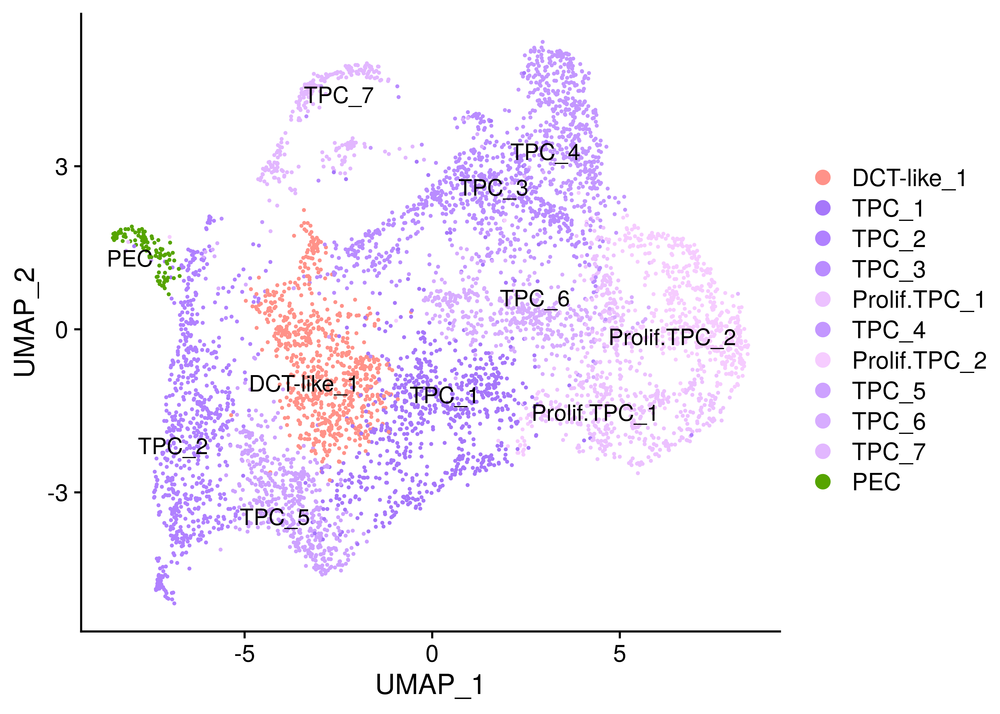
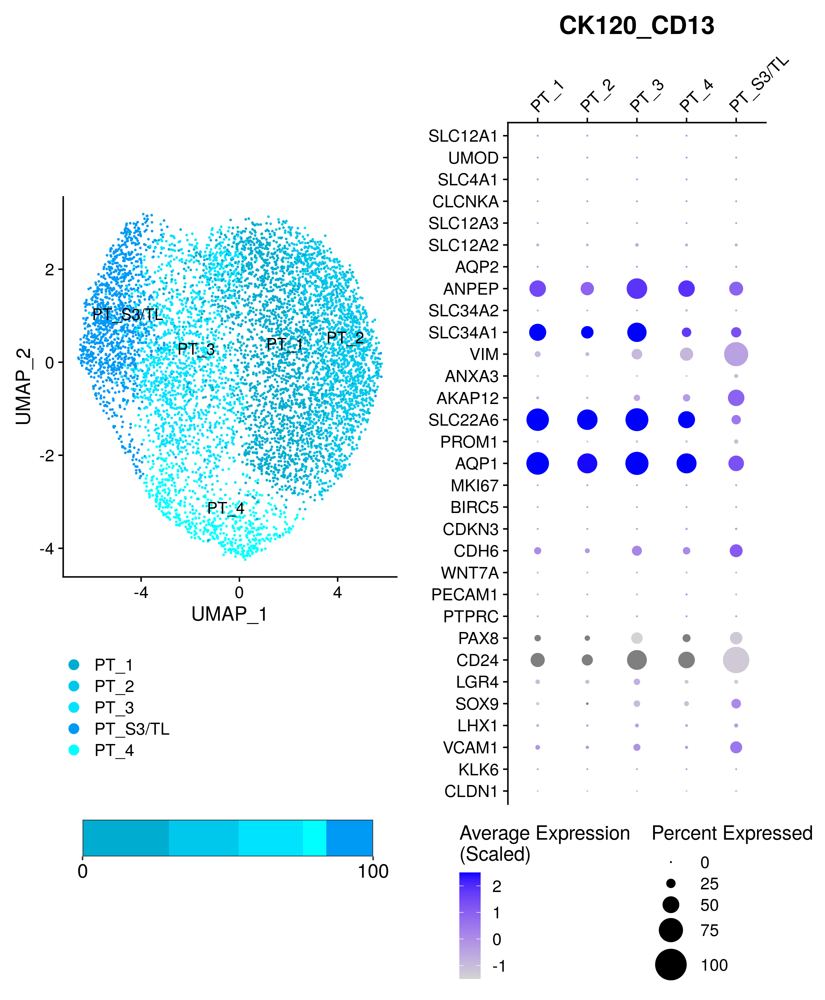
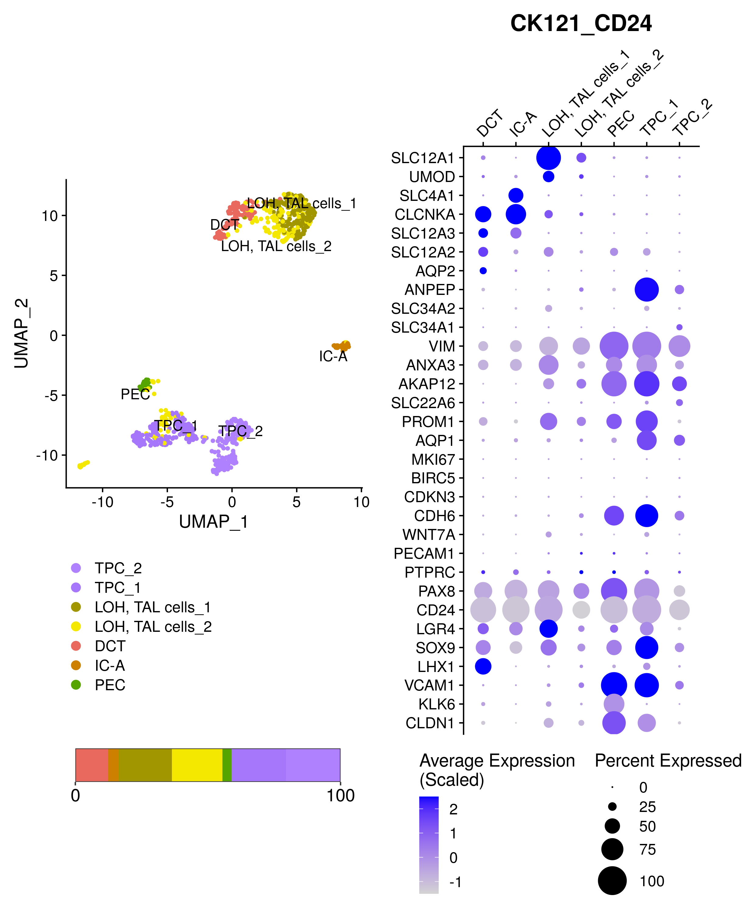
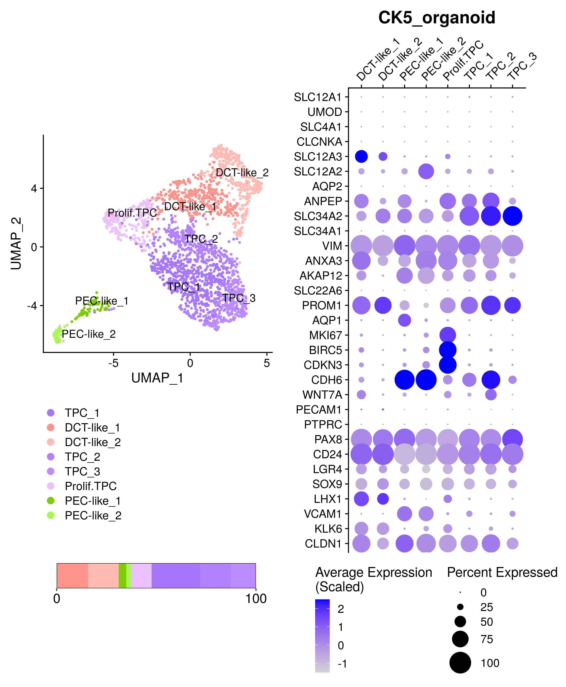
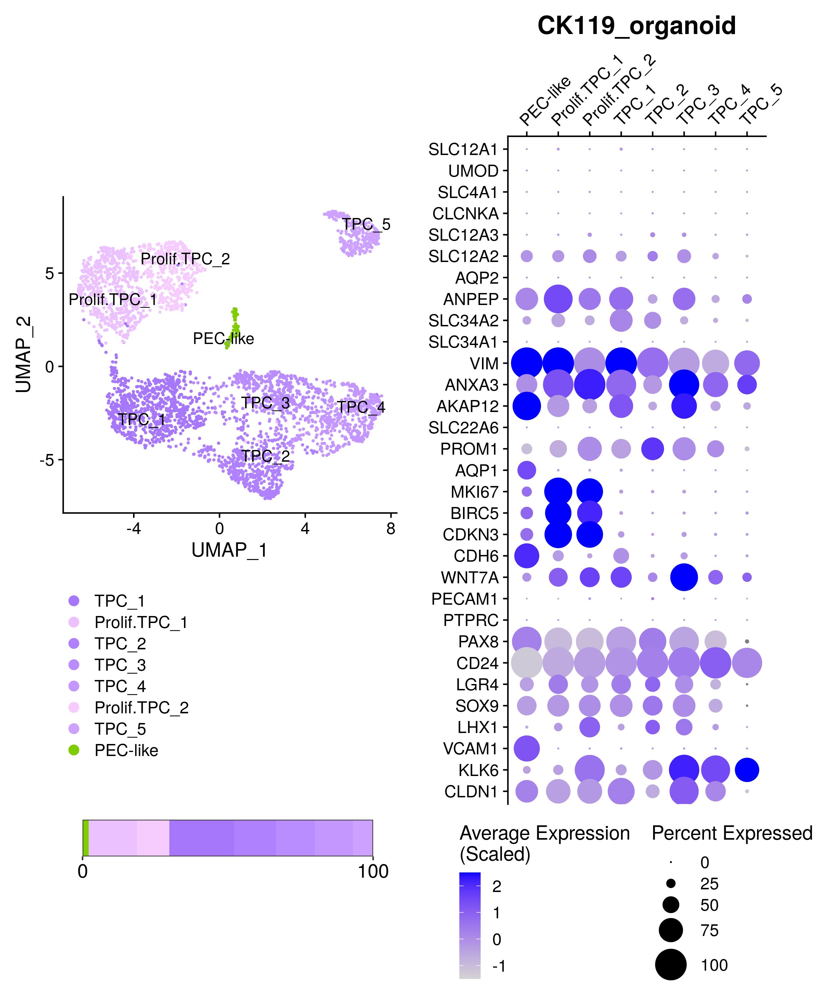
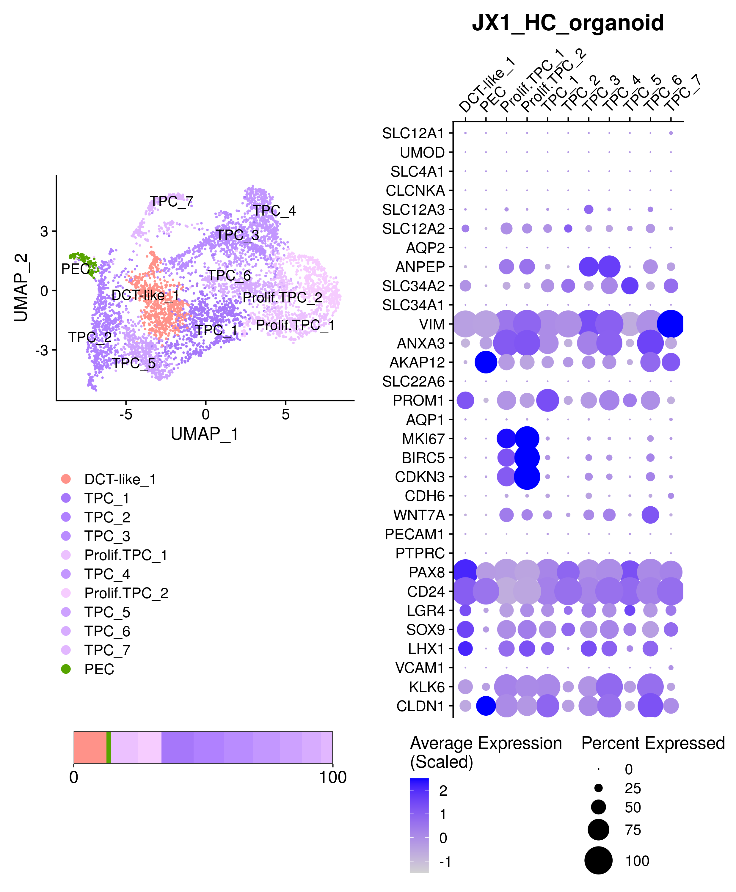
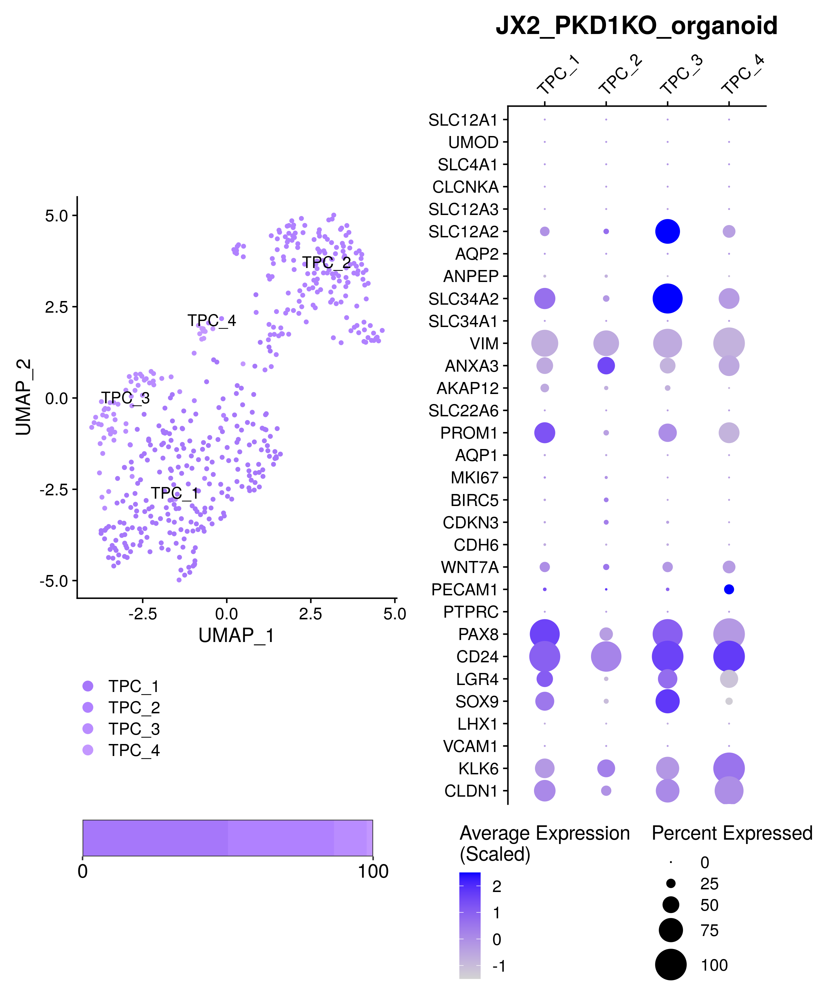
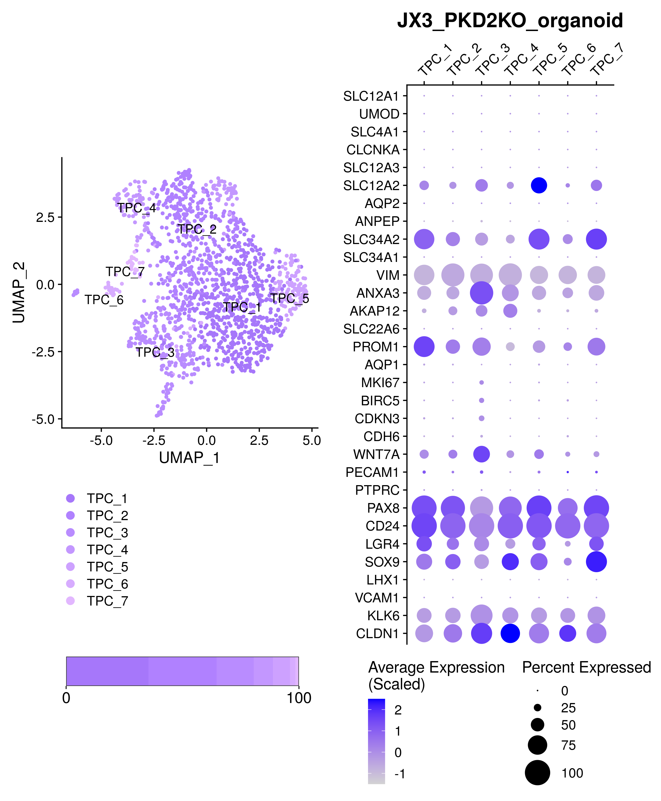

merge\_individuals
================
Javier Perales-Paton

``` r
set.seed(1234)
suppressPackageStartupMessages(require(Seurat))
suppressPackageStartupMessages(require(GSEABase))
suppressPackageStartupMessages(require(ggplot2))
suppressPackageStartupMessages(require(cowplot))
suppressPackageStartupMessages(require(ComplexHeatmap))
source("../src/seurat_fx.R")
```

## Prepare environment

Define the output directory for figures and tables

``` r
OUTDIR <- "./output/"
if(!dir.exists(OUTDIR)) dir.create(OUTDIR)

FIGSDIR <- paste0(OUTDIR,"/figs/")
knitr::opts_chunk$set(fig.path=FIGSDIR)
knitr::opts_chunk$set(dev=c('png','pdf'))
knitr::opts_chunk$set(dpi=300)
```

## Combine samples

Load and merge the individual samples from the
project

``` r
list_rds <- c("CK5_organoid"="../Individual_analysis_CK5_early_organoid/output/4_final_assignment/data/SeuratObject.rds",
          "CK119_organoid"="../Individual_analysis_CK119_late_organoid/output/4_final_assignment/data/SeuratObject.rds",
          "JX1_HC_organoid"="../Individual_analysis_JX1_HC_organoid/output/4_final_assignment/data/SeuratObject.rds",
          "JX2_PDK1KO_organoid"="../Individual_analysis_JX2_PKD1KO_organoid/output/4_final_assignment/data/SeuratObject.rds",
          "JX3_PDK2KO_organoid"="../Individual_analysis_JX3_PKD2KO_organoid/output/4_final_assignment/data/SeuratObject.rds",
          "CK120_CD13"="../Individual_analysis_CK120_CD13/output/4_final_assignment/data/SeuratObject.rds",
          "CK121_CD24"="../Individual_analysis_CK121_CD24/output/4_final_assignment/data/SeuratObject.rds")

# Load individual SeuratObjects
for(sname in names(list_rds)) {
  cat(paste0("Loading ",sname, "'s SeuratObject","\n"), file=stdout())
  SObj <- readRDS(list_rds[[sname]])
  # Scale data
  SObj <- ScaleData(SObj, verbose = FALSE)
  
  SObj$proj_ident <- paste0("[",Project(SObj),"] ",Idents(SObj))
  SObj$ident_proj <- paste0(Idents(SObj), " [",Project(SObj),"]")
  # Rename idents incl
  assign(sname, SObj)
  rm(SObj)
}
```

    ## Loading CK5_organoid's SeuratObject
    ## Loading CK119_organoid's SeuratObject
    ## Loading JX1_HC_organoid's SeuratObject
    ## Loading JX2_PDK1KO_organoid's SeuratObject
    ## Loading JX3_PDK2KO_organoid's SeuratObject
    ## Loading CK120_CD13's SeuratObject
    ## Loading CK121_CD24's SeuratObject

``` r
(snames <- names(list_rds))
```

    ## [1] "CK5_organoid"        "CK119_organoid"      "JX1_HC_organoid"    
    ## [4] "JX2_PDK1KO_organoid" "JX3_PDK2KO_organoid" "CK120_CD13"         
    ## [7] "CK121_CD24"

## individual UMAPs per sample

``` r
cols <- readRDS(file="./output/color_scheme.rds")
```

``` r
umap_cols <- cols[levels(get("CK5_organoid")@active.ident)]
CK5_umap <- DimPlot(get("CK5_organoid"), reduction="umap", cols = umap_cols[], label=TRUE, repel=TRUE)
```

    ## Warning: Using `as.character()` on a quosure is deprecated as of rlang 0.3.0.
    ## Please use `as_label()` or `as_name()` instead.
    ## This warning is displayed once per session.

``` r
# print(CK5_umap)
```

``` r
umap_cols <- cols[levels(get("CK119_organoid")@active.ident)]
CK119_umap <- DimPlot(get("CK119_organoid"), reduction="umap", cols = umap_cols[], label = TRUE, repel=TRUE)
# print(CK119_umap)
```

``` r
umap_cols <- cols[levels(get("CK120_CD13")@active.ident)]
CK120_umap <- DimPlot(get("CK120_CD13"), reduction="umap", cols = umap_cols[], label=TRUE, repel=TRUE)
# print(CK120_umap)
```

``` r
umap_cols <- cols[levels(get("CK121_CD24")@active.ident)]
CK121_umap <- DimPlot(get("CK121_CD24"), reduction="umap", cols = umap_cols[], label=TRUE, repel=TRUE)
# print(CK121_umap)
```

``` r
umap_cols <- cols[levels(get("JX1_HC_organoid")@active.ident)]
JX1_umap <- DimPlot(get("JX1_HC_organoid"), reduction="umap", cols = umap_cols[], label = TRUE, repel=TRUE)
print(JX1_umap)
```

<!-- -->

``` r
umap_cols <- cols[levels(get("JX2_PDK1KO_organoid")@active.ident)]
JX2_umap <- DimPlot(get("JX2_PDK1KO_organoid"), reduction="umap", cols = umap_cols[], label = TRUE, repel=TRUE)
# print(JX2_umap)
```

``` r
umap_cols <- cols[levels(get("JX3_PDK2KO_organoid")@active.ident)]
JX3_umap <- DimPlot(get("JX3_PDK2KO_organoid"), reduction="umap", cols = umap_cols[], label = TRUE, repel=TRUE)
# print(JX3_umap)
```

Change order of legends

``` r
for(obj in ls(pattern="_umap$")) {
    assign(obj, get(obj) + theme(legend.position="bottom", legend.direction = "vertical"))
}
```

# Merged-sample report

``` r
# Merge ind
SeuratObject <- merge(x=get(x = snames[1]), y=sapply(snames[-1], get), add.cell.ids = snames)
# Clean mem
rm(list = snames)
```

## Figures

``` r
if(! dir.exists(FIGSDIR)) dir.create(FIGSDIR, recursive = TRUE)
```

``` r
cell_pop <- table(SeuratObject$orig.ident,Idents(SeuratObject))
cell_pop_perc <- (sweep(cell_pop,MARGIN = 1, STATS = rowSums(cell_pop), FUN = "/")) * 100
cell_pop_perc2 <- reshape2::melt(cell_pop_perc)
cell_pop_perc2$Var1 <- relevel(cell_pop_perc2$Var1, ref = "CK5_organoid")


ggplot(cell_pop_perc2, aes(x= Var1, fill=Var2, y=value)) +
    geom_col(position = position_stack(reverse=TRUE)) + 
         scale_fill_manual(values = cols[levels(cell_pop_perc2$Var2)]) +
  labs(y="Percentage of cells (%)") + theme_bw() + coord_flip() +
  theme(legend.title = element_blank(),legend.text = element_text(size=10),
    legend.key.size = unit(0.5, "cm"),
        axis.title.x = element_text(size=18, color = "black"), axis.title.y = element_blank(),
        axis.text.x = element_text(size=14, color = "black"),
        axis.text.y = element_text(size=12, color = "black"),
        panel.grid = element_blank())
```

<!-- -->

``` r
# Split barcodes per sample for future plotting
bp_res <- lapply(split(cell_pop_perc2, cell_pop_perc2$Var1), function(df) {
           ggplot(df, aes(x= Var1, fill=Var2, y=value)) +
               geom_col(position = position_stack(reverse=TRUE)) + 
               scale_fill_manual(values = cols[levels(df$Var2)]) +
               scale_y_continuous(breaks=c(0,100), 
                       expand=c(0,0)) + 
        scale_x_discrete(expand=c(0,0)) + 
               labs(y="Percentage of cells (%)") + theme_bw() + coord_flip() +
               theme(legend.position="none",
                 legend.key.size = unit(0.5, "cm"),
                 axis.ticks.y = element_blank(),
                 axis.title = element_blank(),
                 axis.text.x = element_text(size=14, color = "black"),
                 axis.text.y = element_blank(),
                 plot.margin = unit(c(0,6,0,0),"mm"),
                 panel.grid = element_blank())


    })

# Create output table
colnames(cell_pop_perc2) <- c("sample", "population", "percentage")

cell_pop2 <- reshape2::melt(cell_pop)
cell_pop2$Var1 <- relevel(cell_pop2$Var1, ref = "CK5_organoid")

colnames(cell_pop2) <- c("sample", "population", "num_cells")


# Reorder
stopifnot(dim(cell_pop2) == dim(cell_pop_perc2))

cell_pop2 <- cell_pop2[order(cell_pop2$sample,
                             cell_pop2$population), ]
cell_pop_perc2 <- cell_pop_perc2[order(cell_pop_perc2$sample,
                                       cell_pop_perc2$population), ]

# Both tables must be same order
stopifnot( all( (cell_pop2$sample == cell_pop_perc2$sample) & 
                  (cell_pop2$population == cell_pop_perc2$population))
)

cell_pop_tab <- cbind(cell_pop2, percentage=cell_pop_perc2$percentage)
# Remove absent populations from the tab
cell_pop_tab <- cell_pop_tab[cell_pop_tab$num_cells!=0, ]

write.table(cell_pop_tab,
            file= paste0(OUTDIR,"/tubuloid_cell_populations_desc.csv"), sep=",",
            row.names = FALSE, col.names = TRUE, quote=TRUE)
```

### DotPlots of context-specific biomarkers

``` r
context_genes <- getGmt("../data/Prior/Kramann_context.gmt")
```

``` r
plots <- DotPlot_panel(SeuratObject, assay = "RNA",
                       unlist(geneIds(context_genes)), dot.scale = 10,
              scale.min = 0, scale.max = 100, col.min = -2.5, col.max = 2.5)

# Common scale
plots <- lapply(plots, function(gg) {
  gg + coord_flip() + scale_y_discrete(position = "right") +
    
  # This is extremely important to use same scaling color for all samples
  scale_color_gradient(low="lightgrey", high = "blue",limits=c(-1.5, 2.5)) +
      
  theme(axis.text.x = element_text(angle = 45, hjust = 0),
        plot.title = element_text(size=18, hjust = 0.5))
  })
```

    ## Scale for 'colour' is already present. Adding another scale for
    ## 'colour', which will replace the existing scale.
    ## Scale for 'colour' is already present. Adding another scale for
    ## 'colour', which will replace the existing scale.
    ## Scale for 'colour' is already present. Adding another scale for
    ## 'colour', which will replace the existing scale.
    ## Scale for 'colour' is already present. Adding another scale for
    ## 'colour', which will replace the existing scale.
    ## Scale for 'colour' is already present. Adding another scale for
    ## 'colour', which will replace the existing scale.
    ## Scale for 'colour' is already present. Adding another scale for
    ## 'colour', which will replace the existing scale.
    ## Scale for 'colour' is already present. Adding another scale for
    ## 'colour', which will replace the existing scale.

``` r
# Remove xlab
plots <- lapply(plots, function(gg) gg + theme(axis.title.x = element_blank()))
plots <- lapply(plots, function(gg) gg + theme(axis.title.y = element_blank()))
plots <- lapply(plots, function(gg) gg + theme(legend.position = "bottom", legend.direction = "vertical"))
```

## Panel of figures

``` r
for(tag in c("CK120", "CK121", "CK5" , "CK119", "JX1", "JX2", "JX3")) {
    gg <- plot_grid(plot_grid(get(paste0(tag, "_umap")) + 
                    theme(plot.margin=unit(c(50, 4,10,4), "mm")), 
                bp_res[[grep(tag, names(bp_res))]] + 
                    theme(plot.margin=unit(c(5, 10, 30, 20), "mm")), 
                ncol=1, rel_heights = c(0.8,0.2)),
                  plots[[grep(tag, names(plots))]] + theme(plot.margin=unit(c(4,15,4,4), "mm")), 
                  ncol=2, rel_widths = c(0.5,0.5))
    print(gg)

}
```

<!-- --><!-- --><!-- --><!-- --><!-- --><!-- --><!-- -->

``` r
ord <- sapply(names(plots), function(z) strsplit(z, split="_")[[1]][1])
dplots <- plot_grid(plotlist=plots, ncol=length(plots), align="h", rel_widths=c(1.25,1.25, 1.5, 0.9, 1, 0.9, 1.1))

umaps_list <- sapply(ord, function(tag) get(paste0(tag, "_umap")) + theme(plot.margin=unit(c(50, 4,10,4), "mm")), 
             simplify=FALSE)
umaps <- plot_grid(plotlist=umaps_list, ncol=length(umaps_list), align="h")

bp_list <- sapply(ord, function(tag) bp_res[[grep(tag, names(bp_res))]] + theme(plot.margin=unit(c(5, 10, 30, 20), "mm")), 
          simplify=FALSE)
bps <- plot_grid(plotlist=bp_list, ncol=length(bp_list), align="h")

plot_grid(dplots, umaps, bps, ncol=1, rel_heights = c(6, 5, 1))
```

<!-- -->
