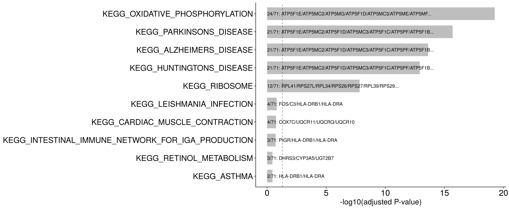
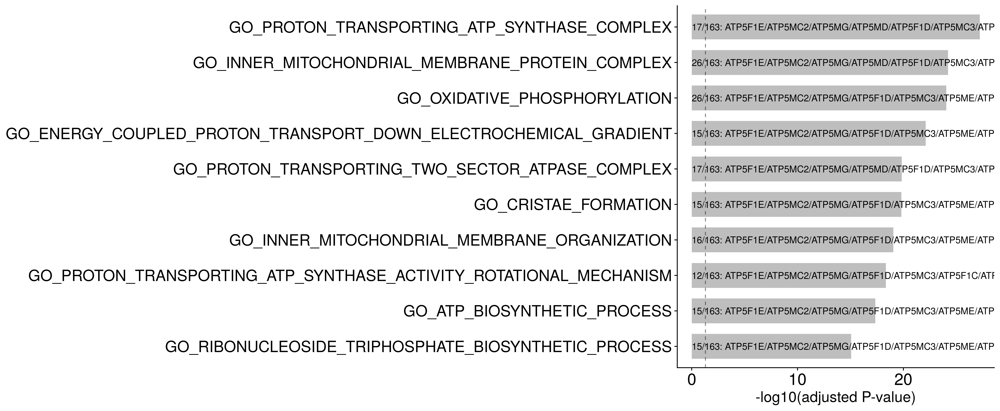
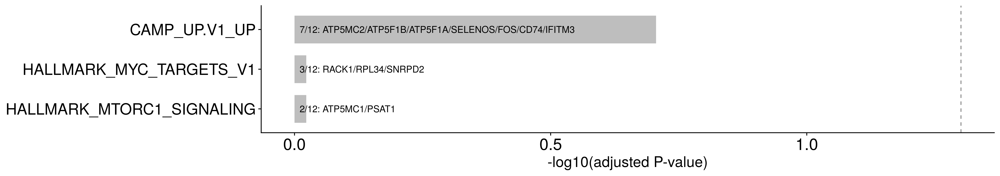

ADPKD marker differential expression
================
Javier Perales-Paton - <javier.perales@bioquant.uni-heidelberg.de>

## Load libraries and auxiliar functions

``` r
set.seed(1234)
suppressPackageStartupMessages(require(Seurat))
suppressPackageStartupMessages(require(ggplot2))
suppressPackageStartupMessages(require(clustree))
suppressPackageStartupMessages(require(cowplot))
suppressPackageStartupMessages(require(GSEABase))
suppressPackageStartupMessages(require(clusterProfiler))
suppressPackageStartupMessages(require(openxlsx))
suppressPackageStartupMessages(require(ComplexHeatmap))
source("../src/seurat_fx.R")
```

## Load SeuratObject with initial clustering outcome

``` r
late <- readRDS(paste0("../Individual_analysis_CK119_late_organoid/",
            "output/2_cell_assignment/data/SeuratObject.rds")
)
late$final_Ident <- Idents(late)
late$orig.ident <- factor("Healthy")

ADPKD_PDK1KO <- readRDS(paste0("../Individual_analysis_JX2_PKD1KO_organoid/",
                "output/2_cell_assignment/data/SeuratObject.rds"))
ADPKD_PDK1KO$final_Ident <- Idents(ADPKD_PDK1KO)
ADPKD_PDK1KO$orig.ident <- factor("PDK1KO")

ADPKD_PDK2KO <- readRDS(paste0("..//Individual_analysis_JX3_PKD2KO_organoid/",
                "output/2_cell_assignment/data/SeuratObject.rds"))
ADPKD_PDK2KO$final_Ident <- Idents(ADPKD_PDK2KO)
ADPKD_PDK2KO$orig.ident <- factor("PDK2KO")
```

## Merging

``` r
S <- merge(late, list(ADPKD_PDK1KO, ADPKD_PDK2KO))
```

    ## Warning in CheckDuplicateCellNames(object.list = objects): Some cell names
    ## are duplicated across objects provided. Renaming to enforce unique cell
    ## names.

## Refining data

Check unique cell types among
    organoids

``` r
unique(gsub("_[0-9]", "", levels(S)))
```

    ##  [1] "DCT-like"           "Epith.Unknown"      "PEC-like"          
    ##  [4] "Prolif.TPC"         "Prolif.TPC:LowQual" "TPC"               
    ##  [7] "TPC:LowCov"         "TPC:HighMT"         "TPC:LowQual"       
    ## [10] "TPC:lowCov"

Discard low quality clusters and
proliferating

``` r
S <- S[, !grepl("(Prolif|\\:Low|\\:High)", Idents(S), ignore.case = TRUE)]
Idents(S) <- droplevels(Idents(S))
unique(gsub("_[0-9]", "", levels(S)))
```

    ## [1] "DCT-like"      "Epith.Unknown" "PEC-like"      "TPC"

Pooling cell types

``` r
Idents(S) <- factor(gsub("_[0-9]", "", as.character(Idents((S)))))
```

## Differential testing

Get which comparisons present enough representation for a two-group
comparison

``` r
cnt <- table(S$orig.ident, Idents(S))
print(cnt)
```

    ##          
    ##           DCT-like Epith.Unknown PEC-like  TPC
    ##   Healthy        0           255       77 2335
    ##   PDK1KO       309             0        0  187
    ##   PDK2KO         0             0        0 1483

``` r
# Criteria: at least 100 cells in each group
cont <- sapply(setdiff(rownames(cnt), "Healthy"), function(idx) {
                   colSums(rbind(cnt["Healthy",], cnt[idx,])>100)==2
            }, simplify=FALSE)
print(cont)
```

    ## $PDK1KO
    ##      DCT-like Epith.Unknown      PEC-like           TPC 
    ##         FALSE         FALSE         FALSE          TRUE 
    ## 
    ## $PDK2KO
    ##      DCT-like Epith.Unknown      PEC-like           TPC 
    ##         FALSE         FALSE         FALSE          TRUE

``` r
# Remove unsufficient representation cell types
cont <- lapply(cont, function(z) names(z[z]))
print(cont)
```

    ## $PDK1KO
    ## [1] "TPC"
    ## 
    ## $PDK2KO
    ## [1] "TPC"

Go over each organoid to be compared to Healthy, go over each cell type
for the two-group comparison

``` r
# Create a list of lists to store the result
DGE_res <- setNames(vector("list", length=length(cont)), names(cont))
DGE_res <- sapply(names(DGE_res), function(gr) setNames(vector("list", length=length(cont[[gr]])), cont[[gr]]), simplify=FALSE)
# Loop recursively (2-levels) to get DGE_results
for(gr in names(DGE_res)) {
    for(cell in names(DGE_res[[gr]])) {
        Sx <- S[, S$orig.ident %in% c("Healthy", gr) & Idents(S) == cell]
        Idents(Sx) <- Sx$orig.ident
        dge <- FindMarkers(Sx, ident.1=gr, ident.2="Healthy",
                   test.use="wilcox", only.pos=TRUE)
        dge$gene <- rownames(dge)
        dge <- dge[, c("gene", colnames(dge)[-ncol(dge)])]
        # store DGE_result
        DGE_res[[gr]][[cell]] <- dge
    }
}
```

Show how many
DEGs

``` r
lapply(DGE_res, function(resX) lapply(resX, function(z) table(z$p_val_adj < 0.05)))
```

    ## $PDK1KO
    ## $PDK1KO$TPC
    ## 
    ## FALSE  TRUE 
    ##   417   291 
    ## 
    ## 
    ## $PDK2KO
    ## $PDK2KO$TPC
    ## 
    ## TRUE 
    ##  759

## GO term analysis

``` r
GO <- getGmt("../data/Prior/c5.all.v7.0.symbols.gmt")
GO <- geneIds(GO)
GO_t2g <- data.frame(term=unlist(sapply(names(GO), function(k) rep(k, length(GO[[k]])))),
             gene = unlist(GO))
```

``` r
GO_res <- lapply(DGE_res, function(k)  {
        ng <- lapply(k, function(z) rownames(z)[z$p_val_adj < 0.05])
        en <- lapply(ng, function(x) enricher(x, TERM2GENE=GO_t2g, minGSSize = 10, maxGSSize = 200, pvalueCutoff = 0.05))
        return(en)
    })

GO_res <- lapply(GO_res, function(k) lapply(k, function(z) z@result))
```

## KEGG analysis

``` r
KEGG <- getGmt("../data/Prior/c2.cp.kegg.v7.2.symbols.gmt")
KEGG <- geneIds(KEGG)
KEGG_t2g <- data.frame(term=unlist(sapply(names(KEGG), function(k) rep(k, length(KEGG[[k]])))),
             gene = unlist(KEGG))
```

``` r
KEGG_res <- lapply(DGE_res, function(k)  {
        ng <- lapply(k, function(z) rownames(z)[z$p_val_adj < 0.05])
        en <- lapply(ng, function(x) enricher(x, TERM2GENE=KEGG_t2g, minGSSize = 10, maxGSSize = 200, pvalueCutoff = 0.05))
        return(en)
    })
KEGG_res <- lapply(KEGG_res, function(k) lapply(k, function(z) z@result))
```

## Meta-analysis of DEGs

``` r
META_res <- setNames(vector("list", length=1), "TPC")
for(cell in names(META_res)) {
    Sx <- S[, Idents(S) == cell]
    Idents(Sx) <- ifelse(Sx$orig.ident=="Healthy", "Healthy", "PDK-KO")

    Si <- Sx[, Sx$orig.ident %in% c("PDK1KO", "Healthy")]
    Si <- RenameCells(Si, paste0(Si$orig.ident,"_",colnames(Si)))
    Si$orig.ident <- "PDK1KO"

    Sj <- Sx[, Sx$orig.ident %in% c("PDK2KO", "Healthy")]
    Sj <- RenameCells(Sj, paste0(Sj$orig.ident,"_",colnames(Sj)))
    Sj$orig.ident <- "PDK2KO"

    Sx <- merge(Si, Sj)

    dge <- FindConservedMarkers(Sx, ident.1="PDK-KO", ident.2="Healthy",
                    grouping.var="orig.ident",
               test.use="wilcox", only.pos=TRUE)
    dge$gene <- rownames(dge)
    dge <- dge[, c("gene", colnames(dge)[-ncol(dge)])]
    # store META_result
    META_res[[cell]] <- dge
}
```

    ## Warning in CheckDuplicateCellNames(object.list = objects): Some cell names
    ## are duplicated across objects provided. Renaming to enforce unique cell
    ## names.

    ## Testing group PDK1KO: (PDK-KO) vs (Healthy)

    ## Testing group PDK2KO: (PDK-KO) vs (Healthy)

ORA on these meta-signature

``` r
KEGG_out<- lapply(META_res, function(k)  {
        ng <- rownames(k)[k$PDK1KO_p_val_adj< 0.05 & k$PDK2KO_p_val_adj < 0.05]
        en <- enricher(ng, TERM2GENE=KEGG_t2g, minGSSize = 10, maxGSSize = 200, pvalueCutoff = 0.05)
        return(en)
    })
```

``` r
GO_out<- lapply(META_res, function(k)  {
        ng <- rownames(k)[k$PDK1KO_p_val_adj< 0.05 & k$PDK2KO_p_val_adj < 0.05]
        en <- enricher(ng, TERM2GENE=GO_t2g, minGSSize = 10, maxGSSize = 200, pvalueCutoff = 0.05)
        return(en)
    })
```

``` r
ADPKD_hallmarks <- getGmt("../data/Prior/ADPKD_sets.gmt")
ADPKD <- geneIds(ADPKD_hallmarks)
ADPKD_t2g <- data.frame(term=unlist(sapply(names(ADPKD), function(k) rep(k, length(ADPKD[[k]])))),
             gene = unlist(ADPKD))

ADPKD_out<- lapply(META_res, function(k)  {
        ng <- rownames(k)[k$PDK1KO_p_val_adj< 0.05 & k$PDK2KO_p_val_adj < 0.05]
        en <- enricher(ng, TERM2GENE=ADPKD_t2g, minGSSize = 10, maxGSSize = 200, pvalueCutoff = 0.05)
        return(en)
    })
```

``` r
barplot_ora <- function(res, N=10) {
    res$geneID2 <- sapply(res$geneID, function(z) {
                      genes <- strsplit(z, split="/")[[1]]
                      if(length(genes)>10) {
                          txt <- paste0(paste(head(genes, 7), collapse="/"),"...")
                      } else {
                          txt <- z
                      }
                      return(txt)

    })
    res$ID <- factor(res$ID, levels=rev(res$ID))
    res$Ann <- paste0(res$GeneRatio,": ",res$geneID2)

    #NOTE: result is ordered by significance (pval) by default
    gg <- ggplot(head(res, N), aes(y=-log10(p.adjust), x=ID)) + 
        geom_bar(stat="identity", width=0.7, fill="grey") +
        #   geom_point(size=7) +
        #   geom_segment(aes(xend=ID), yend=0) + 
        #   expand_limits(y=0) + 
        geom_text(mapping=aes(y=0.01, x=ID, label=Ann), hjust=0, size=4) + 
        theme_cowplot() +
        geom_hline(yintercept = -log10(0.05), lty=2, alpha=0.5) + 
        coord_flip() +
        ylab("-log10(adjusted P-value)") +
        theme(legend.position="bottom",
              legend.key.width=unit(1.5,"cm"),
              legend.title=element_text(size=16),
              legend.text=element_text(size=16),
              axis.title.y=element_blank(),
              axis.text.y=element_text(size=19),
              axis.text.x=element_text(size=20),
              axis.title.x=element_text(size=18))
    
    return(gg)

}
```

``` r
gg_kegg <- barplot_ora(KEGG_out$TPC@result, 10)
print(gg_kegg)
```

<!-- -->

``` r
gg_go <- barplot_ora(GO_out$TPC@result, 10)
print(gg_go)
```

<!-- -->

``` r
gg_pkd <- barplot_ora(ADPKD_out$TPC@result, 10)
print(gg_pkd)
```

<!-- -->

## Save

``` r
for(gr in names(cont)) {
    ## Excel file
    xlsx_file <- paste0(OUTDIR, "/", gr, "_vs_Healthy.xlsx")
    wb <- createWorkbook()

    for(cell in cont[[gr]]) {
        RES <- ls(pattern="_res$")      
        for(RESx in RES) {
            tag <- gsub("_res$", "", RESx)
            tab <- get(RESx)[[gr]][[cell]]
            sheet_name <- paste0(cell,"_",tag)
            addWorksheet(wb, sheetName = sheet_name)
            writeData(wb, sheet = sheet_name, x=tab, rowNames=FALSE)
        }
    }

    ## save file 
    saveWorkbook(wb, file =  xlsx_file, overwrite = TRUE)
}
```

``` r
## Excel file
xlsx_file <- paste0(OUTDIR, "/meta-analysis_PDK-KO_vs_Healthy.xlsx")
wb <- createWorkbook()
for(cell in names(META_res)) {
    tag <- "DiffExpr_metanalysis"
    tab <- META_res[[cell]]
    sheet_name <- paste0(cell,"_",tag)
    addWorksheet(wb, sheetName = sheet_name)
    writeData(wb, sheet = sheet_name, x=tab, rowNames=FALSE)
}

## save file 
saveWorkbook(wb, file =  xlsx_file, overwrite = TRUE)
```
